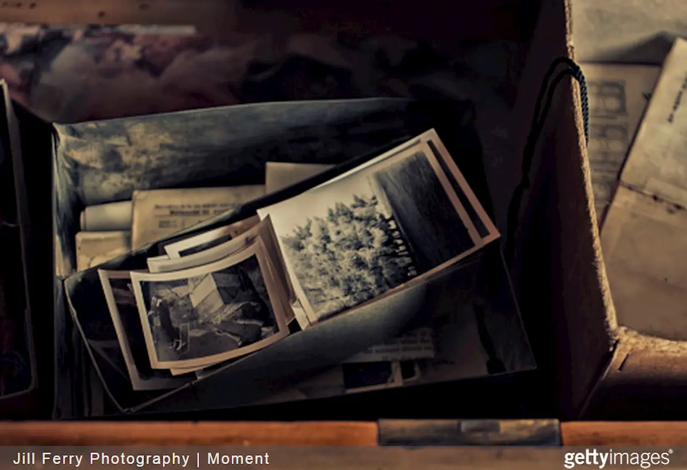

Oggi sono a pezzi: capita, dicono, di prendere l'influenza in inverno. Non riesco a scrivere nulla di profondamente geniale o di intensamente creativo: ne approfitto per aggiungere la **pagina disclaimer** al sito. E per dire due parole su alcune questioni tecniche.

### Di cosa parlo? E quando?

Cominciamo con **i giorni in cui pubblico**: lunedì, mercoledì e venerdì. In linea generale al mattino, tra le otto e le dieci. Però, come è intuibile, questo blog non è un lavoro: è una passione. Quindi in caso di imprevisti, o impegni lavorativi pressanti non abbiatene a male. E non preoccupatevi: non ho nessuna intenzione di abbandonare questo sito.

Di cosa parlo? Beh, lo vedete anche voi: **di musica, di scrittura, di giornalismo**. Di quello che mi appassiona, da sempre o sul momento. La musica, perché è la mia vita, la mia musa ispiratrice in ogni momento di ogni giorno. La scrittura, perché ho scoperto di poterla coltivare, farla crescere e farla vivere fianco a fianco con la musica. E il giornalismo, ma inteso nel senso più nobile, quello alla Mark Twain, quello che guarda alla meraviglia con stupore, gioia e curiosità.

### A proposito di immagini: dove le trovo?

Nei miei articoli, su questo blog, **utilizzo immagini. Mie**, per lo più: foto scattate in questi anni, o foto nuove. Come la mia foto, quella che vedete in alto, nel cerchio. O quelle che accompagnano alcuni articoli. I loro diritti d'utilizzo sono miei, e ci mancherebbe anche che così non fosse!

Ci sono però altre foto, che non sono scatti miei. Sono immagini trovate sul web, quelle così dette di pubblico dominio. Utilizzo una fonte in maniera predominante, ed è l'archivio [Getty Images Free](https://www.gettyimages.it/ "Getty Images"): da qualche tempo permette di incorporare alcune delle immagini nel proprio sito, e mediamente sono di buona qualità. Le riconoscete perché hanno tutte il nome del fotografo - che ne detiene i diritti di copyright - e la scritta "_getty images_" come watermark.

La seconda fonte che utilizzo è la [ricerca avanzata di Google Immagini](https://images.google.com/advanced_image_search "Ricerca avanzata per immagini utilizzabili liberamente"): permette di trovare immagini da utilizzare liberamente su blog e siti, e si possono limitare i risultati a quelle immagini con licenza Creative Commons.

Va da sé che sono disponibile a sostituire qualsiasi immagine qualora violassero il diritto d'autore: avvisatemi nei commenti, o tramite mail, o ancora usando il modulo contatti presente nel primo articolo del blog (questo, dove c'è anche [la mia presentazione](./claudia-falzone).

### Copyright e licenze varie

A proposito di copyright e di licenze di utilizzo: ho scelto di utilizzare la [Licenza Creative Commons Attribuzione – Non commerciale – Condividi allo stesso modo 2.5](https://creativecommons.org/licenses/by-nc-sa/2.5/it/ "Licenza Copyright Creative Commons"). Per chi non la conoscesse, questa licenza prevede tre aspetti:

> - **Attribuzione**: Devi riconoscere una menzione di paternità adeguata, fornire un link alla licenza e indicare se sono state effettuate delle modifiche. Puoi fare ciò in qualsiasi maniera ragionevole possibile, ma non con modalità tali da suggerire che il licenziante avalli te o il tuo utilizzo del materiale.
> - **NonCommerciale**: Non puoi usare il materiale per scopi commerciali.
> - **StessaLicenza**: Se remixi, trasformi il materiale o ti basi su di esso, devi distribuire i tuoi contributi con la stessa licenza del materiale originario.

Significa, in parole povere, che detengo il copyright dei miei testi. Però potete citarli, linkarli, usarli e condividerli. A patto di **mettere un link al post originale**, e di indicarmi come autrice. Come è consuetudine fare, nel web.

### Ospiti

E per i testi che non sono miei?

Beh, al momento non ho ancora cominciato però penso - e spero - di cominciare presto a ospitare dei così detti guest post in cui lascerò libertà di parola (e di scrittura) ad altri. Tra parentesi, se avete qualche idea, o **se volete scrivere un articolo sul sito**, fatemelo sapere. Chiusa parentesi. Quindi, dicevo, per questi contributi non miei il copyright e i conseguenti diritti di utilizzo restano ai creatori dei testi. Se li citate, citate l'autore originale oltre che il sito.

### Cookie e pubblicità

Infine la **pubblicità**. Che non ho ancora deciso se mettere o meno. E che magari non metto. Ma che visto siamo in argomento allora ve lo dico subito, e non ci pensiamo più: uso, userò, [Google Analytics](https://marketingplatform.google.com/about/analytics/) per monitorare le visite. Poi, se il mio moroso smette di ciapinare con i file php, metterò anche un qualche indicatore delle visite fatte dal sito a fondo pagina, o qui a destra: giusto per ascoltare il mio lato vanesio. Comunque il concetto è semplice, se non vi piace l'idea di essere conteggiati nelle visite del sito, allora dovrete disabilitare i **cookie** dal vostro browser: [qui Google spiega](https://support.google.com/accounts/answer/61416?hl=it "Disattivare Cookie") bene come fare.

Ricordo, comunque, che **per eventuali chiarimenti** potete utilizzare la [pagina facebook](https://www.facebook.com/tramusicaetparole "Pagina Facebook di Tra Musica e Parole") del sito o il [mio account Twitter](https://twitter.com/MusicaEtParole).
