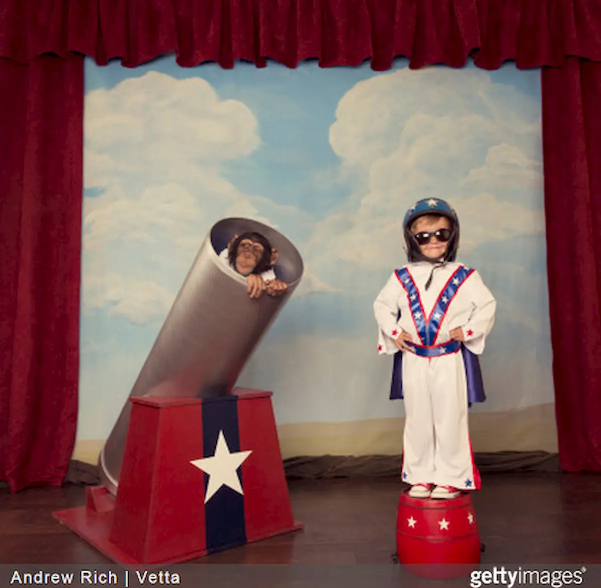

Avete presente **il blocco dello scrittore**? Quando siete davanti al foglio e non riuscite a buttare giù nemmeno una riga? Ecco, a volte è solo un po' di stanchezza, a volte semplicemente non è il giorno. L'importante è non arrendersi e non cadere in uno di questi 5 errori che ostacolano la scrittura.

### Se usi l'emisfero sinistro non sei creativo

Tra le banalità legate alla scrittura e, più in generale, alla creatività a tutto tondo, questa è la più pericolosa e fuorviante. Pericolosa perché è un modo per relegare la capacità creativa a una determinata élite di persone, sminuendo chi ha un processo cognitivo diverso. Mi spiego meglio: l'emisfero destro del cervello è quello che regola la creatività e la fantasia, quello sinistro si occupa di ragionamenti logici e analitici. Scrivere seguendo un flusso di coscienza razionale non vuol dire avere capacità inferiori rispetto a coloro che, invece, buttano giù inchiostro su inchiostro seguendo l'onda dell'emotività: semplicemente sono due approcci diversi alla scrittura che permettono in egual modo di esprimersi. Fuorviante perché non è affatto vero che per essere creativi occorre usare la parte destra del cervello. Secondo la neuroscienza, infatti, emisfero destro e sinistro gestiscono sì due aree diverse ma complementari. E non è solo un discorso legato a neuroni e fibre nervose cerebrali, che mettono in comunicazioni di due parti di uno stesso cervello, ma anche alla formazione del pensiero. Ad esempio, lo storytelling: per ottenere un risultato d'impatto **occorre essere originali ma anche costruire una storia credibile e con solide fondamenta**, risultato che si può ottenere ragionando.

### I creativi sono geni incompresi solitari

La figura dello scrittore incompreso che vive da eremita può esercitare, inizialmente, un fascino indiscutibile sugli altri. Questa, occorre dirlo, è una visione romantica e per nulla compatibile con la realtà. Chi vive di scrittura ha alcuni momenti in cui ha l'esigenza di stare rintanato in casa in compagnia del suo notebook - o con carta e penna -ma non è nulla di diverso rispetto a chi lavora 8 ore in ufficio, si tratta sempre di lavoro. Quindi, se un vostro amico vi invita fuori a cena e state scrivendo un saggio sul quale lavorate da tempo, non abbiate paura di rifiutare per il timore di essere bollati come asociali. State attenti, però, a non commettere l'errore contrario, ovvero tralasciare del tutto i rapporti interpersonali. **Frequentare altre persone, anche nella sfera professionale, non solo non è una perdita di tempo ma aiuta anche a migliorare e migliorarsi, a livello intellettivo e personale.** E se siete in crisi di idee, rifugiarvi nello schema “non ce la farò mai, non sono un genio” è quanto di più sbagliato possiate fare. Perché, se è vero che per scrivere bene occorre essere mediamente intelligenti, è altrettanto vero che non è di certo un QI 160 che aumenta le vostre capacità creative.

### I risultati migliori si ottengono se c'è uno stimolo esterno

In realtà non è affatto così. Lo stimolo esterno, quale una commissione ricevuta da un cliente, ci spinge generalmente ad essere più rapidi e lucidi nella stesura, quasi ci fosse una sorte di distacco tra noi e ciò che stiamo scrivendo. L'impegno sarà lo stesso, altrimenti non avremmo scelto come professione la scrittura, ma quando scriviamo di materie che ci stanno a cuore, che ci coinvolgono più di altre perché rispecchiano i nostri interessi, l'impatto nel lettore è completamente diverso. Subentra la componente emozionale, il mettere se stessi dentro un articolo o un saggio che consente al destinatario di scorgere una finestra con vista sul nostro mondo interiore. A dimostrare questa teoria, uno studio condotto alla Harvard Business School da Teresa Amabile. La Amabile ha suddiviso questo esperimento in due parti: per la prima ha chiesto a pittori e artisti di preparare alcune opere, alcune per esigenza personale e altre su commissione, che poi sarebbero state giudicate da persone all'oscuro dell'identità dell'artista e dello scopo delle opere. La seconda parte ha visto impegnate le studentesse del college alle quali è stato chiesto di preparare uno scritto, ma solo ad alcune di loro è stato detto che la loro relazione sarebbe stata esaminata. In entrambi i casi è emerso lo stesso risultato: l**e opere migliori sono quelle dettate dall'ispirazione personale**, ancor meglio se non c'è di mezzo un giudizio esterno. Perché? Semplice: **perché in quel momento si stabilisce un rapporto stretto tra il nostro essere e le nostra dita**, che traducono in parole ciò che stiamo pensando.

### Aspettare il lampo di genio

Il mito del lampo di genio in cui finalmente le parole sembrano quasi prendere forma per conto proprio è il sogno di ogni scrittore. Che sia autore di un libro, un giornalista che deve preparare un pezzo o un cantante che scrive di suo pugno un brano per il suo nuovo album, chi di noi non ha mai provato il desiderio di svegliarsi nel bel mezzo della notte e mettersi a scrivere di getto come se si fosse stati folgorati da un moto di creatività e ispirazione? Spiacenti, abbiamo una brutta notizia: il lampo di genio non esiste. O meglio, esiste ma solo se alimentato dall'esercizio e dalla pratica. Prima del braccio, è la mente ad agire. Passeremo ore, giorni, addirittura settimane ad arrovellarci su un concetto che abbiamo ben chiaro e che, ahinoi, non riusciamo a rendere in frasi, nemmeno semplificandolo ai minimi termini. Sia ben chiaro, può accadere che, a causa del nostro perfezionismo, arriveremo ad un punto in cui riusciremo ad individuare la chiave di lettura più adatta a noi e ci sentiremo come se fossimo stati colti da un'epifania. Ma **ciò che abbiamo definito epifania è una conclusione naturale, l'ultima di una serie di fasi che si attraversano nel processo di elaborazione**. Quindi, un consiglio: non incaponitevi su un'inezia, non spaventatevi per un'apparente lacuna linguistica, concentratevi su ciò che avete intenzione di dire e lasciatevi andare. Allenate la vostra mente, se possibile leggete molto, e fatevi trovare pronti nel momento in cui intenzioni e parole si fonderanno in una cosa sola. La mente non è un muscolo ma necessità di allenamento costante.

### Il brainstorming è l'unica soluzione in caso di empasse

Ultima ma non meno importante è la questione del brainstorming. Ma davvero è la soluzione da adottare? La risposta a questa domanda è nì. Finora abbiamo esaminato esclusivamente le casistiche di lavoro in solitaria. Se stiamo scrivendo esclusivamente per noi, il brainstorming è pressoché la situazione naturale in cui incappiamo quando abbiamo un blocco, nonché l'ancora che ci tira fuori dalle sabbie mobili mentali che ostacolano le nostre idee. Ma se lavoriamo in un team di scrittori o autori? In questo caso la soluzione è leggermente diversa. Immaginate di riunirvi in un ufficio con l'equipe nella quale siete stati inseriti. Fatto? Ok. Adesso pensate ad una sessione interminabile di brainstorming. Qual è il risultato? Una confusione infernale, di più persone che formulano idee senza un progetto dietro. Questa è la strada più lontana per poter elaborare un'idea innovativa e di senso. Cosa bisogna fare, quindi, per avere un risultato produttivo? Ideare un progetto, delle alternative creative - completamente per conto vostro - prima di lavorare in gruppo. Una volta che si riunisce il team, ognuno presenterà la sua visione, rendendo più facile capire su cosa occorre orientarsi, e così via a turno. Una volta concluso il giro, avrete un prospetto più preciso sulle varie idee e un quadro ben chiaro sulle intenzioni da perseguire. **La creatività si alimenta non solo con altra creatività ma anche con metodo e riflessione.**

Niente e nessuno ci preserverà dal blocco dello scrittore, è uno spettro incombente su tutti coloro i quali decidono di scrivere per professione. Tuttavia, sfatando questi miti, sarà più facile uscirne (quasi) indenni. O quantomeno, più forti di prima.
