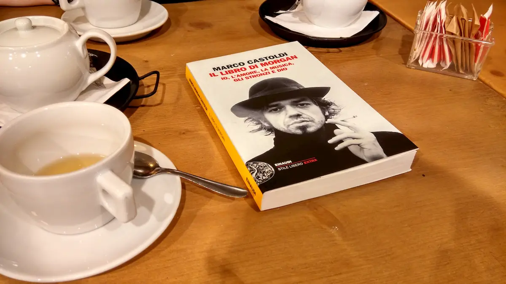
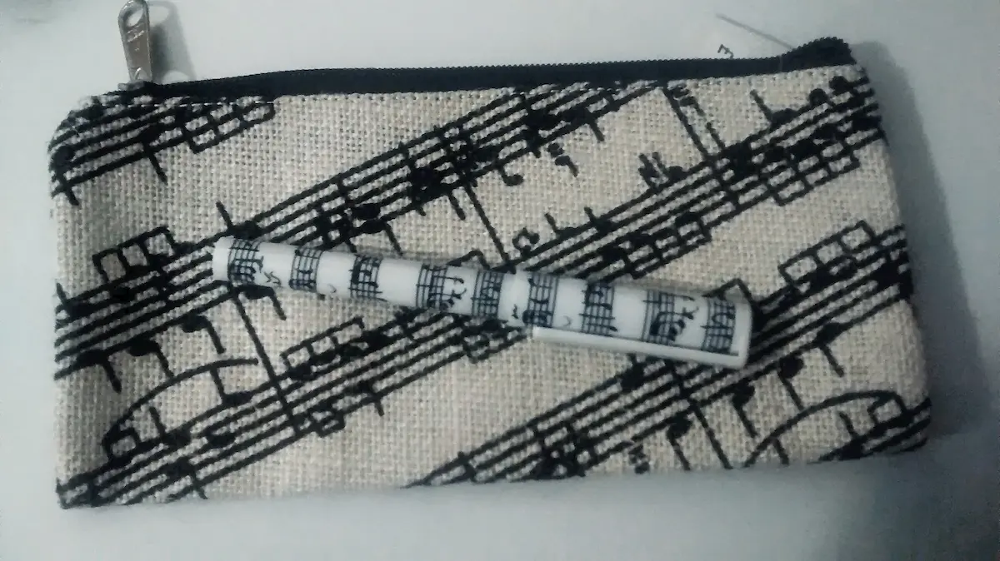
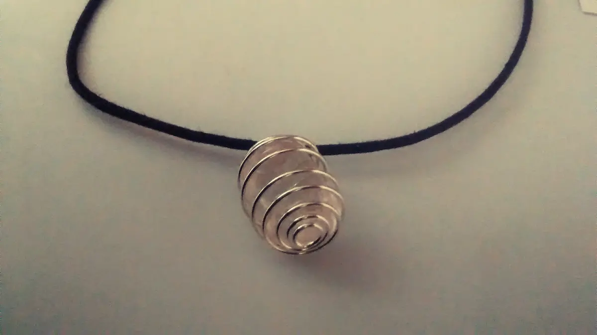

Sono ancora alle prese con l’eupepsia (_cit_.) tipica dei postumi da pranzi natalizi. Come, penso, lo sarete anche voi. Quindi, diciamo no alla pesantezza mentale e parliamo di cose frivole: i regali di Natale. Che, in tutta realtà, nel mio caso non sono stati affatto frivoli.

Avete presente la sensazione meravigliosa di quando ricevete un regalo che è pensato su misura per voi? In tal proposito, quest’anno mi è andata alla grande perché il fil rouge non è stato saponette, sali da bagno et simili (per quanto io adori tali prodotti, avete notato che ci sono le annate tematiche in cui vi regalano solo un certo tipo di oggetti?), bensì Musica e Parole. Esattamente, come questo blog. Volete scoprirne di più? Vi accontento subito.

### In arte Marco Castoldi

Il moroso ha deciso di fare le cose in grande stile, regalandomi ben tre libri. Il primo è “**Il libro di Morgan: Io, l’amore, la musica, gli stronzi e Dio**”, l’autobiografia di Morgan, all’anagrafe Marco Castoldi. **Un autoritratto nel quale ci si perde** prima nelle riflessioni filosofiche del musicista e, subito dopo, ci si ritrova catapultati in alcuni flashback dell’infanzia di Morgan stesso. Spesso e volentieri aneddoti che svelano il suo lato più intimo e tenero, distante anni luce dal ruolo di giudice controverso di X-Factor. In tutto ciò emerge la grande identità coerente di Castoldi: un amante della Musica in tutto e per tutto, tanto da farne la sua professione. L’autobiografia di Morgan non solo è un - raro - esempio di umanità nel bene e nel male, ma **è anche un manuale che ogni musicista, di professione o ingabbiato in un sogno nel cassetto, non può fare a meno di leggere**. Perché in ogni singola parola trasuda Amore totalizzante per le sette note. Non mi capita spesso di essere catturata emotivamente da un libro. Probabilmente più avanti ne farò una recensione, più ragionata e meno di pancia. Ma adesso è troppo presto.

### Un secolo di musica

Il secondo libro è “**Il resto è rumore**”, di Alex Ross. Ross è il critico musicale del New Yorker dal 1996 e ciò che propone in questo volume è un’analisi storica e musicologica del XX secolo. A differenza del libro di Morgan, che ho divorato, questo ho solo iniziato a leggerlo (sono 874 pagine, mi sa che ci metterò un bel po’). Tuttavia, le recensioni riportate sulla copertina e sul retro fanno ben sperare:

> “Avanzare negli alti e bassi di così tanti artisti in compagnia di Alex Ross riaccenderà in chiunque il fuoco della musica” (Björk)

> “Solo raramente qualcuno scrive il libro che stai aspettando di leggere da tutta la vita. L’affascinante storia della musica del XX secolo di Alex Ross è uno di quelli” (Alan Rusbridger - The Guardian).

> “Un libro ambizioso e traboccante di esperienza di ascolto, intenzionato a raccogliere il significato del Novecento attraverso la sua musica” (Quirino Principe - Il Sole 24 Ore).

Quando finirò di leggerlo, farò una recensione anche di questo.

### Cinema. Di musica, ovvio

<iframe width="560" height="315" src="https://www.youtube.com/embed/zVjcbYktkqo" frameborder="0" allow="accelerometer; autoplay; encrypted-media; gyroscope; picture-in-picture" title="Freda" allowfullscreen></iframe>

Una mia amica, al corrente della mia nota passione per i Beatles, ha optato per il film “**La segretaria dei Beatles**”, film documentario del 2013 girato da Ryan White e che ha come protagonista Freda Kelly, segretaria ma anche responsabile del fan club ufficiale dei Fab Four. Pur non essendo una grande amante del cinema, non vedo l’ora di poter avere due ore di puro relax per gustarmelo totalmente. Adoro i cofanetti Feltrinelli DVD + libro, trovo che diano un approfondimento non indifferente. Dello stesso formato ho anche il dvd “**George Harrison Living in The Material World**” - regalatomi dalla stessa amica, in occasione del mio compleanno - ovvero il film di Martin Scorsese sulla vita dell’ex Beatle, e “**This Must Be The Place**”, che non ha bisogno di presentazioni. E se non l’aveste ancora fatto, guardatelo!

### Note, note, note, tante note!

Vi ho parlato già del rapporto conflittuale con il mio notebook, compagno di mille avventure ma anche aggeggio infernale. Uno degli aspetti negativi usando il pc è che, quando mi ritrovo a scrivere a mano, talvolta mi sembra di non essere più capace di scrivere in corsivo. Tuttavia, questa penna con relativo astuccio sono una motivazione più che sufficiente per far pace coi fogli di carta. E’ un regalo che mi ha molto stupita, ad opera della mia carissima amica Morena. Consegnandomi il pacchettino, mi ha detto “sai, questo te l’ho preso a Bath. Ero in questo negozietto, dove vendono oggetti a tema musicale e Doctor Who. L’ho visto e ha cominciato a lampeggiare nella mia mente - Questo lo devo troppo prendere alla Cla -”. E qui si torna alla meravigliosa sensazione di cui parlavo all’inizio, della consapevolezza di qualcuno che pensa a TE quando ti prende un regalo. Solitamente commettiamo l’errore di usare un metro di giudizio sbagliato, di pensare “MI piace, glielo prendo”. Invece no, occorre pensare esclusivamente ai gusti della persona a cui vuoi fare un dono. Se poi i vostri gusti coincidono, tanto meglio.

### Strapazzami di Coccole

Oltre a Musica e Parole, però, c’è stato spazio anche per le coccole, come questo **ciondolo con incastonata una pietra di quarzo rosa**. La cosa ancora più singolare è che, nel momento in cui stavo acquistando il pensierino per questa mia amica, anche io ho guardato questa collanina pensando “Magari gliela regalo”, cambiando idea all’ultimo secondo. Questa si chiama telepatia, signori.

E sempre a proposito di coccole, anche il terzo libro del moroso è un manuale di istruzioni su come prendersi cura di se stessi. “**E’ facile vincere lo stress a Milano, se sai dove andare**” è una guida, divisa per zone, per scoprire angoli di paradiso all’ombra della Madonnina. Di questi 101 luoghi, la maggior parte li devo ancora sperimentare ma alcuni, come il California Bakery, sono posti davvero irrinunciabili. Non vedo l’ora di visitare tutte queste chicche: non so se ne uscirò più rilassata ma, sicuramente, il mio senso dell’orientamento ne gioverà. Quasi quasi me lo tengo come buon proposito realizzabile nel 2015.
