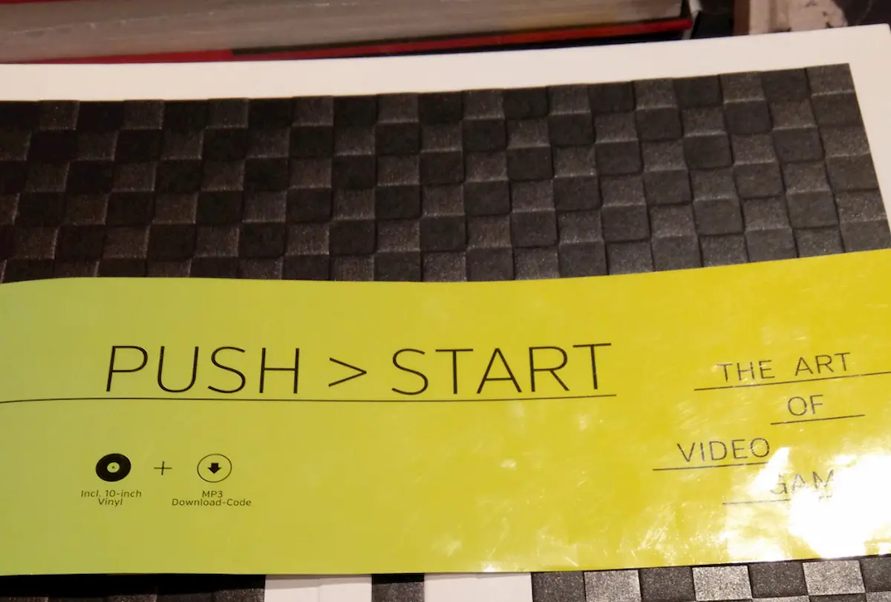
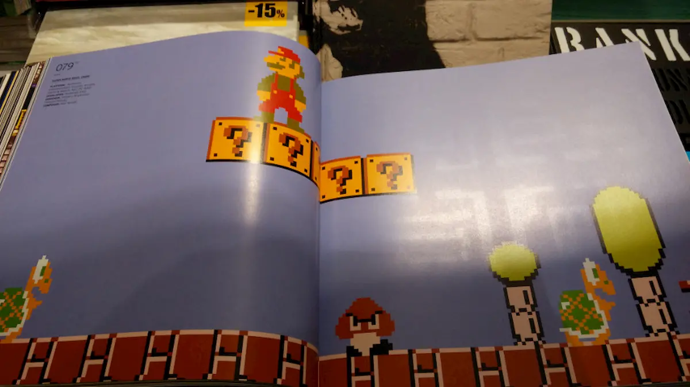
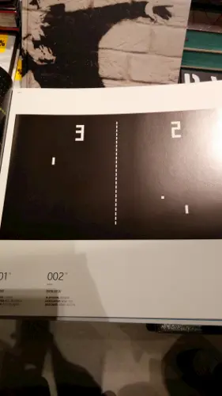
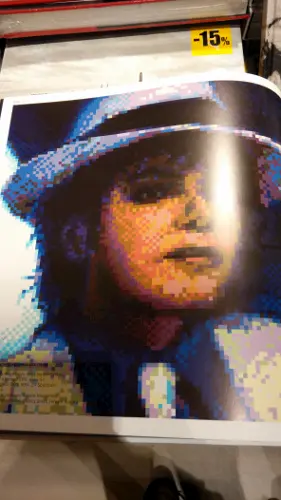
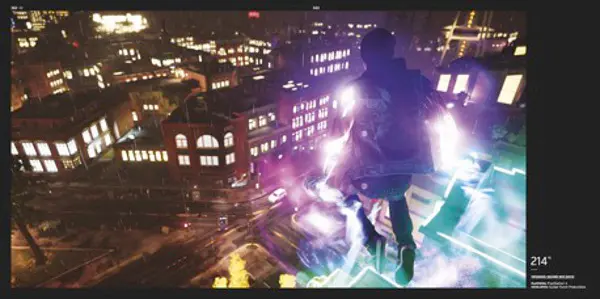
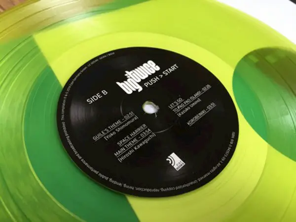

Natale. La ricerca dei regali per parenti, amici e fidanzato ha portato ad alcune scoperte interessanti: un [negozietto di chitarre nascosto](https://www.facebook.com/tramusicaetparole/posts/752917108126112 "Il misterioso mistero delle chitarre misteriose") dietro la stazione centrale di Milano, di cui parlerò meglio in futuro, e un librone assolutamente nerd. Anzi, geek, come direbbe il mio moroso, perché **Push > Start The Art of VideoGame** è un libro dedicato ai videogiochi, dai primi fino a quelli di quest'anno, curato e prezioso. Non ne esiste una traduzione in italiano, ma non serve nemmeno: **sono 380 pagine, zeppe di foto e di ricordi**. E c'è un vinile, un vinile vero, con una compilation delle colonne sonore più importanti dei videogiochi.

Sfogliando il libro ci si ritrova a rivivere i momenti della propria infanzia, quando una partita a PacMan era un'avventura, e il record dei record sempre a un passo ma irraggiungibile. Non sono l'unica ad averne nostalgia, lo so. Perché è di questo che parla la prima parte del libro, **di tutti quei giochi che ci hanno accompagnato** dalla fine degli anni '70 in poi. [Stephan Guenzel](http://www.btk-fh.de/de/team/stephan-guenzel/ "Stephna Guenzel, professore alla Berlin Technical Art School"), l'autore del libro, lo spiega così

> Un'intera generazione, durante la Guerra Fredda, è cresciuta con i film di fantascienza, l'incubo dell'invasione aliena e delle guerre stellari. Poi, improvvisamente, arrivò SPACE INVADERS. E poi GALAGA, TEMPEST (1981), STAR WARS (1983): le fantasie diventarono realtà. Per lo meno nel cyberspace.

Non è però un libro di storia, è più un compendio per **tracciare l'evoluzione grafica dai primi giochi dell'epoca d'oro degli arcade fino ai capolavori d'oggi in HD**.

Scorrendo il libro si nota un effetto collaterale abbastanza bizzarro nella storia dei videogiochi. I primi videogame sono stilizzati, rappresentano la realtà in maniera astratta e non hanno nessuna pretesa di realismo. Era impensabile, all'epoca, ricreare su computer o su console la realtà in maniera fedele, per una semplice questione tecnologica.

Però più passa il tempo, e più la tecnologia procede, più la grafica tende a diventare importante in un gioco. E iniziano ad apparire le prime pretese di realismo. Però sono pretese velleitarie, e il continuo alternare tra grafica 3D e pixel crea un effetto bizzarro, e per certi versi disturbante anche se divertente.

La storia dei videogiochi è la storia della pixel art. O, per lo meno, lo è stato fino a poco tempo fa perché solo con le più recenti console, e con schermi in grado di far girare giochi in HD, il videogame si è emancipato dai quadratini colorati.

Il dibattito, decennale, sul considerare o meno i videogiochi una forma d'arte trova una sua complicazione. Se fino a qualche anno fa la parte grafica dei videogiochi era vincolata alla potenza di PC e delle console, oggi non è più così. Alcune creazioni ludiche competono con i colossal hollywoodiani sia per budget che per effetti speciali (grafici) che per musica.

A proposito di musica, **a corredo di Push Start: The Art of Video Games c'è un vinile**.

Il vinile contiene, incisi su due lati, 8 temi per altrettanti videogiochi:

> Lato A 1. Vampire Killer (Kinuyo Yamashita) 2. Super Mario Bros Main Theme (Koji Kondo) 3. Dr Wily's Theme (Takashi Tateishi) 4. Master Ninja Theme (Keiji Yamagishi)
>
> Lato B 1. Guile's Theme (Yoko Shimomura) 2. Space Harrier Main Theme (Hiroshi Kawaguchi) 3. Let's Go To Pao Pao Island! (Kazuko Umino) 4. Korobeiniki (davvero non conoscete la musica di Tetris?)

Chi non ha un vinile a casa può comunque scaricare l'MP3 del disco dal sito della casa editrice [earBOOKs](https://www.edelbooks.com/buecher/earbooks/ "earBOOKS"). Oppure, se vi interessa, potete anche ascoltarle gratis sul [canale YouTube di Push Start](https://www.youtube.com/user/earBOOKS/videos "Ok, in realtà è il canale video della casa editrice").
