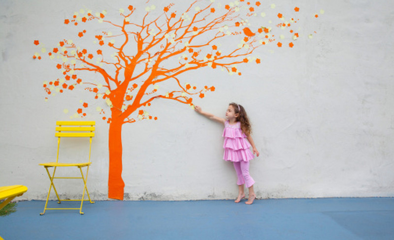

Premetto che questo post nasce come spunto di riflessione che è conseguito all'[intervista con **Conchita Wurst**](https://www.tramusicaeparole.com/conchita-wurst-il-mio-obiettivo-e-essere-felice/). In **You Are Unstoppable**, uno dei brani contenuti nel suo album di esordio, canta

> Sometimes it's just gonna hurt – yeah But you gonna live and learn – yeah You're stronger than you believe you are You are unstoppable!
>
> A volte ti farà male Ma sopravviverai e imparerai Sei più forte di quanto tu creda di essere Sei inarrestabile

Un messaggio tanto semplice quanto straordinario e dirompente, in quanto siamo in molti a bloccarci per mancanza di autostima. Mi è venuto spontaneo, dopo quella chiacchierata, chiedermi **quali sono i meccanismi mentali che ci frenano** e ci fanno perdere in un bicchier d'acqua. E, come immaginate, sono davvero tanti. Siamo bravissimi a auto-criticarci e condannarci, mentre dovremmo imparare ad essere un pelo più indulgenti con noi stessi.

Dicevo, sappiamo sempre come muovere delle critiche a noi stessi, mentre invece dovremmo essere più concentrati su come evitare di cadere in queste trappole. **Il rimedio c'è ed è molto semplice**: basta focalizzarci sulle empasse che ci sembrano insormontabili e guardarle con un occhio obiettivo. Fidatevi, non saranno mai così gravi come quando le vedete in un momento di panico.

Per la buona riuscita di questa fase, però, ci sono delle **riflessioni** sulle quali sarebbe utile soffermarsi più spesso, soprattutto quando stiamo andando in crisi. Ecco, quindi, la lista delle **10 cose da ripetersi quando tutto sembra andare storto.**

1. Non serve a nulla piangere sul latte versato e recriminare su quanto successo. E' molto più utile, invece, ricavarne insegnamenti.
2. Una sfida è un ostacolo solo se glielo permettiamo.
3. Ci rialzeremo ogni volta, sempre più forti di prima.
4. E' meglio sbagliare rimanendo se stessi che agire nel modo giusto snaturandosi.
5. Se non abbiamo tempo per le cose importanti, è ora di smettere di fare quelle non importanti.
6. Saremo felici solo quando ci permetteremo di esserlo.
7. Andare avanti è importante ma è ugualmente essenziale lasciarci alle spalle chi ci ha messo in difficoltà.
8. La strada per la realizzazione personale è fatta di piccoli passi, ognuno meritevole di esser celebrato.
9. Non sprechiamo tempo prezioso pensando di essere migliori, bensì lavoriamo per migliorare costantemente.
10. Non nascondiamoci dalle nostre paure: nascondono, al loro interno, qualcosa per cui vale la pena lottare.

Come potete notare, **i più grandi competitor di noi stessi siamo proprio noi**. Spesso tendiamo a sentirci dei falliti se il primo tentativo di raggiungere il nostro intento risulta vano. L'aspetto meraviglioso della vita è che non è sempre tutto rose e fiori, a volte bisogna lottare non poco per ottenere gli obiettivi che ci siamo prefissati. Ma è proprio grazie a questi momenti no che riusciamo ad oltrepassare le avversità e a comprendere quanto siamo forti, nel bene e nel male. Perché, proprio come dice Conchita nella sua canzone, siamo "_unstoppable_".

