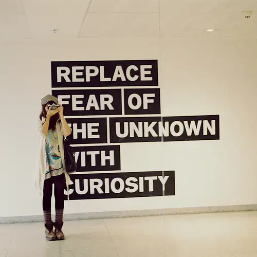
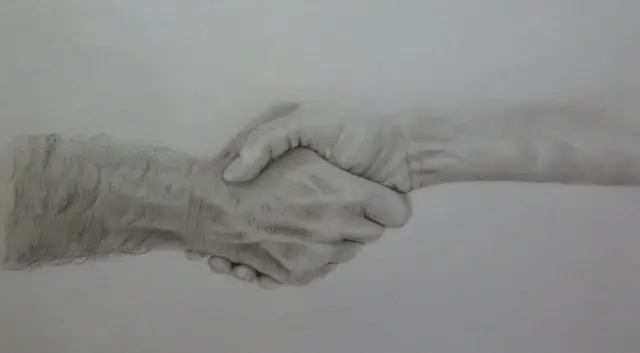
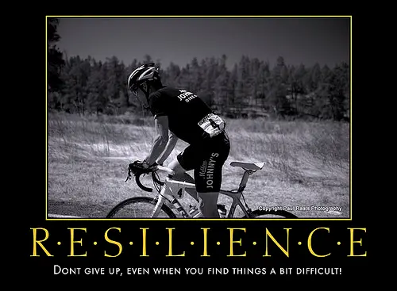
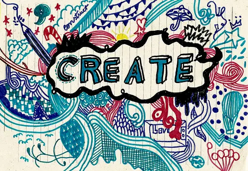
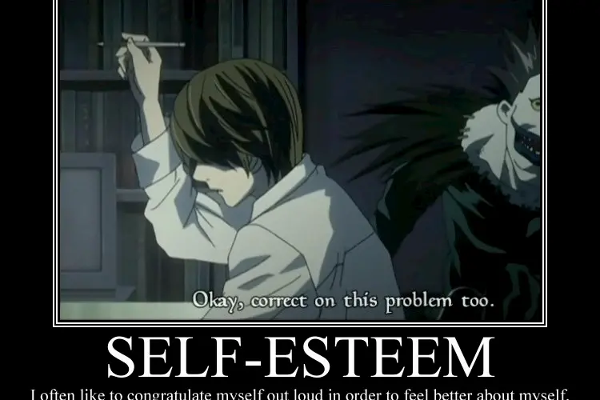

Sin dalla prima adolescenza cerchi, in ogni modo, di uscire da quella dimensione di incertezza che a tratti ti ottenebra la vista. Hai un lavoro soddisfacente, un partner e una famiglia che ti adora. Oppure sei felicemente single e hai un lavoro che ti fa sentire realizzato/a e, in caso contrario, sai, dentro di te, di poter avere tutte le risorse per dare una svolta alla tua vita. Perfetto, allora dove sta il problema? Il punto è proprio questo: talvolta non ce ne rendiamo conto ma, a causa del nostro comportamento, ci tarpiamo le ali da soli. Non farti prendere dal panico: con un po’ di impegno, e senza snaturare te stesso, potrai sviluppare alcune caratteristiche che ti faranno essere una persona vincente. Sei pronto? Via!

### Pazienza

> “Ogni potere umano è composto di tempo e di pazienza” (Honoré de Balzac).

Ti sembrerà una frase fatta, ma è proprio vero che la pazienza è una delle virtù più grandi che possa avere un essere umano. Attenzione a non confondere il concetto di pazienza con quello di pigrizia. Essere paziente non significa stare sdraiato a contemplare le stelle sperando di veder ciò che vuoi cadere magicamente dal cielo, bensì avere metodo e lavorare seguendo i tuoi princìpi per ottenere risultati a lungo termine. Non te lo nascondo, è un percorso lungo e, talvolta, anche tormentato ma ti assicuro che vale la pena di fare fatica se, in cambio, potrai godere a lungo dei benefici. Ovviamente dovrai avere molta costanza anche dopo il primo traguardo: i tuoi risultati sono come delle piantine che necessitano di acqua e luce ogni giorno, senza bisogno di essere trascurate o, al contrario, sottoposte a trattamenti forzati per vederle fiorire più in fretta.

### Curiosità

La curiosità è il nettare per crescere intellettualmente e umanamente. La fame di apprendimento, infatti, contribuisce a sviluppare una vivacità acuta, la stessa che ti porterà a considerare i vari accadimenti della vita da più punti di vista. Essere curioso significa uscire dalla tua comfort zone, esporti e allargare i tuoi orizzonti. La lezione migliore che puoi apprendere dalla tua curiosità è mantenere un approccio mentale attivo che, inevitabilmente, ti spingerà ad essere sempre mentalmente giovane. Non farti intimorire da strane paure ma osa chiedere e imparare: fa’ progressi ed esperienze, sbaglia e trai insegnamenti dai tuoi errori. Così facendo, inizierai a guardare avanti, avrai ambizioni sane e migliorerai, diventando una persona vincente. Lascia che la curiosità ti accompagni sempre e ti faccia vivere ogni aspetto della tua vita come un viaggio.

### Interazione

Per certi versi, forse, la spinta all’interazione è la caratteristica più difficile da sviluppare. Se sei una persona estroversa, ti risulterà facile in quanto ricarichi le tue energie dalle situazioni sociali. Se, invece, sei una persona introversa, dovrai combattere con te stessa per autoconvincerti a presenziare a iniziative ed eventi sociali. La tentazione di metterti in un angolino e cercare un libro per isolarti dal mondo sarà forte, fortissima. Tuttavia, sia che si tratti di occasioni di lavoro o un party organizzato da amici, fare network e stringere conoscenze è fondamentale. Anche se la maggior parte di quelle persone non le vedrai più, prendi questa occasione come un allenamento per essere più propositiva. Non potrai che trarne giovamento, alla lunga. Solo un consiglio: non passare da un estremo all’altro, il rischio sarebbe fingere di essere ciò che non sei e ne andrebbe a discapito della tua serenità personale. Perché, ricordati, la prima regola per essere una persona vincente e di successo è rimanere coerenti a se stessi e alla propria natura, smussandola ma non stravolgendola.

### Resilienza

Adotta la resilienza come tua filosofia di vita. Cosa s’intende, di preciso, col concetto di resilienza? In poche parole, la resilienza è la capacità di affrontare momenti dolorosi e traumatici attraverso la ricostruzione di sé e la riorganizzazione della propria vita, senza però alienarsi. Inizialmente, accetta l’idea di non poter controllare nulla, se non i tuoi pensieri. Una volta che avrai fatto pace con questa indiscutibile realtà, avrai uno strumento migliore per convivere con le avversità che la vita ci propina quotidianamente. Certo, ognuno ha il suo carattere e il suo modo di reagire: c’è chi cerca di combattere un momento no negandolo, c’è chi si crogiola e chi, dopo un attimo di crisi, si rialza e va avanti nonostante tutto. Non ti sto dicendo di diventare un supereroe, ma solamente di non mollare mai, anche quando stai guardando il mondo intorno a te con delle lenti nere. Dipende tutto dalla tua volontà e dal tuo istinto di sopravvivenza. Inizialmente è difficile ma, passo dopo passo, diventerai più forte - e resiliente - che mai.

### Creatività

Se la curiosità è la spinta mentale per crescere, la creatività è mettere in atto tutti gli insegnamenti, teorici e pratici, appresi e applicarli dandone nuova veste e forma. Mi spiego meglio: la creatività è uno degli strumenti più potenti a tua disposizione, ma devi anche imparare ad allenarla. E’ bello fantasticare di svegliarsi, durante la notte, in preda ad una ispirazione che può rivelarsi l’idea della vita. La verità, però, è ben diversa: la cosa migliore che puoi fare per sviluppare questo tuo aspetto è considerare la creatività come un muscolo che deve essere allenato ogni giorno per poter essere performante. Ci saranno giorni in cui ti sarà più facile, altri in cui sarà un’impresa titanica. L’importante è mettersi le gambe in spalla e lavorare, lavorare, lavorare. Con creatività non intendo esclusivamente il senso stretto del termine, quello legato all’arte - pittura, scrittura o musica - bensì la chiave per rendere originale la tua vita, mettendoci tutto te stesso. Insomma, abbandonare l'ordinario e far pace col proprio lato creativo. Tutti lo abbiamo, basta coltivarlo e lasciarlo esprimere, distinguersi dalla massa e far emergere la propria identità

### Fiducia in se stessi

Ultima in ordine di apparizione, ma prima come importanza, è la fiducia in te stessa. Nei primi vent’anni della tua vita, a meno che tu non sia una delle pochissime eccezioni, avrai sicuramente combattuto con i tuoi mostri neri, ovvero quella parte di te colpevole di farti sentire inferiore verso tutti e a tutto, una sorta di trasposizione realistica del “brutto anatroccolo”. Vuoi sapere la bella notizia? I tuoi mostri neri non hanno ragione e, soprattutto, colpiscono molti giovani. A un certo punto, però, è ora di metterli da parte e sbocciare, diventando un meraviglioso cigno. La parola chiave è risorgere dalle proprie ceneri per migliorarsi, inizia a usare la tua energia come un motore per andare avanti e prendi il controllo della tua vita. Non potrai che sentirti una persona vincente e orgogliosa di ciò che è diventata. Ascolta te stesso, i segnali che ti manda il tuo corpo, i tuoi sentimenti e i tuoi pensieri, senza perdere il controllo. E, soprattutto, non essere più lo spettatore del tuo film chiamato vita: diventane il protagonista.
