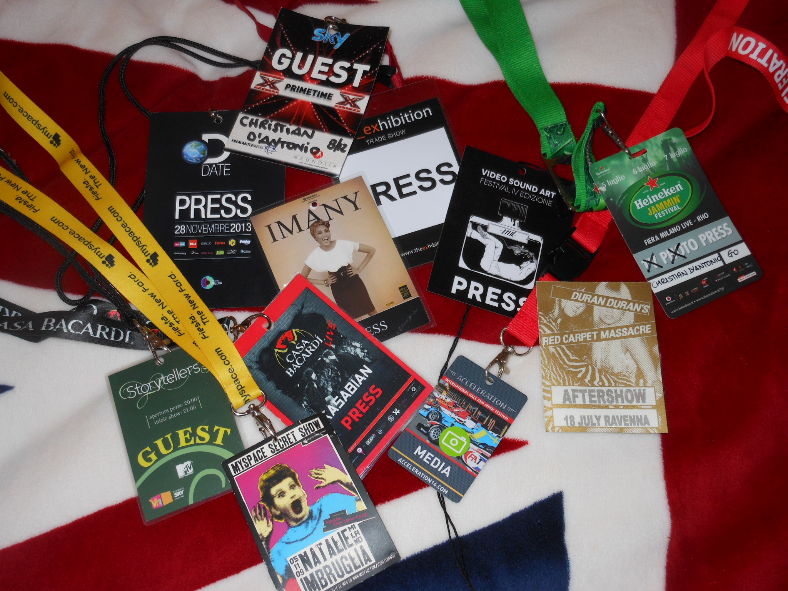
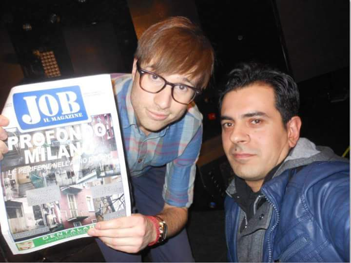

_Sulle pagine di questo blog, quando si tratta di musica, parlo della mia esperienza professionale e non. Ritengo opportuno, tuttavia, offrire altri punti di vista sul pazzo mondo del giornalismo musicale. Qui di seguito troverete l'intervista che ho fatto a un collega col quale ho condiviso parecchie conferenze stampa, con un'esperienza decennale e che ha tutta la mia stima._

**Ciao Christian, partiamo da una piccola presentazione. Da quanti anni sei giornalista, per quali testate scrivi e di quante tematiche parli?**

Sono un membro attivo della stampa italiana dal 2000, per così dire. Ho iniziato lavorando in un'agenzia stampa prevalentemente impegnata in cronaca ed economia per quotidiani. Poi dal 2004, quando ho superato l'esame da professionista, mi sono concesso degli sconfinamenti in altri campi, come lo spettacolo e la cultura. Nei primi anni 2000 ho partecipato al lancio di Tu, un femminile della Mondadori, che in Italia fu una sorta di caso editoriale: un settimanale alla portata di tutti con tematiche varie trattate con leggerezza ma molto dettagliate. Per loro ho iniziato a seguire le grandi manifestazioni canore italiane, come il Festivalbar e il Festival di Sanremo. Poi ho collaborato con Grazia, Panorama, Freequency e Metro. Oggi lavoro a [jobnotizie.it](http://www.jobnotizie.it/), e faccio articoli di showbiz su [mydreams.it](https://www.mydreams.it/) e [riocarnivalfanzine.com](http://www.riocarnivalfanzine.com).

**Si dice spesso che chi sceglie la carriera di giornalista musicale è una persona che, come sogno iniziale, aveva quello di diventare musicista. Quanto c'è di vero in questa affermazione?**

Forse sono un musicista frustrato, è vero. Ma da piccolo i miei volevano che imparassi la chitarra classica e dopo due anni ho lasciato perdere. Se avessi potuto schitarrare con un'elettrica assecondando la ribellione dei 13 anni sarebbe stato diverso, chissà. Non c'è niente di male ad avere più attitudine all'ascolto che alla composizione o all'esecuzione, è una cosa che ormai mi ripeto da tempo. Però quello che dici è vero. Anche se ci sono vari modi per amare e fare la musica, specie oggi che non c'è bisogno di particolari tecnicismi per crearla. Non so bene cosa sia un giornalista musicale oggi. Forse è la figura che indirizza e propone cose interessanti, non necessariamente con un punto di vista oggettivo. Un punto di vista è di per sé già una scelta, come non parlare di alcune cose piuttosto che di altre. E la professione nell'era digitale è totalmente cambiata. Tutti possiamo essere con i social network una potenziale fonte di informazione e non vivo questa possibilità come una minaccia. Mi augurerei di trovare sempre più competenza in giro, questo sì. I mezzi ci sono e bisogna sfruttarli, tutto è alla portata di tutti. Io per risalire alle influenze degli artisti che amavo dovevo vestirmi, scendere di casa, trovare un negozio di dischi fornito. Ora basta accedere al web. Ma quanti lo fanno?

**Come sei arrivato a imboccare questa strada? Sono stati gli eventi della vita a portarti qui o c'è stato un momento in cui ti sei detto "voglio fare il critico musicale"?**

Ho collaborato ad alcune fanzine di gruppi che seguivo nei primi anni 90 e gli articoli venivano apprezzati. Poi nel 1998 ho iniziato a scrivere recensioni nelle pagine dei lettori per alcuni mensili e con mia sorpresa, venivano pubblicate! Quindi ho pensato che ci fossero spunti interessanti. Però ho dovuto attraversare il purgatorio della cronaca economica per arrivare a fare professionalmente quello che volevo.

**Adori la musica synth-pop anni '80 in generale, ma hai soprattutto una predilezione per i Duran Duran. Tanto che, nel 2006, hai scritto il libro "Duran Duran - Glam Pop Party". Quanto tempo ci hai lavorato e come hai gestito la gran mole di lavoro che questo libro ha richiesto?**

L'ho scritto con un musicista napoletano, Marcello Santone e la cosa ha dato molto spessore al libro. Volevamo mettere in risalto la valenza musicale di un gruppo che fino agli anni 2000 è stato sempre considerato, almeno in Italia, una band per teen ager. Avevamo pensato a una benedizione da parte degli stessi Duran, ma le cose si sono complicate perché queste grandi star vogliono avere, e giustamente dico io, il controllo su tutte le minuzie che vengono pubblicate, se in maniera ufficiale. Quindi abbiamo desistito e abbiamo raccolto informazioni e interviste a persone che avevano lavorato con loro e che ne avevano seguito da vicino la parabola. Per me è stata una sfida quasi investigativa, perché erano anni in cui il web aiutava già molto ricerche di questo tipo, ma non c'erano i social network come adesso. Quindi a essere onesto non so come ho fatto, ma ho rintracciato gli uscieri dei locali e gli ingegneri del suono in giro per il mondo che avessero qualcosa da dire sulla carriera del gruppo.

**C'è una cosa che mi incuriosisce: immagino che tu li abbia contattati più e più volte. In quanto tempo e come sei riuscito a convincerli a parlare?**

Nel libro loro non parlano consapevolmente. Ho riportato cose che mi erano state dette nei backstage o negli studi di registrazione. Non è stata un'operazione riconosciuta dalla band o dal management e questo secondo me ha dato un sapore più interessante al libro. Si tratta di una libera ricostruzione delle mie memorie e del contesto in cui sono usciti i vari dischi della band, dal 1981 al 2005. Ho preso molto dalla stampa dell'epoca, dagli special in tv, dalla mia immensa collezione di cimeli degli anni 80. Mi hanno aiutato molto delle chiacchierate che ho fatto negli anni specie con John Taylor o Warren Cuccurullo. E poi ho tanti ricordi di cose incredibili che mi sono successe a Londra, specie negli anni 90, seguendoli, che nessuno poteva confermare o smentire, le ho vissute io e se avevano un interesse sono state utilizzate, spero nel modo più appropriato. Vedi, ho ammirato molto la sincerità delle grandi autobiografie delle leggende, da Dylan, Richards a Wood. Ma il sapore quasi "sinistro" dei racconti dei contemporanei e dei collaboratori dei rocker ti offre una prospettiva più interessante, perché più libera, più esterna.

**Al libro del 2006 ne sono seguiti altri?**

No, ho collaborato a delle iniziative editoriali dedicate al sociale, perché sono stato chiamato a lavorare in un giornale di un sindacato e quindi la vita professionale mi ha portato a questo. Però voglio tornare sugli anni 80, specie sul clima generazionale che si respirava in Italia in quegli anni. Lo farò prima o poi perché credo che di approfondimenti come questo manchino nel panorama editoriale musicale italiano, ammesso che ce ne sia ancora uno.

**Consiglieresti a qualche tuo collega di scrivere un libro sul suo gruppo preferito?**

Certo, se ben documentato e ricco di "trivia" è quasi un obbligo morale per chi fa questa professione. Io voglio poter leggere qualcosa di qualcuno che ne sa più di me. Ma non mi interesserebbe molto il rapporto diretto tra l'autore e l'artista, che è un punto dolente, secondo me, di molti libri del genere che escono sul mercato. Tu, collega, spiegami come è venuto fuori il protagonista dalle tue ricerche, ma non raccontarmi come vi siete conosciuti, per intenderci.

**Cosa ne pensi dell'atteggiamento di supponenza e superiorità che alcuni critici hanno sviluppato verso la musica? Non credi che questa professione, come tutte le altre, avrebbe bisogno di umiltà e passione, per essere ben svolta?**

E che dire della letteratura o del cinema? Il protagonismo dei critici è sempre la peggior bestia con cui, specie i lettori, devono fare i conti. Ma non credo ci sia una critica musicale italiana in questo momento in grado di muovere o annientare consensi. Chi fa più recensioni? Dove si vedono i resoconti dei concerti? Ci si limita a fare i classici pezzi d'apertura, per compiacere direttori e uffici stampa. Interviste a raffica su come sarà il concerto o il disco, ma di critica ben poca. Poi c'è un problema generazionale: un quarantenne come me ha i piedi negli anni 80 e la mente nel 2015. Chiaro che si ha più riferimenti a cui attingere, facile dire "Oh, Charlie XCX fa quello che faceva Neneh Cherry nel 1989". Ma bisogna ricordarsi della necessità di spiegare e contestualizzare. L'equilibrio è un dovere per un giornalista, anche se bisogna riconoscere che tra Youtube e talent show siamo noi stessi invasi da prodotti in maniera centuplicata rispetto a qualche tempo fa. E secondo me questa quantità abnorme di stimoli e richieste di attenzione crea in chi filtra una certa insofferenza.

**Che suggerimento ti sentiresti di dare a un adolescente o poco più che vorrebbe fare il tuo lavoro?**

Sembrerà bizzarro ma lo spingerei a leggere più che a scrivere. Da una cosa parte l'altra, secondo me. E nel campo musicale sarebbe bene che si attrezzasse: curiosità per tutti i generi, sapersi costruire una library digitale di 5 decadi e conoscenza di almeno due lingue. La prima, ovviamente, l'italiano. Troppo difficile?
