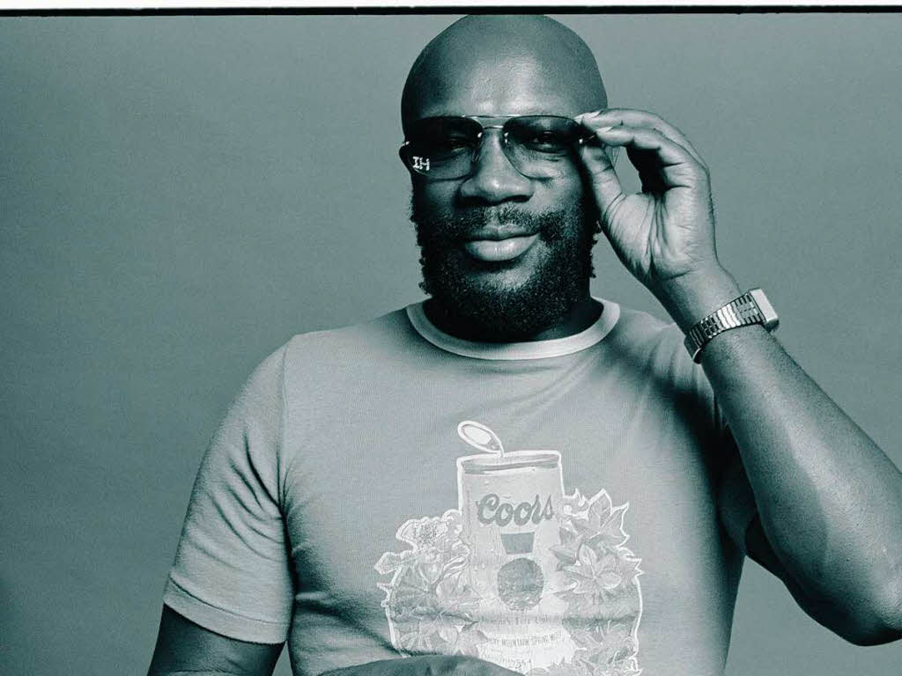
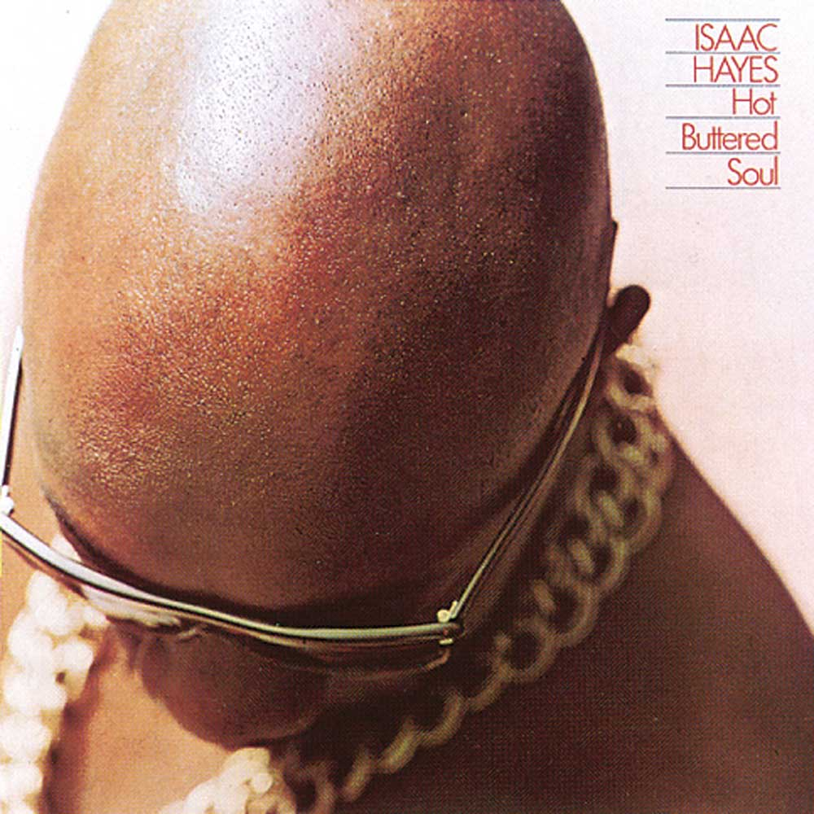

Nel Gennaio del 1968 Estelle Axton e Jim Stewart scoprirono con orrore di non possedere più le loro canzoni. Firmando l'accordo con Atlantic Records erano riusciti a rimodernare il vecchio studio di registrazione e lanciare molteplici artisti. Ma allo scadere tutto il catalogo della [**Stax Records**](https://it.wikipedia.org/wiki/Stax_Records) passò di mano. Non c'era spazio per negoziare, un'etichetta discografica senza dischi non vale nulla. Estelle e Jim avevano perso il loro sogno, divorato dalla famelica Atlantic, vittima della visione ingenua della musica. Ma **non tutto era perduto**.

Nel 1965 avevano affidato la promozione a un venticiquenne disc jockey, [**Al Bell**](https://en.wikipedia.org/wiki/Al_Bell). Al era una fucina di idee e portò alla Stax Records molti giovani artisti. La sua idea era provare giovani talenti, dando loro fiducia e producendo la loro musica. Davanti alla catastrofe **non si arrese** e affrontò lo spettro del fallimento nell'unico modo che conosceva: con la musica. Se l'Atlantic s'era appropriata della storia della Strax, allora la Strax doveva ricreare nuovamente la propria storia. Per farlo, decise Al, serviva lanciare contemporaneamente 27 dischi e 30 singoli. Molta, molta musica, e buona musica, in un solo momento: **condensare dieci anni in uno**.

L'album numero 27 se lo accaparrò [**Isaac Hayes**](https://en.wikipedia.org/wiki/Isaac_Hayes). Il suo primo album, _Presenting Isaac Hayes_, era passato abbastanza inosservato. E, probabilmente, sarebbe anche stato l'ultimo della sua carriera se Al Bell non lo avesse chiamato per portare a compimento l'ambizioso piano. _\- Serve anche il tuo aiuto, Isaac - Ok, ci sto. Ma posso avere un album tutto mio? - Sì, sarà il ventisettesimo - E posso fare la mia musica? - Devi farla!_

Più tardi, quando tutta questa storia sarà passato, Isaac ricorderà così quell'esperienza

> C'erano altri 26 album prima del mio. Penso che nessuno avesse il tempo di farmi pressioni o discutere le mie scelte. Al mi aveva dato carta bianca, e così feci di testa mia.

Ne uscì un album di sole 4 tracce, di cui una cover di quasi 20 minuti di _By the Time I Get to Phoenix_. Era l'album di Isaac Hayes, fatto per Isaac Hayes, secondo il gusto di Isaac Hayes. E fu un successo.

[**Hot Buttered Soul**](https://en.wikipedia.org/wiki/Hot_Buttered_Soul) conquistò immediatamente la testa delle classifiche, vendette oltre tre milioni di dischi, ispirò artisti R&B del calibro di Marvin Gaye e Stevie Wonder. Ed è tutt'ora **una pietra miliare del soul**.

[via](https://99u.com/articles/7300/the-stax-records-guide-to-overcoming-setbacks)
