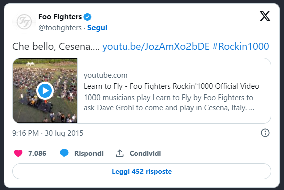
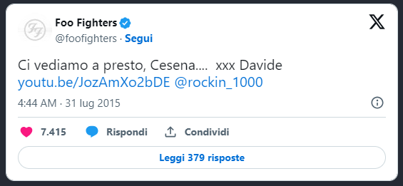
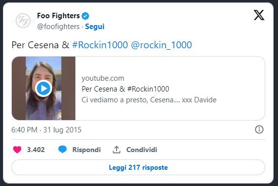

La notizia ormai la sapete tutti: il **sogno dei Rockin'1000**, ovvero **far suonare i Foo Fighters a Cesena, diventa realtà**. Ma chi sono, esattamente, i Rockin'1000?

Partiamo dall'inizio. Siamo nel mese di maggio 2014 e **Fabio Zaffagnini**, fondatore della start up Trail Me Up - che realizza sistemi di realtà virtuale aumentata per vedere sentieri e percorsi remoti - nonché appassionato di musica rock, **ha un'idea tanto geniale quanto folle**: portare a suonare a Cesena i Foo Fighters. **L'ultima volta** che la band di Dave Grohl si esibì in Romagna **fu nel 1997**, in occasione del tour di supporto al secondo album "_The Colour And The Shape_".

Con l'adrenalina a mille, **Fabio chiama Anita, Claudia e Martina** per raccontare loro dell'idea che gli sta girando per la testa: radunare 1000 musicisti e far suonare loro un brano dei Foo Fighters, in modo da farlo arrivare alla band e convincere i suoi membri ad esibirsi a Cesena. Le tre ragazze, entusiaste, **decidono di seguire Fabio nell'impresa eccezionale.**

Nel mese di settembre, dopo le vacanze estive, la grande **macchina dei Rockin'1000 si mette in moto**: al nucleo del progetto si uniscono fonici, addetti stampa, tecnici, grafici, webmaster, responsabili per il fund raising e musicisti. A questo punto, con una vera e propria equipe di addetti ai lavori in ogni settore, **è ora di promuovere il progetto Rockin'1000 attraverso un video**, diffuso il 18 dicembre 2014, che spiega nei dettagli l'iniziativa.

<iframe width="560" height="315" src="https://www.youtube.com/embed/OU_GqfT-Y6Q" frameborder="0" allow="accelerometer; autoplay; encrypted-media; gyroscope; picture-in-picture" allowfullscreen title="Rockin'1000"></iframe>

La notizia ha un'eco mondiale: **la stampa nazionale e internazionale specializzata comincia a occuparsi del fenomeno Rockin'1000**, perché quella che all'inizio sembrava un'idea del tutto irrealizzabile, assume i contorni di un'impresa che potrebbe anche rivelarsi fattibile. Tuttavia, occorrono ben 40.000 euro per far sì che tutto possa accadere e i tempi sono piuttosto limitati. I ragazzi di Rockin 1000 decidono così di organizzare, in data 14 marzo 2015, una **festa per la raccolta fondi presso il Teatro Verdi di Cesena**. Per l'occasione, viene anche presentato il video in romagnolo con sottotitoli in italiano per spiegare, ancora una volta, **come aderire alla campagna di fundraising**.

<iframe width="560" height="315" src="https://www.youtube.com/embed/F0ApAYsbErk" frameborder="0" allow="accelerometer; autoplay; encrypted-media; gyroscope; picture-in-picture" allowfullscreen title="Rockin'1000"></iframe>

Il brano dei Foo Fighters che i musicisti (250 cantanti - 350 chitarristi - 150 bassisti - 250 batteristi) sono chiamati a suonare è "_Learn To Fly_**"**, uno dei maggiori successi della formazione statunitense. La ragione è principalmente il fatto che, essendoci sia uomini che donne cantanti, è necessario che la canzone sia eseguibile da tutti senza particolari problemi di estensione. **Tuttavia, nonostante siano arrivate molte risposte,** **raccogliere 1000 musicisti è davvero complicato** e, a ridosso della scadenza del crowdfunding, Fabio prende la decisione sofferta di **prolungare la durata della campagna di fund raising fino alla fine di maggio**. Perché se è vero che, pochi giorni prima, i Foo Fighters hanno annunciato una data a Bologna per il 2015, oramai **si tratta di una missione da compiere** o, quantomeno, provarci.

<iframe width="560" height="315" src="https://www.youtube.com/embed/Ya7T5Ay0Wvk" frameborder="0" allow="accelerometer; autoplay; encrypted-media; gyroscope; picture-in-picture" allowfullscreen title="Rockin'1000"></iframe>

Nel frattempo, dopo alcune indiscrezioni, viene reso noto il nome di colui che dirigerà i 1000 musicisti: si tratta del **direttore d'orchestra Marco Sabiu**, un professionista molto noto nel mondo della musica. Oltre ad averlo visto varie volte sul palco del Festival di Sanremo, **Sabiu ha lavorato con** artisti del calibro di **Ligabue, Luciano Pavarotti, Take That, Ennio Morricone e Kylie Minogue**. Il 30 maggio 2015, l'annuncio del raggiungimento del budget. Da qui è una corsa contro il tempo per organizzare tutto quanto, dalla preparazione dei musicisti (suonare con altri 349 chitarristi o cantare con altre 249 persone non è cosa facile), alla location dell'esibizione. **Nessun dettaglio può esser trascurato**. Non adesso.

Il pomeriggio di **domenica 26 luglio**, il sogno prende finalmente forma: **1000 musicisti suonano e cantano contemporaneamente "Learn To Fly", al Parco Ippodromo di Cesena**, dando vita a una performance davanti alla quale si rimane senza parole.

<iframe width="560" height="315" src="https://www.youtube.com/embed/JozAmXo2bDE" frameborder="0" allow="accelerometer; autoplay; encrypted-media; gyroscope; picture-in-picture" allowfullscreen title="Rockin'1000"></iframe>

Alla fine del brano, Fabio rivolge infine un appello ai Foo Fighters:

> Immagino che molta gente, in tutto il mondo, vedrà questo video ma in realtà è stato pensato solo per 5 persone. Ovvero Chris, Pat, Nate, Taylor e Dave Grohl, i Foo Fighters. L'Italia è un paese in cui i sogni non si possono esaudire molto facilmente, ma siamo un popolo passionale e creativo. Quello di oggi **è un vero e proprio miracolo**. E' da più di un anno che lavoro a questo progetto, alzandomi ogni mattina pensando a come poter realizzare il tutto. Questo è il risultato: 1000 persone, 1000 rocker, provenienti da tutta la nazione che sono venute qui a loro spese, e l'hanno fatto solo per una canzone: la vostra. Ciò che vorremmo chiedere a voi, i Foo Fighters, **è di venire qui a suonare**, **di fare un concerto qui, a Cesena, per tutti noi.** E vorrei chiedere, a tutti i presenti, di fare un urlo per i Foo Fighters!

A poche ore dalla pubblicazione del video, la risposta di **un emozionatissimo Dave Grohl** e dei Foo Fighters non si è fatta attendere.

<iframe width="560" height="315" src="https://www.youtube.com/embed/qD35ASXHmsU" frameborder="0" allow="accelerometer; autoplay; encrypted-media; gyroscope; picture-in-picture" allowfullscreen title="Rockin'1000"></iframe>  

Perché mi ha colpito tanto questa iniziativa? Perché è la vera dimostrazione che, se si vuole, si può fare davvero tutto o quasi. E **i Rockin'1000 sono riusciti a smuovere le montagne**, a trasmettere il messaggio che **l'amore per la Musica è più forte di qualsiasi cosa**. **Vedere 1000 persone che suonano la stessa canzone**, senza voler primeggiare ma solo con la voglia di divertirsi e abbracciarsi, in un periodo in cui la disillusione la fa da sovrana, **fa commuovere**, è davvero un miracolo. Altrettanto toccante è il messaggio di Dave Grohl. Le **rockstar sono abituate ai tributi**, alcune quasi non li apprezzano: Dave, invece, ci dimostra che **la musica è fatta anche di uno scambio reciproco di emozioni**, di persone che amano ascoltare e altre che amano suonare, di esseri umani uniti dalla stessa passione. E ci racconta che puoi essere anche il musicista rock più esperto e navigato del mondo ma **se hai un animo sensibile**, e porti un gran rispetto per il tuo pubblico, **restare indifferenti è praticamente impossibile**.

Mi sento di fare **un applauso** a tutti: **a Dave e i Foo Fighters per** essersi dimostrati così umani da **rispondere al volo** **e accettare l'invito**. **Ai 1000 musicisti - e al Maestro Marco Sabiu** - che si sono riuniti, per aver messo tutti loro stessi e **aver dato uno spettacolo grandioso**, totalizzante, energizzante e altamente emotivo. **Ai tecnici** e a tutti i membri dello staff, **che hanno dedicato ogni energia** per la riuscita del progetto. E ultimo applauso, ma non meno importante, **a Fabio Zaffagnini per averci insegnato che** non bisogna aver paura di sognare, al contrario **dobbiamo alimentare i nostri sogni**. Perché anche le idee più pazze, se sostenute da una grande determinazione, possono diventare realtà. Per questi, e tanti altri motivi, i Rockin 1000 passeranno alla storia.

**E ai detrattori** - vogliamo chiamarli anche rosiconi? - che hanno criticato l'iniziativa perché non amano in particolar modo la canzone o il gruppo, **rispondo così**: questo episodio non c'entra affatto col genere musicale che si preferisce o meno. C'entra con **la passione, con l'amore, con la forza propria della Musica**, che demolisce ogni barriera e ci rende tutti uguali. Se davvero non apprezzate, vi consiglio di fare un bagno **di semplicità e speranza**. Non può che farvi un gran bene.

<iframe width="560" height="315" src="https://www.youtube.com/embed/1VQ_3sBZEm0" frameborder="0" allow="accelerometer; autoplay; encrypted-media; gyroscope; picture-in-picture" allowfullscreen title="Rockin'1000"></iframe>
