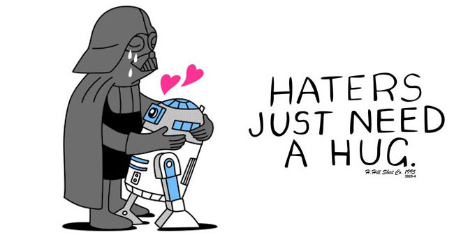

È il destino di ogni essere umano: qualsiasi sia la tua professione, le tue ambizioni o i tuoi progetti **incapperai**, almeno una volta nella vita, **in un hater**. **Cos'è**, scientificamente, **un hater?** Non è altro che **una persona** (o un gruppo di persone) che, per qualche astruso motivo, decide di **prenderti di mira**. Può essere un familiare, un collega, un ex fidanzato o qualsiasi altro individuo che incrocia la tua strada e decide di darti filo da torcere, nella vita reale e su Internet. Sarò sincera: **non è una cosa gradevole** avere un hater e c'è poco da esser contento se ne hai.

(Se ci pensi bene, **godere di essere odiati è controproducente** e, 99 su 100, coloro che sono fieri di essere detestati mancano di lungimiranza. **Che vantaggio c'è** a costruirsi l'immagine di persona antipatica che non riesce a imporsi in altri modi? Te lo dico io: **Nessuno**).

Un noto autore americano, [James Altucher](https://jamesaltucher.com/), ha trattato a fondo **il tema degli haters**, scrivendo un articolo molto approfondito sul fenomeno e fornendo le soluzioni migliori per affrontare situazioni di questo genere al meglio. Devo ammettere di aver imparato molto dall'articolo in questione, mi ha fatto aprire gli occhi e, seguendo i suoi consigli, ho **tratto parecchi benefici**. Per questo motivo, ho deciso di condividere gli insegnamenti per me più importanti ([qui](https://jamesaltucher.com/blog/the-ultimate-cheat-sheet-for-dealing-with-haters/), invece, trovi la versione originale). Ti avviso che non sempre sarà facile, ma questa è la **strada migliore da intraprendere**.

### 1. È un problema loro.

Perché una persona se la prende con te? A meno che tu non le abbia rubato la bicicletta, bruciato la casa o portato via il partner, generalmente **l'hater è mosso dalla paura e/o dall'invidia**. La voglia di stare sotto i riflettori è tanta ma, talvolta, l**a frustrazione fa perdere il contatto con la realtà** e fa credere ai tuoi detrattori che qualsiasi cosa tu dica, o faccia, è per ferirli. La verità, invece, è che tu stai benissimo così, conduci la tua vita e la loro influenza su di essa è pari a zero. Quindi, perché dare importanza a persone che non hanno altro da fare che elucubrare e vedere attacchi dove, in realtà, non ci sono? Vai avanti a costruire il tuo presente e futuro e non considerarli, vedrai che si stancheranno. E se non dovessero stancarsi, saranno loro a sprecare energie, non tu. Ti svelo un segreto: nel momento in cui decidi di aprirti tramite un blog, un racconto per un concorso o uno stato su facebook, potrai scaturire **tre reazioni nel pubblico che ti legge**: empatia, indifferenza, disprezzo. **Non fartene un cruccio** e non lasciare che il disprezzo degli haters ti annienti. **E' proprio quello che vogliono**, non vorrai mica render loro la vita facile, vero?

### 2. È anche un problema tuo.

Talvolta, sfortunatamente, **l'hater riesce a colpire nel segno** ed individua il punto debole. Che sia un tallone d'Achille caratteriale (ad esempio una scarsa autostima) o un cruccio riguardante le tue abilità, quando i tuoi "rivali" (che poi rivali, per te, non sono) fanno centro ti senti mancare la terra sotto i piedi. So perfettamente che in questi momenti ti sale la rabbia e hai l**a propensione alla calma tipica di un'erinni**. Però, ricordati, stiamo parlando sempre di quella persona che sta cercando di farti reagire e risponderle male per godere della tua rabbia e illudersi di essere importante. Respira a lungo, conta fino a 10, prendi atto della sua opinione e mettila da parte. **La cosa peggiore per un hater è essere ignorato** quindi, per quanto tu possa essere un tipo fumantino, fermati un attimo e lascia defluire tutta l'energia negativa che si sta creando in quel momento dentro di te. In pochi secondi andrà molto meglio. Attenzione a **non confondere una persona** **che critica** una tua opinione con vis polemica **con un hater**. Gli appartenenti alla prima categoria forniscono spunti di riflessioni diametralmente opposti ai tuoi, ma con una capacità dialettica molto sviluppata, tale da tessere **un'argomentazione costruttiva**. L'hater, invece, la maggior parte delle volte si aggrapperà ad una tua caratteristica fisica per prenderti in giro o **ti citerà sarcasticamente**. Forse perché, molto probabilmente, non ha altri modi per attaccarti. Queste aggressioni non portano a nulla di buono. Ti consiglierei di ignorare bellamente i soggetti con questo comportamento, ma se ti trovi nella situazione di doverli per forza ascoltare, falli sfogare e poi rispondi loro con una frase neutra tipo "ok, adesso vado". O, ancora meglio "non condivido la tua opinione ma la rispetto". **E poi te ne vai**. Puoi star certo che questo tuo atteggiamento lì manderà in bestia.

### 3. Non cedere alla tentazione di rispondere.

**Ci risiamo un'altra volta**. Il tizio o la tizia la cui occupazione preferita è seguire la tua vita da vicino manco fosse una soap opera, **ne ha detta o fatta un'altra delle sue**. Siamo umani, non robot, quindi è naturale che ti venga il nervoso. Vuoi perché è stata una giornata orribile, vuoi perché sei stanco, sei lì che stai bollendo dalla voglia di rispondere e mandare al diavolo il simpatico soggettino. **Sbagliatissimo!** Se rispondi, non solo gli dai un'importanza che non merita ma, soprattutto, rischi di innescare una catena infinita di battutine perfide. Non mi stupirei di scoprire che alcune delle cause civili più longeve siano la conseguenza di continui botta e risposta. Se resisti, invece, ti **eviterai un'ulteriore rottura di scatole**. A lungo andare, vedendo che i tentativi di attaccarti sono un buco nell'acqua, getteranno la spugna. Dovrai avere pazienza, morderti la lingua più e più volte, ma alla fine sarà servito. Bastano **24 ore, sole 24,** per rendere inefficace ogni moto d'invidia

### 4. L'odio è contagioso.

La maggior parte delle volte, come ho già detto, l'hater è una persona con la quale hai avuto che fare, dal punto di vista personale/sentimentale o dal punto di vista lavorativo. Un ex superiore che non ti ha mai sopportato o un ex fidanzato che non ti ha mai dimenticato sono papabilissimi autori di commenti poco carini o messaggi offensivi sui social. Ma se, invece, **è un perfetto sconosciuto** a comportarsi così con te? La curiosità è un tratto tipico dell'essere umano e, grazie al web, in qualche caso possiamo ricorrere all'identità della suddetta persona. E una volta che lo scopri, cosa fai? Vai a cercarla sotto casa? Cerchi di farla licenziare dal posto di lavoro? Le mandi una mail carica di disprezzo? E una volta che hai fatto tutte queste cose, ti senti forse meglio? Certo che no. Anzi, non stai facendo altro che covare odio e rancore per qualcuno che **sta riversando su di te tutta la sua frustrazione.** Continuare a pensarci e ripensarci è un gesto masochista, un perpetuo tormentarsi. Un religioso osservante ti consiglierebbe di porgere l'altra guancia, ma non è ciò che ti suggerisco di fare. Non conosci questa persona e, probabilmente, non avrai mai modo di scoprire l'intenzione dietro al suo messaggio. Quindi, trattala come si trattano gli sconosciuti: ignorala. **Non permettere alla tua anima e al tuo cervello di farti intaccare dall'odio**: sarebbe il modo migliore per far credere all'hater che la sua critica ha una base di verità. Cosa ancora più grave, pugnaleresti te stesso e la tua autostima. E **a te non piace autopugnalarti, giusto?**

### 5. Niente è per sempre, nemmeno il disprezzo.

Ok, poniamo il caso che tu **abbia davvero una ragione per farti odiare**, anche la meno importante del mondo. Ti vesti sempre di blu e una persona odia visceralmente questo colore? Non si esimerà dal trattarti male. Trovi che un disco sia noioso e incappi nella fan numero uno di quell'artista? Diventi bersaglio di insulti. Possono essere mille le ragioni per attirare gli haters, ma ricordati che dietro l'invidia, spesso, si nasconde un **mix letale di ignoranza e frustrazione**. Però, puoi stare tranquillo: **niente dura per sempre, nemmeno l'odio.** A un certo punto, il tuo detrattore si stuferà di inseguirti e lagnarsi e deciderà, una volta per tutte, di far fiorire il suo orticello. Non dico che diventerete amici, ma **scivolerete lentamente verso il dolce oblìo dell'indifferenza**. E se ciò non dovesse accadere? Se tutto questo non dovesse smettere mai? Nessun problema, è il suo fegato che si roderà e non il tuo. Questa sarà **la tua vittoria più grande.**
