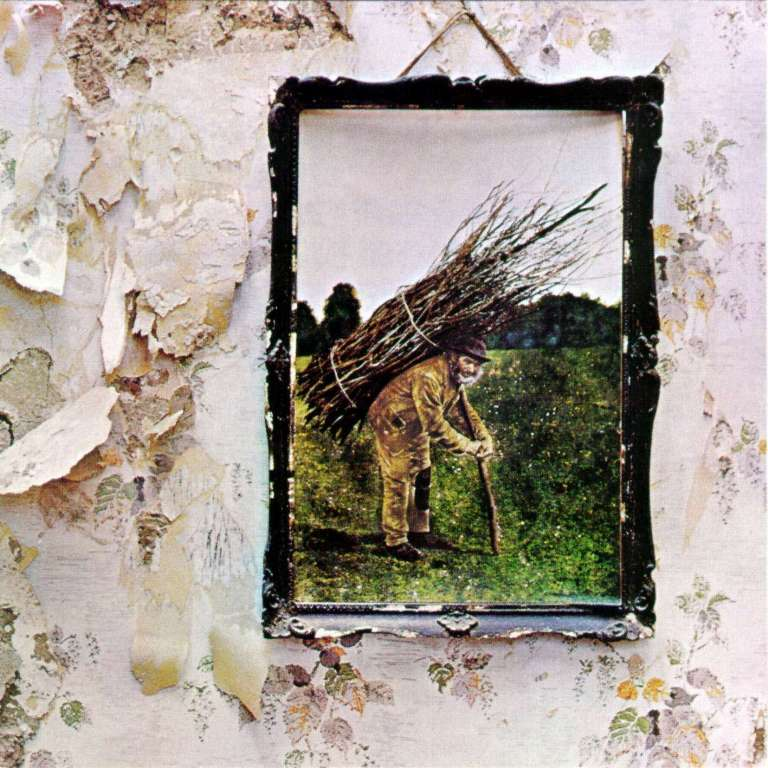

Se pensiamo ai Led Zeppelin, i primi titoli che vengono alla mente sono “Kashmir”, “Whole Lotta Love” e “Immigrant Song”. Tuttavia, il loro brano più famoso è sicuramente “Stairway To Heaven”.

Registrata nel 1971 e inserita nell’album “Led Zeppelin IV”, pubblicato lo stesso anno, Stairway to Heaven è alla 31 esima posizione nella classifica delle canzoni più belle stilata dalla rivista americana Rolling Stone e alla prima di Guitar World per il miglior assolo di rock esistente. Sono state inoltre vendute più di un milione e duecento mila copie del suo spartito. Il brano rappresenta un caso particolare non solo nella storia della band britannica ma anche per la musica in generale.

Innanzitutto, a differenza di tutte le canzoni di successo, non fu mai estratta come singolo prima degli anni ‘90, in occasione del suo ventennale.

In più, Stairway to Heaven arrivò come una totale novità per i Led Zeppelin, la prima volta alle prese con una vera ballad, tanto che la prima esecuzione in concerto (il 5 marzo 1971 a Belfast), fu accolta abbastanza freddamente dai fan.

> There's a lady who's sure all that glitters is gold And she's buying a stairway to heaven. When she gets there she knows, if the stores are all closed With a word she can get what she came for. Ooh, ooh, and she's buying a stairway to heaven.
>
> C’è una donna che crede che è tutto oro quello che luccica E sta comprando una scalinata per il paradiso Quando arriva, se i negozi sono chiusi Basta che dica una parola e ottiene ciò che vuole Ooh ooh e sta comprando una scalinata per il paradiso

Come molti pezzi famosi, anche “Stairway to Heaven” ha dato adito a molte leggende e finte interpretazioni. Una delle leggende metropolitane più famose racconta che il brano parli di droga, in quanto la donna che compra “la scalinata per il paradiso” sta acquistando delle dosi. Ovviamente, questa chiave di lettura non fu mai presa in considerazione in quanto senza fondamento.

<iframe width="560" height="315" src="https://www.youtube.com/embed/ovFSEHH_yJw" frameborder="0" allow="accelerometer; autoplay; encrypted-media; gyroscope; picture-in-picture" allowfullscreen title="Stairway to Heaven"></iframe>

Nel testo, appare un importante riferimento letterario al poeta William Wordsworth, nel verso “In my thoughts I have seen rings of smoke through the trees” (nel poema Tintern Abbey, Wordsworth declama “and wreaths of smoke Sent up, in silence, from among the trees!”).

Ciò che è sicuro è che Robert Plant, voce e autore del testo, fu ispirato soprattutto dal volume “Magic Arts in Celtic Britain”, che aveva da poco finito di leggere.

> If there's a bustle in your hedgerow, don't be alarmed now, It's just a spring clean for the May queen. Yes, there are two paths you can go by, but in the long run There's still time to change the road you're on.
>
> Non aver paura se c’è confusione nella tua siepe Non è altro che la pulizia di primavera per la Regina di Maggio Sì. ci sono due sentieri che puoi percorrere, ma alla lunga C’è ancora tempo per cambiare la strada che stai percorrendo.

Robert Plant dichiarò, in seguito, che scrisse il testo davanti a un caminetto, senza quasi rendersene conto. Probabilmente, quel libro lo colpì a tal punto da rimanere radicato nella sua mente.

L’interpretazione più famosa è legata alle accuse di presunto satanismo. Fermo restando che il chitarrista Jimmy Page non nascose mai di aver seguito  Alester Crowley - noto esperto di esoterismo - e di aver aperto una libreria specializzata nell'occulto in quel di Londra, è del tutto errato muovere accuse di questo tipo a Stairway To Heaven.

Secondo i detrattori, il passaggio in cui si nomina la Regina di Maggio conterrebbe, se ascoltato al contrario, un messaggio satanico:

> Oh here's my sweet Satan, the one little path won't make me sad, whose power is saint... he'll give growth giving you six-six-six... a little tool shed he'll make us suffer sadly
>
> Oh ecco il mio dolce Satana, L’unica piccola via non mi renderà triste il cui potere è sacro... egli darà forza dandoti il 666... in una piccola baracca di attrezzi e ci farà soffrire tristemente

In un’intervista rilasciata alla BBC nel 2014, Jimmy Page dichiarò “_L'idea di Stairway to Heaven era quella di avere un pezzo di musica, una canzone che si sarebbe dovuta sviluppare su più strati e dovesse andare a coinvolgere diversi stati d’animo. Tutta l'intensità e la finezza dovevano servire per dare spinta al brano sotto ogni punto di vista, sia quello emozionale che musicale_”.

E, in effetti, è questa l’idea che traspare ascoltando il pezzo: un succedersi di colori, una sorta di caleidoscopio emotivo in netto crescendo che attraversa tutte le emozioni umane. Nella musica di oggi, purtroppo, viaggi emozionali così intensi non ce ne sono quasi più. Per questo motivo Stairway to Heaven rappresenta un punto di riferimento inarrivabile per tutti coloro che compongono musica.

Page sostiene anche che brani come questo sono una pietra miliare e hanno il potere di cristallizzare una band e renderla immortale, e che ogni gruppo vorrebbe scrivere almeno un pezzo che assuma anche il ruolo di marchio di fabbrica. Se da una parte Jimmy Page è più che soddisfatto del risultato, tanto che non permetterà mai a nessun altro cantante di approcciarsi alla canzone, Robert Plant non ne è così d’accordo, soprattutto dalla prima volta che sentì in radio,per la prima volta, la teoria dell’elogio a Satana.

Quasi sicuramente, questo episodio lo sconvolse così tanto da iniziare a provare una repulsione per Stairway.

“_Per me è veramente triste, perché Stairway to Heaven fu scritta con le migliori intenzioni, e per quanto riguarda messaggi registrati al contrario, non è la mia idea di fare musica_”.

Sarà per questo motivo che, come ha affermato in passato, il cantante preferirebbe avere un’orticaria all’eventualità di doverla eseguire ad ogni concerto dei Led Zeppelin?

> And as we wind on down the road Our shadows taller than our soul There walks a lady we all know Who shines white light and wants to show How everything still turns to gold And if you listen very hard The tune will come to you at last When all are one and one is all To be a rock and not to roll... E scendiamo in strada Le nostre ombre, più ingombranti delle nostre anime Là cammina una donna, che noi tutti conosciamo Che risplende di luce bianca e vuole mostrare Come qualsiasi cosa si tramuti in oro E se ascolti molto attentamente Alla fine la melodia verrà da te Quando tutti sono uno, e uno è tutti Per essere una roccia, senza rotolare via...
