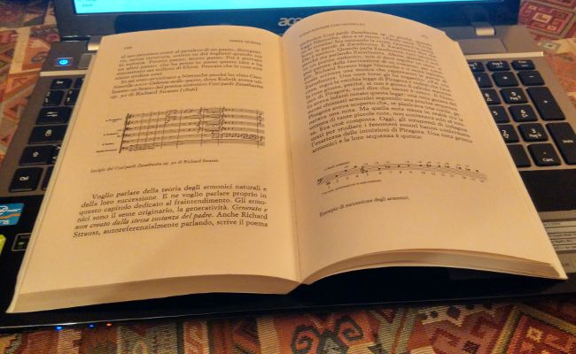

Come vi avevo anticipato nell’eupepsia post prandiale natalizia, tra i doni ricevuti dal moroso nerd figura anche il libro di Marco Castoldi, alias Morgan: “**Il libro di Morgan - Io, l’amore, la musica, gli stronzi e Dio**”. Curato dalla sorella di Morgan Roberta Castoldi, poetessa violoncellista e ricercatrice, il volume di 221 pagine è molto più di una retrospettiva sulla vita dell’eclettico artista: **è un viaggio pluridimensionale**, nel quale esploriamo il mondo del Morgan musicista ma - soprattutto - conosciamo l’uomo **Marco Castoldi**.

Dai tempi in cui era un bambino di cinque anni, sgattaiolava fuori dalla chiesa e cantava le canzoni di _Elvis_ solo per il piacere di esibirsi, il frontman dei **Bluvertigo** si è sempre nutrito con la melodia grazie ai gusti dei genitori, ma in lui già vibrava la voglia di fare musica, anziché subirla passivamente. Dettaglio fondamentale se, nella vita, lo scopo di un individuo è essere musicista. Morgan svela **la magia che ci ruba l’anima** quando scopriamo qual è la nostra strada, quel qualcosa che fa pensare “_ok, io sono nato per fare questo_”. Dall’approccio a _Black Celebration_, l’album più oscuro dei _Depeche Mode_, alla scoperta di Robert Fripp, leggendario chitarrista e fondatore dei King Crimson, il processo di individuazione e il percorso verso lo stile musicale che trasformerà il giovane Marco in Morgan trasmette euforia ed entusiasmo da tutti i pori. Ne ho avuta l’ennesima riprova in un momento buio in cui avevo perso la bussola e non sapevo più che ruolo avesse la musica nella mia vita, ma mi è bastato leggere poche frasi per ritrovare immediatamente la mia dimensione. Un po’ come venire nuovamente alla luce.

Tuttavia, **la musica non è l’unica protagonista**: il simpatico rapporto con l’amico/mentore _Franco Battiato_ - che lo ribattezza _Morganetto_ - l’amore totalizzante per _Asia Argento_, che gli farà scrivere la struggente “_Amore Assurdo_” e, alla fine del loro amore, gli impedirà di usare di nuovo la stanza da letto. E ancora il dramma del suicidio del padre, quando Marco aveva sedici anni, che lo spingerà ancora di più al bisogno smodato di comporre, oppure la brutta storia legata alla tanto discussa intervista su Max del 2010 nella quale sosteneva di fumare crack ogni giorno. Per la prima volta Morgan parla dello scandalo che causò in un primo momento il suo allontanamento dalla tv e, subito dopo, la mercificazione della vicenda per ottenere un’impennata di ascolti. Con questo esempio si capisce come la scorza da artista maledetto del cantautore monzese nasconde, in realtà, **un’anima tanto tormentata quanto pura e ingenua**.

Un Morgan inedito, quello dipinto in queste pagine: egotico, cervellotico, astratto e pratico al tempo stesso, il cui spirito è ancora quello di un bambino che si meraviglia per le cose belle della vita, ma anche una persona che ha imparato dai suoi errori, consapevole e maturo. Ma, soprattutto, sincero.

Quando ho cominciato a leggere il libro ero cosciente che mi sarei trovata immersa in un altro mondo, dove l’unica regina è la musica, aspettandomi poco altro. Invece sono rimasta piacevolmente coinvolta in **un diario che ha tutto il sapore di un’autoterapia** per espiare ansie pregresse, con lo scopo di guardare al domani con un pizzico in più di serenità tenendo sempre ben presenti i propri obiettivi professionali e non. In questo senso **ringrazio Morgan**, per avermi fatto riscoprire vibrazioni che ritenevo sopite a causa della gran disillusione del momento e, in primo luogo, per avermi ricordato che ogni tanto guardarsi dentro e indietro, per ricordare chi siamo, da dove veniamo e cosa siamo diventati, non può fare che bene.
