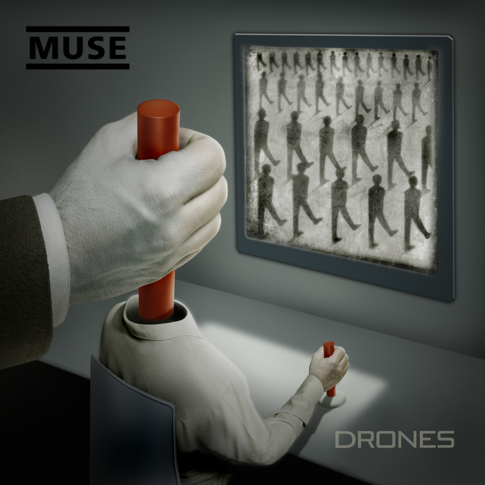

Ci sono gruppi che, durante il corso della loro carriera, continuano a ripetersi per andare sul sicuro. E poi ci sono band, come i **Muse**, che invece fanno della ricerca musicale una delle loro priorità. Dopo aver spaccato l'opinione pubblica nel 2012 con il disco super elettronico _The 2nd Law_, il 9 giugno i Muse pubblicheranno il settimo album in studio _Drones_, anticipato a marzo dai due singoli _Dead Inside_ e _Psycho_, che segna il **ritorno alle sonorità epiche** degli inizi. Ecco cosa mi ha raccontato **Chris Wolstenholme**, bassista dei Muse, durante l'incontro per la presentazione di Drones alla stampa.

**Chris, qual è l'idea che ha dato vita al concetto di Drones?**

In realtà, l'artefice di Drones è stato esclusivamente Matthew Bellamy (autore e voce dei Muse _ndr_) che ha composto ogni singolo pezzo. Però, quello che ti posso dire è che, sebbene i nostri album abbiano avuto sempre un filo conduttore alla base che faceva da collante tra le canzoni, questo è il **primo disco della nostra carriera che si possa definire realmente concept**. Più che un disco, è un racconto.

**Ho notato un ritorno ai suoni epici e apocalittici del passato. E' stata una scelta voluta?**

Assolutamente, è la storia raccontata in questi brani che, in un certo senso, ha riportato questo sound a galla. Ascolterete **sonorità e arrangiamenti molto simili**, nelle atmosfere, a **Citizen Erased** e Black Holes & Revelations.

**Questo album ha un suono prettamente politico e militare ma, a dire il vero, mi ha colpita parecchio The Globalist, unica vera ballad di Drones.**

Il tema principale è di stampo militare, è vero, ma in fondo si raccontano tutti gli stati d'animo di un essere umano. The Globalist ha **una struttura molto complessa**: dapprima ci sono arrangiamenti isolati, che percorrono una strada parallela ma convergono nel finale. Il tutto crea un'atmosfera confusa, in cui si alternano gioia, tristezza e malinconia.

**Approfondiamo il tema del concept: chi sono i droni di cui parlate?**

I droni sono **coloro che soggiogano gli esseri umani, li fanno soffrire fisicamente e psicologicamente**, fino ad annientare ogni traccia di volontà e identità delle loro prede. La vicenda raccontata in Drones si evolve in 12 puntate, in cui assistiamo al percorso interiore di una vittima dei droni: il tutto ha inizio con Dead Inside e Psycho, in cui il protagonista viene catturato da  queste entità, chiamate appunto droni, e sottoposto a torture e maltrattamenti. Dopo una lieve fase anestetica, in cui sembra svanito ogni briciolo di volontà, il protagonista **si rende finalmente conto di essere in balìa** di un sistema malsano e implora pietà. Naturalmente non viene ascoltato,  quindi inizia a nutrire un sentimento di ribellione. Finalmente, dopo una lotta tutt'altro che facile, **riesce a uscire dalla prigionia** e si riappropria della sua vita.

**Ancora una volta avete scelto di collaborare con Tommaso Colliva...**

Tommaso è un grande. L'abbiamo conosciuto ai tempi di Black Holes & Revelations e penso **sia il migliore nel settore della tecnologia musicale.** Sa perfettamente cosa vogliono i musicisti, per questo ci fidiamo molto di lui. Inoltre, è sempre bello vedere un viso conosciuto. Tommaso, per noi, è un amico e un ottimo collaboratore.

<iframe width="560" height="315" src="https://www.youtube.com/embed/I5sJhSNUkwQ" frameborder="0" allow="accelerometer; autoplay; encrypted-media; gyroscope; picture-in-picture" allowfullscreen title="Muse"></iframe>

**Quindi, è vero che avete registrato parte dell'album in Italia?**

Sì, verissimo!

**Quanto tempo vi ha occupato la registrazione?**

A maggio abbiamo cominciato con qualche provino e demo ma è stato un processo molto blando, **non più di due volte a settimana**. Si è creata una magia straordinaria, grazie alla quale le canzoni hanno preso forma rapidamente. Ci siamo trasferiti al Warehouse di Vancouver **da ottobre fino a novembre**, poi abbiamo fatto tappa a Milano e **abbiamo finito il disco a febbraio**. Ultima, ma non meno importante, la fase di mixaggio, portata a termine tre settimane fa.

**Il concept di Drones è chiaro. Ci puoi svelare qualche dettaglio in più sulla scrittura?**

Come già sai, Matt si è occupato totalmente della scrittura dei brani. Però una cosa la so ovvero che le canzoni **le ha scritte proprio in questo ordine cronologico**.  E, se un concept è simile ad un libro, come puoi scrivere il capitolo 7 se non hai già fatto l'1, 2, 3, 4, 5, e il 6?

**Il brano JFK riporta un estratto del discorso che  John Fitzgerald Kennedy tenne nel 1961 ad Astoria. Perché l'avete inserito?**

L'abbiamo messo perché **è un discorso memorabile, che ha fatto la storia**, e poi credo sia d'aiuto, in un certo senso, per fornire la giusta chiave di interpretazione per i testi di questo album.

**Ci sono dei droni nella nostra società? Li possiamo sconfiggere?**

La tecnologia, sicuramente. Mi piace e la uso tutti i giorni, però ci priva di tante cose. Quando ero ragazzo, uscire con gli amici e trascorrere del tempo insieme era una vittoria, un traguardo. Adesso siamo tutti connessi alla realtà virtuale ma **non c'è più la comunicazione faccia a faccia**, ci rinchiudiamo nel guscio di casa nostra. Anche nella mia famiglia succede così, mia moglie e i miei figli sono perennemente connessi. Onestamente, **l'evoluzione che abbiamo avuto in questi 50 anni mi inquieta un po'**. E ho paura a pensare cosa potrebbe capitare nei prossimi 50 anni.
