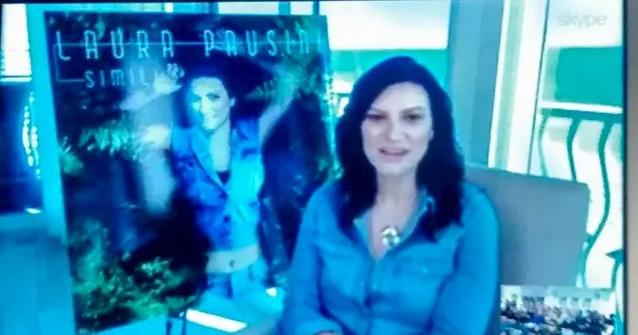

Il 6 novembre 2015 esce **il nuovo disco di Laura Pausini, intitolato Simili**. Considerato una delle uscite nazionali e mondiali più attese di tutto il 2015, l'album uscirà in ben 60 paesi, contiene 15 canzoni ed è nato esattamente dal concetto espresso dalla parola simili

"Ho capito di essere pronta per un nuovo disco quando mi sono soffermata su questo termine, simili: se ci pensate **include due concetti opposti, ovvero diversi e uguali**. Quando ho avuto questo flash ero in fila a fare le impronte digitali, un gesto che facevamo tutti in modo uguale ma per riconoscerci come persone diverse. Dopo questa riflessione ho chiamato Niccolò Agliardi, da tempo mio collaboratore, e gli ho detto che mi sentivo pronta per iniziare. **E' la prima volta** dopo tanti anni di carriera che **non faccio pezzi esclusivamente autobiografici**, per una volta sono solo interprete. Da quando sono madre sono diventata più aperta, libera e interessata ad altre storie che non sono mie."

Laura Pausini, in collegamento da Miami - città in cui vivrà fino a gennaio per l'impegno nel talent "La Banda" - è emozionata e racconta alla stampa, in una sorta di dialogo confidenziale con i giornalisti, il fil rouge che lega i 15 brani "Alcune delle storie, tra cui quella di _Nella Porta Accanto_, sono nate da storie di persone incontrate su Facebook, mentre altre sono frutto di collaborazioni con firme italiane. In questo disco ci sono brani di artisti quali **Tony Maiello**, **L'Aura** - che mi ha anche aiutata a scrivere la mia prima canzone dance - e altri grandi nomi del calibro di **Giuliano Sangiorgi, Jovanotti e Biagio Antonacci**. Biagio ha scritto tre brani, tra i quali _Lato Destro Del Cuore_ e appena l'ho ascoltata è stata come una calamita".

Una canzone alla quale Laura, senza dubbio, rimarrà legata per tutto il resto della sua carriera. Ma non è l'unico brano di Antonacci in questo album che ha fatto breccia nel cuore della cantante originaria di Solarolo "Biagio mi aveva fatto sentire _È a lei che devo l'amore_ e voleva inserirla in un suo disco ma l'ho convinto a darmela perché, ascoltandola, era evidente che descrivesse **tutte le sensazioni che provo da quando è nata mia figlia Paola**. **Ho registrato una versione con Paolo alla chitarra e la voce di Paola**, l'ho mandato a Biagio **e mi ha detto di tenerlo come demo definitivo** in quanto rendeva alla perfezione ciò che proviamo quando sono con il mio compagno e nostra figlia".

Jovanotti, invece, ha scritto per Laura Pausini il pezzo _Innamorata_ e, come confessa lei stessa, "Quando l'ho ascoltata **è stata una botta pazzesca**. Lorenzo ha un modo molto particolare di scrivere e fa un uso della metrica abbastanza lontano dal mio. **Già diverse volte**, negli anni, **ci ritrovavamo ed era lui stesso a bocciare le sue idee** affermando "_non ci siamo ancora_". Stavolta, invece, era perfetta". Diversa, invece, la storia della collaborazione con il cantante dei Negramaro, Giuliano Sangiorgi "Qualche anno fa, Giuliano aveva scritto un bellissimo brano per Malika Ayane (_Niente, ndr_) e gli ho chiesto di scrivere qualcosa per me. Mi rispose "_Cercherò di fare qualcosa_". **Qualche mese fa mi ha mandato un sms** chiedendomi di controllare la mail e **ho trovato** _Sono Solo Nuvole_. Posso dire con assoluta certezza che è una delle canzoni più belle che abbia mai cantato. **Gli ho chiesto di essere anche il produttore del pezzo** perché volevo assicurarmi di non snaturare il brano in alcun modo. Ha un bellissimo senso della scrittura, a metà tra il moderno e Modugno".

_Simili_ sarà quasi sicuramente il secondo singolo mentre _Per la Musica_ prevede **un featuring molto speciale: quello dei fan**: "Ho fatto un sondaggio su [www.laura4u.com](https://www.laura4u.com/ita/), il mio fans club ufficiale, in cui chiedevo chi si dilettasse a suonare e, successivamente, ho fornito una base. I miei fans, anche se preferisco chiamarli amici, mi hanno mandato le loro registrazioni - talvolta anche video - da tutto il mondo senza chiedermi perché. Chissà che faccia faranno quando **scopriranno di aver suonato con me!**"

**Inutile non parlare** con la diretta interessata **dei rumors che la vedevano al prossimo Sanremo**, in veste di ospite o co-conduttrice. Come stanno realmente le cose? "Confesso che Carlo Conti mi ha chiesto di partecipare come co-conduttrice e ho rifiutato, ma solo perché non avrei avuto tempo per prepararmi, essendo impegnata qui fino a gennaio. Un incarico del genere merita preparazione e, tra l'altro, **il palco di Sanremo mi ha sempre fatto un effetto particolare**. Però posso confermare la mia presenza in qualità di ospite, anche se al momento non so ancora precisamente in quale data. Nel frattempo, il prossimo 14 novembre avrò **il grande onore di presentare su Rai Uno** _Simili_, in uno spazio che, solitamente, non è mai riservato alla musica in Italia. Con me ci saranno Biagio Antonacci, Jovanotti, Giuliano Sangiorgi e tutti coloro che hanno contribuito a questo disco, e potrò cantare dal vivo per la prima volta "Lato destro del cuore". **Ringrazio Rai Uno e il direttore Giancarlo Leone**".

Gli appuntamenti per vedere Laura Pausini in concerto negli stadi sono fissati per il **4**, l'**11** e il **18 giugno 2016** rispettivamente a San Siro, all'Olimpico e al San Nicola. Successivamente, la cantante partirà per un tour mondiale che la vedrà impegnata nel continente americano e si concluderà nell'ottobre 2016 in Europa.

<iframe width="560" height="315" src="https://www.youtube.com/embed/0zZzjesaHCM" frameborder="0" allow="accelerometer; autoplay; encrypted-media; gyroscope; picture-in-picture" allowfullscreen title="Laura Pausini"></iframe>
