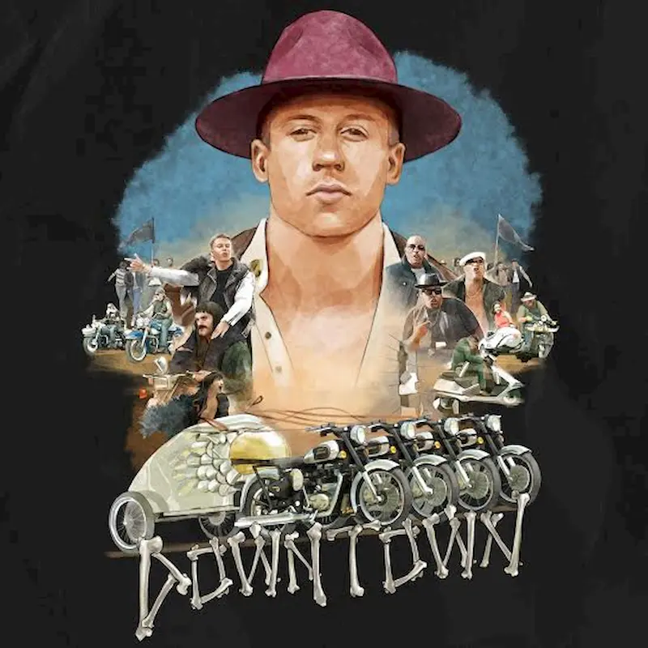

**Macklemore & Ryan Lewis pubblicano Downtown**, il nuovo singolo. Al brano partecipano **Grandmaster Caz, Kool Moe Dee E Melle Mel**, veri e propri colossi dell'hip hop, mentre la parte cantata è stata affidata a **Eric Nally**. "Downtown", quindi, è il primo brano in cui i sopracitati pionieri della musica hip hop si ritrovano a collaborare insieme.

L'ispirazione del brano, stando alle parole dello stesso Ryan Lewis, è la presenza di diversi generi musicali tra gli anni '70 e '80, e al modo in cui farli convivere "_Alla fine degli anni ‘70, inizio anni ’80, non era solo l’hip hop a farla da padrone. C’era anche il rock & roll. Cose fenomenali stavano succedendo ai poli completamente opposti dello spettro. La sfida era come renderli compatibili_". Non è strano, quindi, che musicalmente “Downtown” sia **l’impresa più ambiziosa** a opera di **Macklemore & Ryan Lewis fino a oggi**, tanto da dover lavorare sul brano per più di un anno e mezzo. La canzone ha iniziato a svilupparsi durante il loro ultimo tour mondiale e ha continuato a prendere forma, successivamente, nel loro studio a Seattle.

Su youtube è già disponibile il clip ufficiale di Downtown. Il video è stato **diretto da Ben Haggerty** - nome all'anagrafe di Macklemore - e **Ryan** e **dal regista** nonché collaboratore di lunga data **Jason Koenig**. È stato girato in una settimana nella città natale di Ryan, Spokane (nello stato di Washington). Oltre a Macklemore, Eric Nally, Grandmaster Caz, Kool Moe Dee e Melle Mel, partecipano al video **migliaia di comparse**, tanto che la produzione ha dovuto chiudere alcune strade di Spokane per dare spazio a balletti in strada, corse in motorino, parate complete di palloni giganti e molto altro. E, a proposito di balletti, la coreografia porta la firma dei Massive Monkees, una B Boy Crew di Seattle di fama internazionale.

Macklemore & Ryan Lewis e tutti gli artisti che compaiono nel brano hanno eseguito la canzone dal vivo per la **prima volta** in televisione durante gli **MTV VMA’s**, andati in onda Domenica 30 agosto.

Sebbene “Downtown” sia **il primo singolo ufficiale di Macklemore & Ryan Lewis** dopo il loro album di debutto "The Heist" - che ha riscosso parecchio successo e ha vinto il disco di platino in America e diversi GRAMMY Award - qualche settimana fa è stato **reso pubblico il brano** “_Growing Up (Sloane’s Song)_”. Il pezzo vede il **featuring di Ed Sheeran** ed è stato scritto prima della nascita della prima figlia di Macklemore, Sloane Ava Simone Haggerty, come dedica.

Se siete curiosi di sapere com'è il risultato finale del video di "Downtown", potete vederlo direttamente qui sotto:

<iframe width="560" height="315" src="https://www.youtube.com/embed/JGhoLcsr8GA" frameborder="0" allow="accelerometer; autoplay; encrypted-media; gyroscope; picture-in-picture" allowfullscreen title="Downtown"></iframe>
