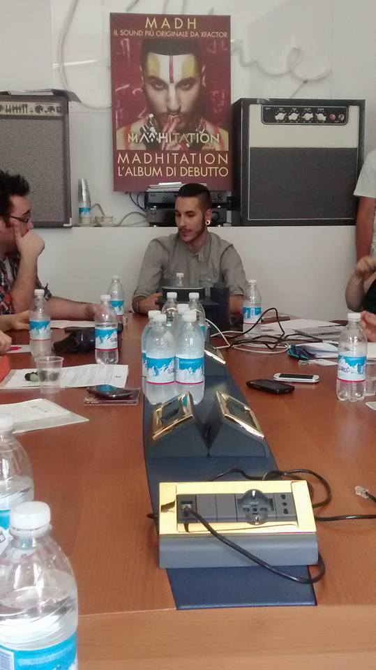

Madh, il secondo classificato di X Factor 8, pubblica il 10 luglio _Madhitation_, il **primo album di inediti**. Nonostante sia stato battuto in extremis dal suo compagno di team Lorenzo Fragola, Marco Cappai - nome all'anagrafe di Madh - è sicuramente da annoverare tra i **talenti più interessanti usciti dal programma**. Madhitation è il manifesto del mondo artistico del giovane cantante, sospeso tra moltissimi generi musicali quali reggae e drum and bass. Il tutto, ovviamente, con la **supervisione di Fedez**, suo giudice in X-Factor e amico.

Sebbene abbia aspettato sette mesi prima di pubblicare il suo album, non si può dire che Madh si sia fermato "_Appena uscito da X Facto_r", afferma durante l'incontro con la stampa "_ho fatto un tour di ben 50 date che mi ha portato via quasi quattro mesi. Visto che ci tenevo a far uscire Madhitation in estate, mi è rimasto pochissimo tempo per preparare i 13 brani ma, fortunatamente, ce l'ho fatta_".

Dietro il titolo dell'album c'è sì l'intenzione di esprimere la forte personalità musicale di Madh ma non solo. Madhitation, infatti, richiama la parola meditation, ovvero meditazione. Pratica tipica del mondo orientale, che esercita un grande ascendente sul ventunenne di Carbonia "_È una dimensione che mi ha sempre catturato, sia dal punto di vista del disegno che della cultura. Come prima cosa ho iniziato a studiare il giapponese ma poi, con gli anni, il mio amore **si è steso anche ad altri paesi quali India e Cina**. Da circa un paio di anni mi sto dedicando al buddhismo, visto come una filosofia di vita e non come una religione_".

Tra le critiche più accanite a Madh, quella per la sua pronuncia inglese un po' atipica "_lo so, ma in realtà **voglio che si capisca quando sono io a cantare in inglese**. L'amore per quella lingua mi accompagna dall'adolescenza ed è frutto delle varie influenze musicali che mi hanno formato. Sono partito dal british soul, **adoravo Amy Winehouse**. Poi sono passato al reggae, in Sardegna abbiamo un cuore molto reggae, e ho preso anche quell'inflessione. L'**inglese è la lingua in cui riesco ad esprimermi** al meglio, perché rispecchia la mia natura e il mio modo di essere. E' per questo che ho deciso di fare tutte le canzoni in inglese_". Tutte, tranne una: Vai "_è **nata come esperimento**. Scrivere in italiano è molto più complicato che scrivere in inglese. Nessuno esclude che possa scrivere altri pezzi in italiano in futuro, mai dire mai_."

**Il secondo estratto** da Madhitation **è River**, il brano più orecchiabile e radiofonico tra quelli della tracklist. Ma c'è anche Gong, che racconta della gara che ognuno ha con se stesso e della cima che vuole raggiungere. Ma **qual è l'obiettivo di Madh**? "_**Sogno di sfondare all'estero**. Il mio genere musicale è un po' insolito e, ascoltando Madhitation, è evidente che adoro le sonorità internazionali. Mi piacerebbe valicare i confini del mio paese con la mia musica"_.

Al momento, Madh ha già avuto la possibilità di valicare i nostri confini grazie all'evento di Calvin Klein che si è tenuto a Hong Kong "_C'era un artista per ogni paese e sono stato l**ieto di esser stato chiamato come influencer** per l'Italia. Ho conosciuto molte persone a cui ho fatto ascoltare un po' di pezzi, e **non ci credevano quando ho detto loro di essere italiano**. Ho incrociato anche Justin Bieber ma ci siamo scambiati solo due chiacchiere"_.

Durante il mese di luglio, **Madh sarà impegnato in un tour instore**, iniziato ieri sera a Milano al Mondadori Megastore e terminerà il 26 di questo mese a Catania, alla Feltrinelli Centro Sicilia.

Un paio di impressioni sull'album? Una proposta del genere in Italia, con la nostra tradizione musicale, potrebbe non attecchire. Un vero peccato perché Madhitation esplora generi lontanissimi fra loro e, tutto questo, mantenendo una forte coerenza, identità e originalità. Un risultato non trascurabile, al giorno d'oggi.

<iframe width="560" height="315" src="https://www.youtube.com/embed/blAswrBhQjo" frameborder="0" allow="accelerometer; autoplay; encrypted-media; gyroscope; picture-in-picture" allowfullscreen title="Madh"></iframe>
