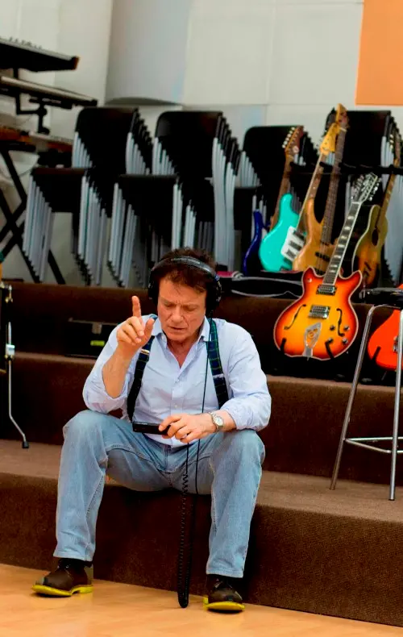

Il 9 ottobre **Massimo Ranieri** ha pubblicato **_Malìa - Napoli 1950 1960_**, un album che testimonia il viaggio nell'affascinante **patrimonio musicale partenopeo** nel decennio compreso **tra il 1950 e il 1960**. Per questa bellissima avventura nel mondo della musica napoletana, Ranieri **si è avvalso della preziosa collaborazione** di un quintetto di conosciutissimi e talentuosi musicisti jazz: **Enrico Rava** (tromba e flicorno), Stefano **Di Battista** (sax alto e sax soprano), **Rita Marcotulli** (pianoforte), **Stefano Bagnoli** (batteria) e **Riccardo Fioravanti** (contrabbasso), coadiuvati dal produttore Mauro Pagani. Ed è proprio nella magica cornice dello studio di registrazione di Mauro Pagani, le Officine Meccaniche, che Massimo Ranieri e Mauro Pagani hanno voluto presentare il disco.

"_Mi sento come se oggi avessi fatto il più bel viaggio degli ultimi 15 anni_". E' raggiante Giovanni Calone - vero nome di Massimo Ranieri - seduto sul sofà delle Officine Meccaniche "_**Ne abbiamo fatti di dischi** dignitosi, io e Mauro Pagani, però questo è il più bello ed eccitante. **E' come aver aperto un altro file**, una nuova strada. Mi rendo conto che, forse, le canzoni che abbiamo inserito, sono un po' particolari. Durante la lavorazione di Malìa abbiamo alternato entusiasmo e freno a mano, avevamo per le mani un repertorio speciale risalente a un momento particolare di Napoli. Ho dovuto "ranierizzarle", e non volevo, ma tornare a Napoli con la memoria mi è servito a molto. **Ho voluto stare al servizio di questi brani**_".

Anche Mauro Pagani è convinto dell'unicità di Malìa, sottolineandone i punti di forza "_Solitamente, quando si parla di un disco jazz, sia cantanti che musicisti tendono a sovrastarsi l'uno sugli altri a vicenda. In questo album, invece, **c'è stato un equilibrio perfetto**: **Massimo ha cantato senza fare il crooner** e i **musicisti hanno reso onore ai brani**, senza coprire troppo la voce o prolungarsi nelle parti strumentali. Abbiamo formato un'ottima equipe e per registrare i primi 9 pezzi ci abbiamo messo solo 3 giorni, senza bisogno di sovraincisioni. Come potrete notare, le canzoni non sono urlate perché abbiamo cercato di ricreare le ambientazioni e le situazioni in cui questi pezzi hanno visto la luce, ovvero i night"_.

Un mondo, quello notturno, che Massimo Ranieri può dire di conoscere bene _"**Mi sono esibito per la prima volta in pubblico nel 1964**, all'età di 13 anni, in un locale americano che si chiamava EM Club. Si trovava in piazza Municipio ma era frequentato solo da americani, essendo un punto di ritrovo per quelli che lavoravano alla NATO. Ed **è stato proprio il mio maestro**, anch'egli alla NATO, **a farmi conoscere il locale_"** prosegue Ranieri, a metà tra l'emozionato e il divertito. "_Cantai un brano da West Side Story davanti a un pubblico esclusivamente americano. Facendo esperienza nei night **ho imparato a gestire la voce**, perché i cantanti dovevano andare avanti per 4-5 ore e l'unico modo per poterlo fare era non esagerare. Sapete, c'è stato un decennio, quello rappresentato in questo disco, che ha subìto l'influenza della musica statunitense - basti pensare che la scuola napoletana di batteristi è ancora la migliore in tutta Italia - e quindi ci è sembrato naturale riproporre questo repertorio in chiave jazz._"

Nel prossimo futuro, Massimo Ranieri sarà impegnato nel suo spettacolo Sogno o Son desto, durante il quale avrà l'occasione non solo di esprimersi nuovamente a tutto tondo come presentatore, attore e showman indiscusso, ma riproporrà dal vivo anche i brani di Malìa.
