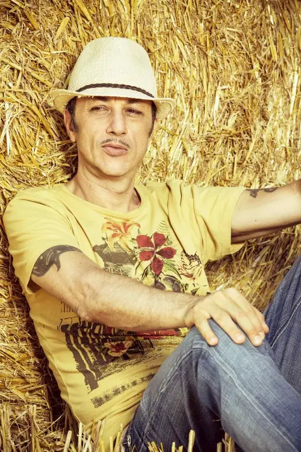

Durante l'estate 2015, uno dei ritornelli che più abbiamo sentito alla radio è stato "Sigarette la mattina, la la la la la la la". Sigarette, questo il titolo del brano, è stata l'apripista di Resistenza, l'ottavo album di Neffa. In occasione della presentazione dell'album, uscito il 4 settembre, Giovanni Pellino - vero nome di Neffa - ha incontrato la stampa per raccontare il mood compositivo dell'album e aprirsi un po'.

**Non hai pensato alle conseguenze che avrebbe potuto avere l'ascolto di un testo come quello di Sigarette, soprattutto sui bambini?**

Sigarette l’ho conservata più un anno e mezzo nel mio PC e mi emoziona ancora come quando l'ho scritta, nonostante sia passato tutto questo tempo. Ho sì pensato alle conseguenze ma solo in un secondo momento, e questa è l'ennesima riprova che non è la musica asservita a me, bensì l'esatto contrario. Sono le canzoni a fare me e non posso fare a meno di seguire la musica. Solo a posteriori ho realizzato che la soluzione migliore, e probabilmente quella più vicina alla realtà, potesse essere "Erba fresca la mattina". Ma tant'è, è andata così.

**Quindi non ti spiace non averci pensato prima?**

In realtà no. Ho ben chiaro il mio personalissimo concetto di composizione e delle cose da fare o non in quanto autore. Ciò che non farò mai come compositore è pensare a tavolino prima di scrivere. Non nascondo che sarebbe utile ma non è assolutamente il mio modo di scrivere. "Passione" è uno dei brani più belli che abbia mai scritto, e per comporre la prima strofa ci ho messo solo 10 minuti.

**Si può tranquillamente affermare che tu sia un precursore in campo musicale: sei stato uno dei primi a far conoscere il rap della scena underground e, al contrario, uno dei primi a mollare per darti al cantato. Pensi che queste scelte abbiano lasciato dei segni?**

Sicuramente, il passato mi segna il volto e l'anima. Ho lasciato un gruppo punk hardcore per darmi al rap underground e alcuni anni dopo mi sono allontanato dal rap perché sentivo l'esigenza di cantare. So di essere bravo nel rap, molto più di quanto lo sia cantando, ma ho voluto seguire le mie esigenze e i miei istinti.

**Hai parlato di rap, non pensi che in questi ultimi anni sia un po' cambiato il modo di farlo?**

Ovviamente. Fare rap oggi è come suonare l'heavy metal nell'84: tutti lo facevano perché era figo. Una volta il rap era rivoluzionario, oggi è completamente l'opposto: reazionario. E' pieno di stereotipi e preconcetti. Anche chi si approccia alla mia musica, il più delle volte, lo fa con preconcetti. Leggo anche un sacco di critiche, tipo "eri meglio con i Sangue Misto ho i Negazione". Esattamente, con l'h davanti. Onestamente, mi preoccuperei ad essere considerato il numero 1 da chi non sa scrivere. Ai miei tempi, nemmeno quello all'ultimo banco faceva questi errori. Non sono diplomato, però so scrivere perché a scuola ci insegnavano le cose, ogni giorno avevamo in mano un libro o un giornale.

<iframe width="560" height="315" src="https://www.youtube.com/embed/-k3ptos7fKY" frameborder="0" allow="accelerometer; autoplay; encrypted-media; gyroscope; picture-in-picture" allowfullscreen title="Neffa"></iframe>

**In che cosa consiste la Resistenza che consideri necessaria?**

Quando mi è stato detto che Resistenza è una canzone d'amore ho avuto una specie di reazione allergica. L'ascoltatore attento capisce che dietro c'è un messaggio molto ampio. E’ un grido, una richiesta di aiuto per ricordarci di essere umani. Questo è un mondo ipertecnologico, ed è una figata ma dobbiamo ricordarci anche che le macchine remano contro gli esseri umani. L’umanità che fine ha fatto? Sogno un mondo in cui, durante i concerti, la gente alzi le mani e inizi a gridare di sua sponte, senza che sia io a incitarla. Io sono timido, non riesco a dire Su le mani! Invidio molto i musicisti jazz e la loro attitudine: entrano, suonano ed escono.”

**Il secondo singolo è "Colpisci", il cui video ti vede protagonista con Valentina Lodovini. Puoi spiegarci com'è nato questo brano?**

Quando ho sentito la melodia di Colpisci, ho avuto subito la sensazione che dovesse trattare un argomento drammatico. Subito dopo, ho avuto l'immagine di questo duello. Ci sono momenti in cui mi sembra addirittura di vedere la musica, tipo che strumenti ci sono in una canzone, come si svilupperanno le linee melodiche. E' come essere sonnambuli: prendi certe strade e vai avanti senza sapere il perché?

**C'è qualche canzone, all'interno di Resistenza, che è stata una sorta di autoterapia?**

Sigarette mi ha sicuramente spostato e posso definirla come una figlia degli alieni. Per me, le figlie degli alieni sono le canzoni che non ti spieghi. Lampadine è così, perché sembra un sogno, non riesco a capire da dove possa esser venuta fuori.

**Ultima indiscrezione: andrai a Sanremo?**

Carlo Conti mi ha espressamente chiesto di andare a Sanremo e, se devo essere sincero, tra le gestioni degli ultimi anni, la sua è stata quella in cui la musica è stata la protagonista assoluta. Non so se andrò, non ne ho idea, ma sono contento che Conti mi abbia cercato. Vedremo.
