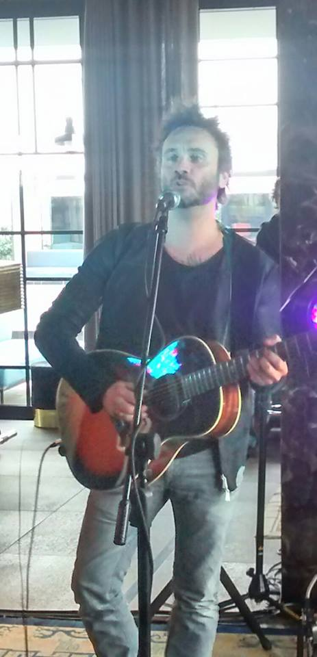
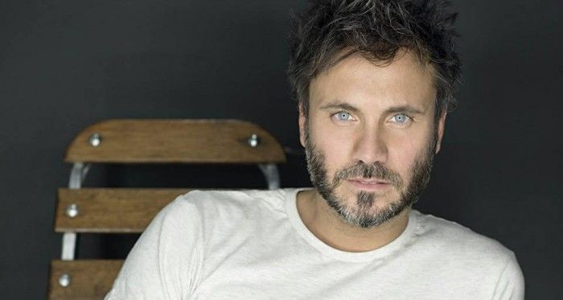

Lunedì 2 marzo è uscito “**Prima Di Parlare**”, il quattordicesimo album di Filippo Neviani, in arte **Nek**. Nelle dodici canzoni presenti nella tracklist, anche la fortunata _Fatti avanti amore_, in gara a Sanremo.

> Siamo fatti per amare
> Nonostante noi
> Siamo due braccia
> Con un cuore
> Solo questo avrai da me
> Fatti avanti amore

Ricordo come se fosse ieri la prima volta che ho ascoltato il brano di Nek a Sanremo. In mezzo a una serie di canzoni pressoché tutte uguali - personalmente, oltre a questo, avevo salvato solo i pezzi di Malika Ayane e Marco Masini - Fatti avanti amore rappresentava una **ventata d’aria fresca, uno svecchiamento** di cui il Festival aveva bisogno. La storia la sappiamo tutti: hanno vinto i ragazzi de Il Volo, ma il vincitore morale del Festival di Sanremo alla fine è proprio Nek. Ieri, durante la conferenza stampa di presentazione dell’album, ha ammesso e riconosciuto il valore positivo di questo traguardo, in quanto il vero successo di una canzone lo si riscontra nelle radio. **Il suo brano**, infatti, non solo **è quello più trasmesso in radio** ininterrottamente dai giorni della manifestazione canora più famosa d’Italia, ma ha anche raggiunto i 5 milioni di visualizzazioni su youtube. Neviani è stato consapevole fin da subito di avere un **pezzo potente per le mani** “_La mia certezza più grande era utilizzare questo singolo come primo estratto di presentazione dell’album, che venisse o meno accettato a Sanremo_”. Prima di parlare rappresenta il nuovo sound al quale si sta dedicando l’artista originario di Sassuolo. L’uomo che ci troviamo davanti è un adulto più maturo e consapevole, e se ne rende conto lui stesso, in primis. Lo dice teneramente, mentre tiene in braccio la sua bellissima bambina, tutta intenta a disegnare: “Riguardandomi indietro, avrei fatto le cose in modo diverso. L’album precedente ha sancito la fine della collaborazione col mio ex team, era più essenziale e tetro. Oggi **sono più diretto e chiaro nel dire le cose.** Prima di parlare nasce sotto il segno della sinergia con questo nuovo gruppo di persone, è luminoso ed **è ricco di contaminazioni sonore**: il pop rock si fonde con la dance e l’elettronica, si amalgama con gli archi e l’orchestra”.

<iframe width="560" height="315" src="https://www.youtube.com/embed/jFxtn_BQauk" frameborder="0" allow="accelerometer; autoplay; encrypted-media; gyroscope; picture-in-picture" allowfullscreen title="nek"></iframe>

Filippo Neviani crede totalmente in questo nuovo lavoro, costellato di potenziali singoli. A differenza di tanti suoi compagni di viaggio a Sanremo, che hanno pubblicato i loro album nella settimana del Festival, ha voluto aspettare i primi di marzo per essere totalmente certo che tutto fisse curato nei minimi dettagli. Scelta che, stando al risultato, si può definire indovinata. “_Tengo particolarmente a questo album_ - aggiunge - _perché ogni pezzo ha riferimenti autobiografici_”. Nella tracklist non poteva mancare la cover di “_Se Telefonando_” di Mina, che gli è valsa la vittoria nella serata delle cover “_Abbiamo scelto questo brano perché era una sfida: non è facile approcciarsi con un brano storico, col testo di Maurizio Costanzo e la musica di Ennio Morricone. Nella versione originale, è un arrangiamento che **ti costringe ad essere sempre a mille con la voce**. Però, ho pensato che potesse essere interessante interpretare la canzone in chiave rock, attualizzandola e arrangiandola come se fosse mia_”.

Nek è tornato definitivamente anche se, tiene a precisare, “_non me ne sono mai andato_”. La novità è che la partecipazione a Sanremo ha segnato la consacrazione e l’approvazione anche nel mondo della stampa “_La stampa non è mai stata generosa con me. Per questo, quando ho visto alcune scene di entusiasmo dalla sala stampa per me, non ci potevo credere. E’ stato un riscontro straordinario_”. Risposta positiva derivante dall’innovazione portata sul palco dell’Ariston “_Avete apprezzato Fatti Avanti Amore, vi ha convinti. E’ stato questo il motivo per cui l’avete premiata!_”.

Caro Nek se posso permettermi di dire la mia, in questo mio piccolo angolo di mondo, abbiamo avuto ragione ad essere entusiasti e premiarti. Perché se Il Volo, per taluni, rappresenta l’eccellenza italiana, tu hai trovato la chiave per entrare nelle orecchie degli italiani e restarci. **Fatti Avanti Nek**!

