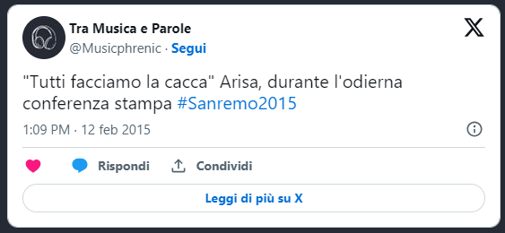
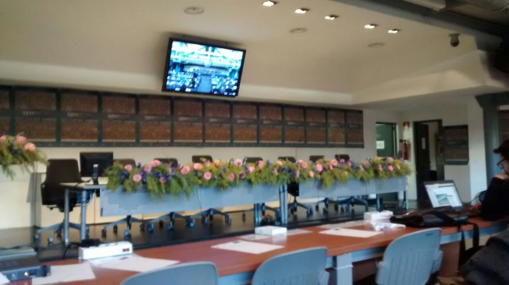
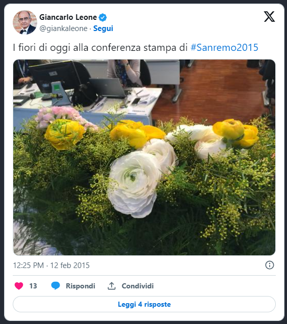
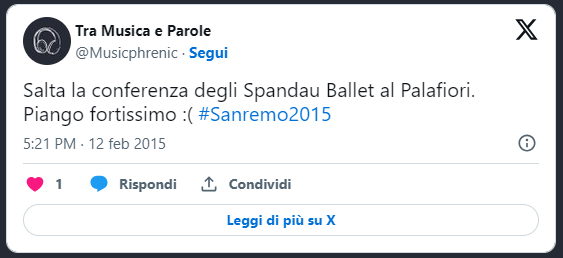
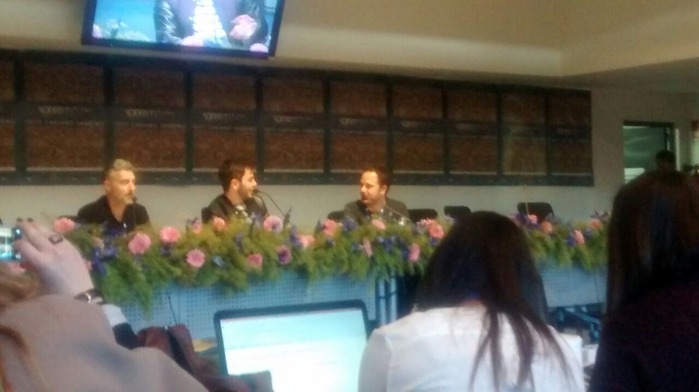

- _Dai, per favore, chiediglielo_
- _Amore, sto lavorando, non posso_

Mi fa gli occhi a cuoricino, il moroso nerd. Che non capisce nulla di musica, ma ogni tanto va in fissa su un argomento: chi è più **Sherlock** tra Benedict Cumberbatch o Jonny Lee Miller? A sentire lui dovrei chiedere a tutti quelli che incontro. E lui già mi immagina con la mano alzata, tipo bambina delle elementari. Conti mi guarda, da dietro i fiori. Tocca a me.

- _Arisa, è meglio Sherlock o Elementary?_
- _Non so, adesso ho le mie cose_

No, aspetta. Stanotte ho dormito due ore e mezza. Mi sono assopita un attimo.

Damn'it! Non è un sogno. **Arisa**, candida, discorre amabilmente delle sue funzioni fisiologiche. E' una conferenza stampa strana, questa. Il sindaco ha tirato buca, Conti tiene banco. La stanchezza si fa sentire. Un collega ha due occhiaie spaventose. Le mie sono nascoste dal trucco. Si inizia a misurare la giornata in caffè.

- _Oggi undici interviste: quanti caffè sono?_

**Surreale**. Oggi è tutto surreale. Silvia e io arriviamo, la sala stampa è vuota. Ci sono solo i fiori.

- _Che fiori sono?_
- _Non so_

Per fortuna il buon Giancarlo Leone ci illustra, via Twitter, le qualità floreali di Sanremo

Dannazione. Non lo sa nemmeno lui, che fiori sono.

Surreale. Surreale la difesa a oltranza dei comici da parte di Conti "_La comicità è soggettiva. Siani ha fatto il suo. Pintus anche_". Sarà anche soggettivo, lo humor, ma sono davvero contenta che i comici abbiano poco spazio. E poi, diciamocelo, il miglior momento comico involontario ce lo regala Vincenzo Nibali.

- _Sono qui per lanciare il Giro d'Italia 2015_
- _Pensi di poter vincere?_
- _No, partecipo solo al Tour de France_

Surreale anche come, all'ultimo momento saltino le interviste. Capita spesso, mi dicono.

Ma la delusione è forte, in questo caso. Non è la prima volta, già non sono riuscita ad andare a Roma, pochi mesi fa, per la proiezione del loro documentario al Roma Film Festival. Spero la prossima volta sia quella buona. Per fortuna il mio cuore di fan trova sollievo al pensiero di vederli stasera, sul palco dell'Ariston.

Passo deciso e sguardo fisso davanti a sé. Prima di guardare la sala si sistema il colletto della camicia. Carinissimo quando prende la parola

- _Sono aperte le iscrizioni per far parte della giuria. Accorrete numerosi_

Sorride. Anche con gli occhi, come solo chi è felice dal cuore può fare. So già che mi mancherai, **omino dell'IPSOS**. E mi mancheranno i tuoi slogan.

Di sicuro non mancherò io alla signorina dei badge. Finalmente, dopo 4 giorni sono riuscita a recuperare il badge. Ha una storia lunga, questo tesserino magnetico, stile telenovela Piemontese. Per la verità non ancora completata. Stasera, a Casa Sanremo, potrebbe esserci un nuovo episodio della serie **Claudia VS Burocrazia**. Incrocio le dita, e spero di no. Stasera voglio gustarmi, senza preoccupazioni, le cover. E scommetto che, musicalmente parlando, sarà la mia serata preferita.
