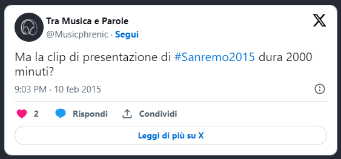

Apro gli occhi, un cuore oscilla sopra il letto. Silvia è già in piedi, sta preparando la colazione. Mi sorride.

- _Buongiorno, Cla. Dormito bene?_
- _Io sono... Aiuto!_

Ecco, questa è me il mercoledì mattina, dopo la prima serata di Sanremo. Mi trascino fuori dal letto, afferro la tazza del caffè. E ripenso alla prima serata.

E' stata strana, e non è stata affatto riposante. Il pranzo alle sei - o erano le sette? - poi di corsa alla sala stampa. Attaccare il tablet pc alla presa. E aspettare l'inizio della prima serata di Sanremo 2015. E aspettare. E aspettare. E aspettare...

Poi, finalmente, si comincia. E appaiono, una alla volta, alla spicciolata, le vallette. Prima Emma, vestita da sposa.

Il mio moroso, prende l'occasiona al balzo e mi spedisce la foto del suo vestito preferito. E già qui, quando durante la serata di Sanremo si parla di matrimonio, dovrebbe scattare il campanello d'allarme. Per fortuna ci ripensa Arisa, scivolando sulle scale, a riportare un po' di normalità al festival.

Poi c'è il momento di Tiziano Ferro. Tutta la sala stampa si lascia andare

E per me potrebbe finire anche qui. Con un mega concerto di TZN, e fa niente Siani, che verrà, e il pessimo imitatore di Bublé. Tiziano, tremendo, saluta.

Poi c'è Siani che prima prende in giro persone a caso

poi parla di amore in modo molto originale

e infine tenta di scusarsi del suo poco tatto

In tutto ciò i cantanti in gara presentano le loro canzoni, con risultati dal soddisfacente alla tragedia. Mi piange il cuore per Grignani

Ma per fortuna Nek sorprende

Su teatro.it ci sono tutte [le pagelle della prima serata](http://www.teatro.it/musica/sanremo_2015/sanremo_le_pagelle_della_prima_serata_14477), non le ripeto. E smetto di ripensare a ieri. Metto giù la tazza. Oggi ricomincia il circo, il carrozzone procede spedito.

Comincerò con [Raf](http://www.teatro.it/musica/sanremo_2015/raf_a_sanremo_solo_per_fare_la_mia_musica_14478) e poi c'è la nuova conferenza di Conti. Di cui vi parlerò un'altra volta.

