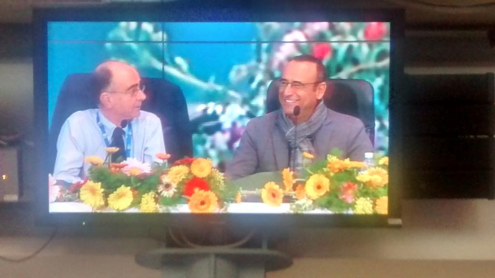
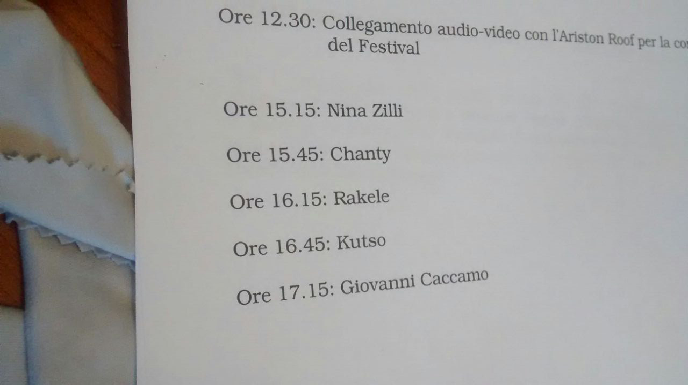
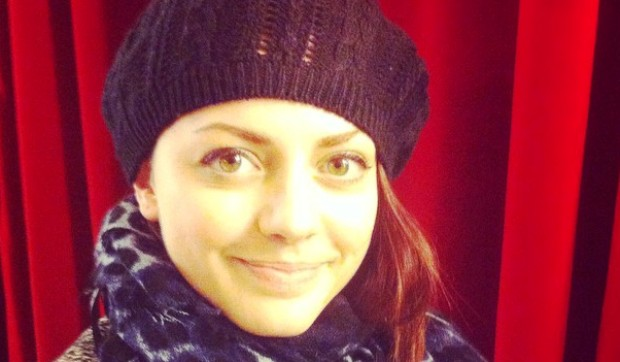
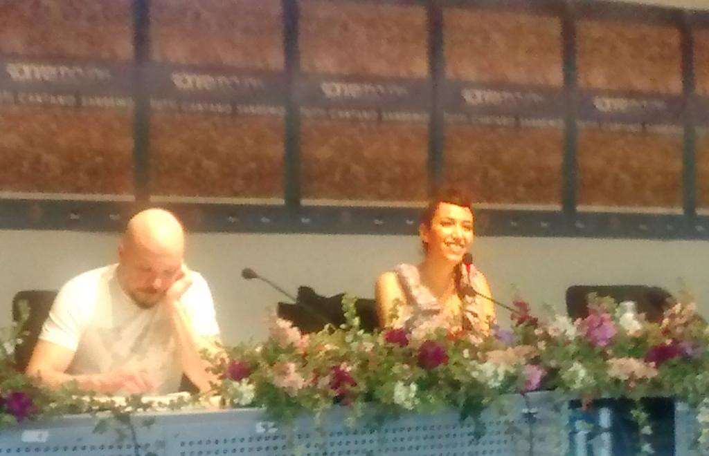

Non ci sono nemmeno le macchinette per gli snack, a Sanremo 2015. Lo scopro alle due e mezza, dopo la conferenza di [presentazione della serata](http://www.teatro.it/musica/sanremo_2015/da_al_bano_e_romina_a_tiziano_ferro_cantanti_e_ospiti_della_prima_serata_14474). Che si distingue dalla conferenza di [presentazione di ieri](./2015-02-09-sanremo-2015-il-mio-primo-giorno) perché oggi ci sono fiori di Mimosa, Gerbera ed Edera, sul palco, e non Tulipani. E mancano i fiori di Sanremo - parole di Carlo Conti - Emma, Arisa e Rocio. A compensare l'assenza c'è il sindaco di Sanremo che ricorda l'**importanza dei fiori** per la città di Sanremo. Mentre giovedì, alla canzone miglior cover verrà assegnato un fiore.

- _Abbiamo sbagliato sala stampa: qui parlano solo di fiori!_

Forse lo penso a voce troppo alta. Silvia mi tira una gomitata. E quello davanti ridacchia. E meno male che nessuno sente il mio "_Grazie che ho bevuto!_" - Bivona docet -, sussurrato ogni volta che Conti posa il suo bicchiere d'acqua. La conferenza segue la falsariga di quella di ieri. Viene confermata la **scaletta di uscita** [girata da Chiara](https://twitter.com/Chiara_Galiazzo/status/564874348524490753/photo/1 "Scaletta Prima Serata Sanremo 2015") ieri sera:

- **Chiara**, Straordinario
- **Grignani**, Sogni infranti
- **Alex Britti**, Un attimo importante
- **Malika Ayane**, Adesso è qui
- **Dear Jack**, Il mondo esplode
- **Lara Fabian**, Voce
- **Nek**, Fatti avanti amore
- **Grazia Di Michele e Mauro Coruzzi (Platinette)**, Io sono una finestra
- **Annalisa**, Una finestra tra le stelle
- **Nesli**, Buona Fortuna Amore

E poi è il momento delle domande. Con l'ennesimo tentativo polemico di tirare dentro la politica (ieri Renzi, oggi Matteo Salvini: chissà chi tirano in ballo domani...). Conti glissa con stile: "_So che Siani dovrebbe parlare di un Matteo ma non so se sia il mio figliolo o un altro_". Allo stesso modo Pagnoncelli evita la polemica sulla giuria demoscopica: "_Perché solo due dischi e un concerto per la giuria demoscopica? Chi compra più di dieci dischi l'anno è il 4%. Serviva una rappresentatività più ampia di questa_". Poi la brutta notizia: **Conti non canterà**, sul palco. _L'associazione meteorologi italiani annuncia bel tempo_, dice, _non vale la pena far piovere con le mie stonature_. Penso che mi userò l'argomento meteo con il mio moroso, la prossima volta che parla di andare al karaoke.

- _Ma c'è da mangiare?_

Ecco, la prima cosa che mi chiede il mio moroso, di Sanremo. Non l'autografo di **Nina Zilli**, non com'è dal vivo **Annalisa**. Mi chiede se c'è del cibo. E mi guarda stupito, dallo schermo dello smartphone, quando gli racconto dell'intervista in piedi, di stamattina, quella che poi mi ha fatto correre per non arrivare tardi da Conti.

- _In piedi?_
- _Sì, come una scolaresca. Quindici giornalisti assiepati ad ascoltarla_
- _Ma vi danno da mangiare?_
- _Sei un idiota!_

Eppure poi se ne resta tutto attento ad ascoltare mentre gli parlo dell'intervista a [Nina Zilli](http://www.teatro.it/musica/sanremo_2015/nina_zilli_e_sola_con_la_musica_affronto_la_solitudine_14476 "Intervista a Nina Zilli"). Perché adora la musica retrò, alla Frank Sinatra, e adora anche le interpretazioni blues di Maria Chiara Fraschetti. **Sola**, poi, è una canzone da incorniciare, melanconica e amara. Nina Zilli ci mostra la "_grande forza che occorre per affrontare la solitudine_", ma anche la profonda tristezza "_legata al rimanere soli_". E' una cosa che capiamo bene, tutti, prima o poi. E mi riporta all'inizio.

Non sono al festival dei fiori, sono a Sanremo, al 65° Festival della Canzone Italiana. Al festival della musica, perché **la musica ti parla, e ti parla dentro, e ti sta vicino. E non ti lascia mai sola, qualsiasi cosa accada.**