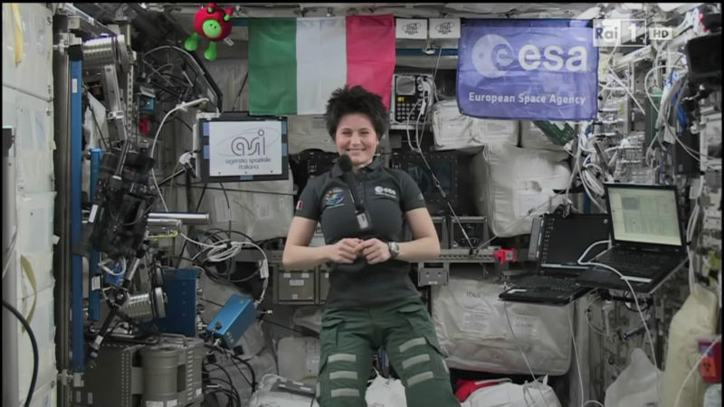
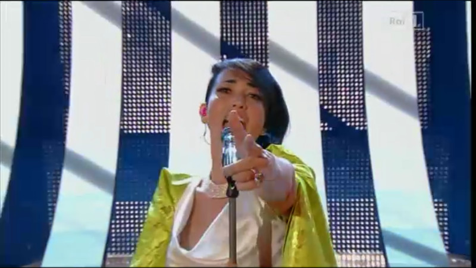

Mentre il microfono galleggia a mezz'aria il moroso dichiara tutto convinto

- _Da grande voglio fare l'astronauta_
- _Ma se hai paura anche solo a prendere l'aereo?_
- _Dannazione!_

Non ho ancora capito cosa gli piaccia del festival, pare un bambino che lo guarda la prima volta. Come in effetti è, giura lui. E continua a fare domande, a chiedere chi è questo, chi è quello, perché c'è Crozza sul palco e non glielo ho detto.

- _No caro, non è Crozza_
- _Dici che è l'originale!?_

Eh già, caro il mio Capitan America, il **Viperetta** è proprio quello vero. E, grazie a lui, Sanremo 2015 ritrova una sua vena comica. Massimo Ferrero, il presidente della Sampdoria, calca il palco come un vero mattatore. Ironico, sopra tutto autoironico, regala una maglietta della Samp a Conti, ne prende il posto, e inizia a cantare _Una Vita Spericolata_. Siani e Pintus dovrebbero prendere appunti. E anche tutto il cast di Forte Forte Forte.

La musica, c'è. Era facile portare a casa la serata. Sul palco sfilano i big, ognuno con una cover. La migliore, "_Se telefonando_" di Mina interpretata da **Nek**, vince facilmente la competizione delle cover. Ma anche **Annalisa** e **Malika Ayane** offrono delle ottime performance. Ma di questo ne ho già parlato, stanotte, con Silvia su [Teatro.it](http://www.teatro.it/musica/sanremo_2015/sanremo_le_pagelle_della_serata_cover_vince_nek_14488)

Oggi, venerdì, ricomincia l'ambaradan. La conferenza stampa, ancora, con Conti, l'intervista alla [Tatangelo](http://www.teatro.it/musica/sanremo_2015/anna_tatangelo_a_sanremo_mai_stata_cosi_libera_14489) e poi di nuovo la serata. E il voto. Già, perché stasera voto anch'io, per il premio della critica. Poi dico meglio, adesso arriva **Il Volo**, e tocca lavorare.
