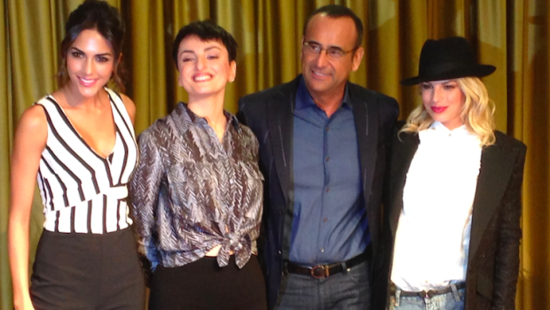

- _Non c’è nessuna Claudia Falzone_
- _Guardi meglio, sono inviata per Teatro.it_

La signorina della RAI sorride, scuote la testa, controlla ancora la lista. Silvia di fianco a me ride, e io provo a dimostrare la mia esistenza alla burocrazia Sanremese. Perché se va tutto liscio al primo colpo non sono io. Ma che ci volete fare, sono qui, finalmente, a Sanremo 2015. E **l’avventura è cominciata**.

- _Serve una sua foto, per il pass_

Prende, gira lo schermo del portatile. E mi faccio fare un selfie con la webcam. Sbuffo:

- _Sembra la foto segnaletica di Natasha Romanoff_

Mi guarda basita

- _La Vedova Nera. Dai, la Marvel_

Scuote la testa. Dandomi della nerd, mi passa il mio pass fresco di stampa

- _Ecco il suo tesserino, Claudia_
- _Grazie_

Allungo la mano, sorrido anch’io, adesso. Il pass è grande come la mia PostePay. Domani, entrerò in possesso anche del mio badge da 10 euro, da utilizzare in cibarie (spero) a Casa Sanremo: non ho ancora il coraggio di chiedere quanto costa un caffè, lì, nel Palafiori. L’Ariston è dietro l’angolo, ma noi il festival lo seguiamo dalla sala stampa. Dove c’è anche il mio posticino. In seconda fila.

Il 65° Festival della Canzone Italiana, detto Sanremo 2015, comincia domani sera ma per gli addetti ai lavori è già partito stamattina con la **conferenza stampa d’apertura**. La sala è piena, non pienissima: molti non hanno fatto in tempo ad arrivare. E ci sono i tulipani.

- _Perché lo fanno notare?_
- _Perché ogni giorno cambiano i fiori._
- _Quindi oggi è il giorno dei tulipani?_
- _Così pare_

Comincia **Giancarlo Leone**, un po’ dispiaciuto per la mancanza di polemiche politiche. Io sono contenta, un problema in meno di cui preoccuparci. Poi è il turno di **Carlo Conti**: battuta sulla propria abbronzatura, e poi una sfilza di informazioni. Dai nomi degli ospiti internazionali (Imagine Dragons, Saint Motel, Spandau Ballet, Ed Sheeran, Conchita Wurst) a quelli italiani (Tiziano Ferro, Al Bano e Romina, Biagio Antonacci, Gianna Nannini e Giovanni Allevi) passando per la decisione di fare aprire le serate di martedì e mercoledì ai giovani. La mette bene, dice che così, in testa, i “_giovani sono valorizzati_”. Emma e Arisa fanno giusto un saluto.

Le domande dei giornalisti, beh, le trovate nelle cronache dei vari giornali. Ci sono **le solite polemiche** per i super ospiti internazionali, e per quelli italiani. Chi chiede se è un festival renziano (ma perché buttarla in politica anche quando non serve?). Una discussione sull’ora di fine festival (Conti dice mezzanotte e venti, Leone mezzanotte e mezza: vedremo domani chi ha ragione). E un **simpatico battibecco** sulla partecipazione di Conchita Wurst. A chi chiede spiegazioni Conti ricorda che “_chi vince il Festival può andare, se vuole, all'Eurovision Song Contest 2015. Ci è sembrato giusto ospitare il vincitore della scorsa edizione_”. **Emma** rincara con “_Conchita la ricordo benissimo. Succede anche che chi arriva ventunesima all'ESC conduca Sanremo_”. **Arisa**, divertita, conclude con una proposta “_Se serve e il vincitore non vuole partecipare all'ESC... c'è Arisa_”.

E’ una bella giornata, a Sanremo. Sole, e la città pare uscita da una cartolina. Il pomeriggio lo dedichiamo a sistemarci nella nostra magnifica mansarda. La nostra padrona di casa, dolcissima, ci ha lasciato un **biglietto di benvenuto**. Poi, prima del tramonto, e prima di cena, un giro per le stradine di Sanremo, un assaggio di vera focaccia ligure. E un po’ di shopping, che da domani non ci sarà nemmeno il tempo di respirare.

Comincia il Festival di Sanremo, **e ci sono anch’io**. Evviva!