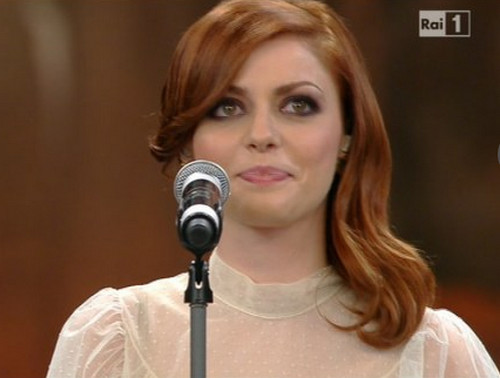
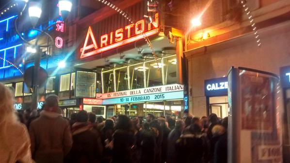

I tempi tra un'intervista e la successiva sono sempre più stretti. Stanchezza e nervosismo sono palpabili in sala stampa. E, penso io, anche fuori. Stasera è una sera speciale: si vota per il **Premio della Critica**. Sarà infantile, ma sento davvero la responsabilità di dover esprimere un voto. Si vota per testata, ogni testata ha un unico voto a disposizione per i Campioni, e un altro per le Nuove Proposte. Però Silvia e io, come inviate per Teatro.it, non avremo problemi a metterci d'accordo su chi votare stasera. Al netto di eventuali sorprese, in positivo e in negativo, ovviamente.

- _Chi voti, Cla?_
- _Tanto non te lo dico, è un segreto_

Il moroso comare abbassa gli occhi, sorride furbetto, e insiste. Ma le regole sono regole. Si vota stasera, e non si dice per chi. Nemmeno alle domande indiscrete dei propri cari.

Se ieri Sanremo era il festival del surreale, oggi è il giorno delle domande indiscrete. I tentativi di fare polemica sul nulla, di alcuni, sono naufragati nei giorni scorsi. Il Festival della Musica Italiana, quest'anno, è **un festival tranquillo**. Evitate, pare, le ingerenze politiche; irreali le accuse di censura da parte di Twitter dietro ordine della RAI; e assurde le polemiche di alcuni sulla "_diretta in differita_" dalla stazione spaziale. Conti giustifica la cosa con un onesto "_non possiamo obbligare la NASA a fare il collegamento quando volevamo noi_". Ha senso, coma ha molto senso il rimando al "**racconto della trasmissione**".

Perché Sanremo è sì il festival in cui i concorrenti cantano in diretta, ma è anche un racconto della musica italiana, delle sue eccellenze, delle sue stramberie e di tante altre cose. E non è una registrazione in differita a togliere la magia di ascoltare Samantha Cristoforetti dallo spazio. (Ah, il moroso nerd ha rotto le scatole perché facessi una spiegazione tecnica approfondita: caro mio, vai a leggere il post di [Attivissimo](https://attivissimo.blogspot.com/2015/02/lintervento-di-samantha-cristoforetti.html), che a Sanremo c'è da parlare di musica, oggi).

- _Perché non hai fatto l'acuto?_
- _L'ho fatto_
- _Ah sì? Scusa, forse è perché io l'ho studiata, la canzone, ed, ecco, sono abituata ad altezze diverse..._

Voce impostata, tono deciso. E un giudizio tagliante sull'esibizione di **Annalisa** di ieri sera. O si vuol far notare, o non ne capisce, o entrambe le cose. Silvia mi stringe la mano. "_Non ti arrabbiare_", sussurra. Da dietro un collega sbotta "_Ma che domanda è? Le sta mancando di rispetto_". L'acuto di Annalisa, ieri sera, è stato formidabile. Lo sappiamo, e lo sa anche lei. Sorride, e con dolcezza afferma

- _No no, fidati: l'ho fatto_

La strizzata d'occhio finale è un tocco di classe. E, Nali, [hai proprio ragione](http://www.teatro.it/musica/sanremo_2015/annalisa_a_sanremo_sono_cresciuta_e_mi_amo_di_pi_14479) quando affermi di essere maturata e di aver imparato a volerti bene. Davvero.

**Masini** si diverte a ricordare il passato. Qualche giorno fa ci ha detto di essere "_più ottimista e tranquillo_"; oggi se ne esce con "_se dovessi scrivere adesso Vaffanculo non basterebbero 4 ore di canzone_". Il tono scanzonato, la piega della bocca, e una luce negli occhi. Non è più rabbia o cattiveria, è la consapevolezza di chi ha capito che ci saranno sempre cose per cui smadonnare. Però, nonostante tutto, si può e si deve andare avanti.

Lo spettacolo è fatto di questo, di vecchie glorie, nuove proposte, carta stampata e web megazine, radio online, blog, e recensioni sui grandi quotidiani. Uno spettacolo che piace ai giovani, racconta Leone. E che abbracciando le nuove tecnologie porta ad aumentare il numero di voti espressi tramite il televoto, via SMS e via app per smartphone. Questo apre la porta ad alcune considerazioni per il futuro. Il festival finisce domani sera, ma già si parla di una sua **edizione novembrina**. Sarà una settimana dedicata alla selezione dei giovani in gara, trasmessa in TV, a mo' di talent. Al sentirlo, molti di noi rabbrividiscono. Poi scuotiamo le spalle. Novembre è distante, e ci sono ancora due lunghe serate davanti a noi di musica, recensioni, commenti. E di sonno arretrato.
