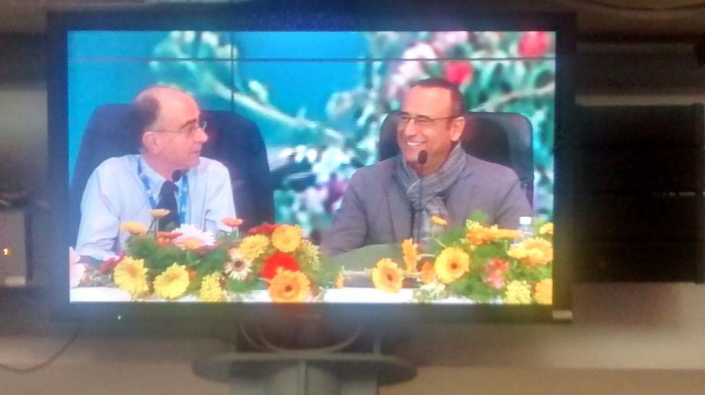

Concluso Sanremo è il momento di mettere ordine in questo diario di bordo. Wordpress non è il massimo per reportage e articoli in sequenza: mette per primi gli ultimi pezzi, e per ultimi i primi. Ma lo Sheldon Cooper che è in me non tollera tutta questa confusione. Occorre quindi fare un recap seguendo un adeguato ordine cronologico.

### [Sanremo, Sto Arrivando!](./2015-02-04-claudia-falzone-a-sanremo)

### [Il (Mio) Primo Giorno](./2015-02-09-sanremo-2015-il-mio-primo-giorno)

### [Il Giorno della Mimosa](./2015-02-10-sanremo-2015-il-giorno-della-mimosa)

### [Il Debutto all’Ariston](./2015-02-11-sanremo-2015-il-debutto-ariston)

### [L’Ora del Caffè](./2015-02-11-sanremo-2015-ora-del-caffe)

### [Il Festival Surreale](./2015-02-12-sanremo-2015-claudia-falzone-al-festival-surreale)

### [Il Grande Volo](./2015-02-13-sanremo-2015-il-grande-volo)

### [Il Premio della Critica](./2015-02-13-sanremo-2015-il-premio-della-critica)

### [Ciao, Sanremo, Ciao](./2015-02-16-ciao-sanremo-ciao)

È questo è tutto. Adesso, per i prossimi due giorni, cado (spero) in letargo, che qui s'ha da recuperare una settimana di sonno arretrato.
