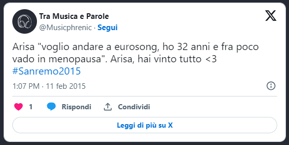
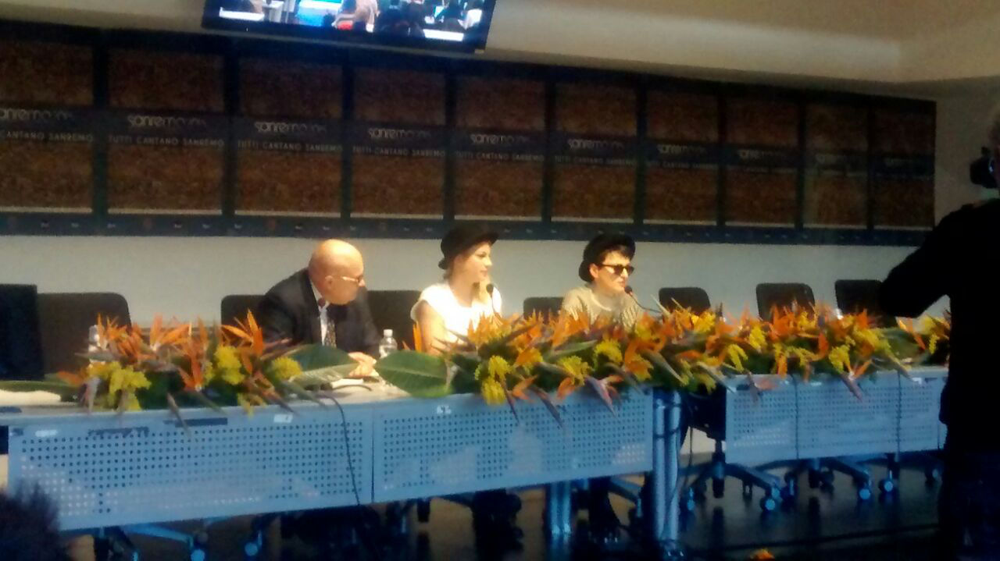

- _Pronto!?_
- _Ciao! Senti, questo pomeriggio sono a Genova. Facciamo shopping?_
- _Ehi, guarda che sono al festival_
- _Beh, le avrai un po' di ore libere, durante il giorno. Sanremo è solo la sera_

Sanremo è così. Finisco di intervistare Malika Ayane, e subito prima di incontrare [Moreno](http://www.teatro.it/musica/sanremo_2015/intervista_a_moreno_da_amici_al_palco_di_sanremo_14482) mi chiama una cara amica. Perché tanto Sanremo è la sera, cosa vuoi che ci sia da fare durante il giorno?

Visto da fuori non te ne accorgi, pare quasi che il magnifico carrozzone proceda per conto suo. Eppure il lavoro che c'è dietro è mastodontico, per tutti quanti. E noi, inviati più o meno speciali, giornalisti - de facto se non di nome -, cronisti, siamo qui. In sala stampa, a parlare con tutti, a tentare di cogliere **il detto e il non detto**. Anche a caccia di gossip, che ci sono o forse no

- _Ma cosa è successo dietro il palco, Emma?_
- _Niente. Eravamo lì con gli autori attente ad ogni eventuale cambio di scaletta_
- _Ma c'è stata frizione tra di voi?_
- _Chi l'ha detto sta stronzata?_

Come se le non-frizioni di Emma fossero la cosa più importante. A volte, in questi giorni, ho come l'impressione che si cerchi lo **scandalo a tutti i costi**. Per portare ascolti, per far parlare giusto per parlarne. Così come la polemica su Siani, e la sua battuta di pessimo gusto, e poi la decisione di devolvere in beneficenza il compenso del comico. Conti giura che non l'ha "_detto per riparare la sua gaffe_". Sarà.

Quella che adoro, è Arisa.

E anche se lo dice con il sorriso, gli occhi sono malinconici. "_Se io rimango in Italia mi toccherà fare Sanremo per i prossimi 30 anni. Vorrei avere la possibilità di aprirmi ad un nuovo mercato. Per il mio percorso artistico fare un Festival fuori mi potrebbe aprire nuove strade_". Siamo coetanei, tu e io, Arisa. Io non conduco Sanremo, ma l'idea di andarsene dall'Italia ci accomuna. E, credo, accomuna molti di noi. Sanremo non è il momento dell'analisi sociologica, e non vale la pena di parlare della fuga all'estero degli italiani. Ma il Festival della Musica Italiana **rappresenta il nostro paese**, nel bene e nel male.

Nel bene, con un'**attenzione per i giovani** che, a parole, sembra vera. A chi chiede polemico sul limite d'età, Conti risponde sornione "_Se uno ha 36 anni e da un po' di tempo fa musica, doveva già accadere qualcosa prima_". In fin dei conti, chiamare nuova proposta uno di quaranta, cinquanta anni è esagerato, e sono d'accordo. Nel male, perché appena capita qualcosa di storto si grida al **complotto**. Mentre in tutto il mondo [Twitter bloccava account](https://techcrunch.com/2015/02/10/twitter-account-locked/?guccounter=1) a caso, in Italia si parla di "_congiura RAI contro i commentatori cattivi_". Leone ammette di non sapere cosa sia successo "_Quello che sappiamo è che c'è stato un traffico incredibile_". Qualcuno in sala stampa sbuffa, non ci crede. Ma siamo fatti così.

- _Mi portate un caffè ragazzi?_

Arisa chiede un caffè. Penso che il mio moroso apprezzerà.

La giornata procede. **Intervista dopo intervista**. Ognuno racconta qualcosa di sé. Noi, in sala stampa, aspettiamo. Ascoltiamo, più o meno attenti. Passano davanti a microfoni e matite Malika Ayane, Platinette, Chiara, Moreno. Non arriva Amara.

- _Evviva, una pausa!_
- _Sigaretta?_

Siamo degli adolescenti di trent'anni, che esultano quando la prof è assente.

- _Signori, arriva Amara._
- _Nooo_

Testa china, mogi mogi, torniamo ai nostri posti. La prof c'è. E vuole fare un compito a sorpresa. Siamo e resteremo sempre degli adolescenti.

Per fortuna ci pensa Moreno a tirarci su di morale. Il rap, a Sanremo, è un azzardo strano, vero. Però non la butta in politica, non cerca messaggi sovversivi o facili polemiche. Moreno ci guarda e ci ricorda, semplice, che "**_la musica è gioia, non fa male a nessuno_**".

A parte a noi, chiusi nel carrozzone, infiltrati per raccontare il festival dall'interno, in attesa della nostra ora d'aria.
