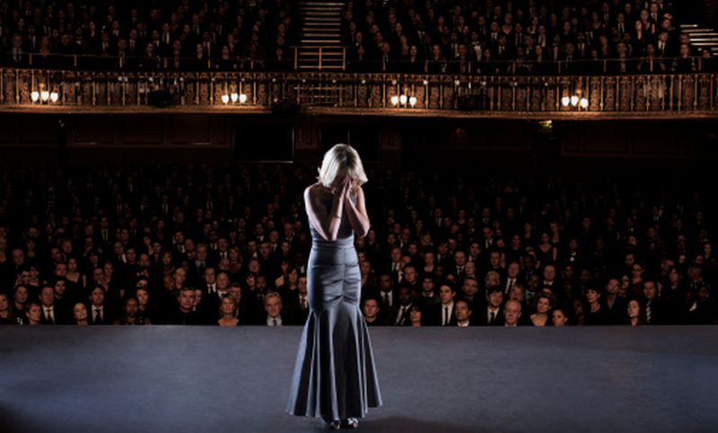
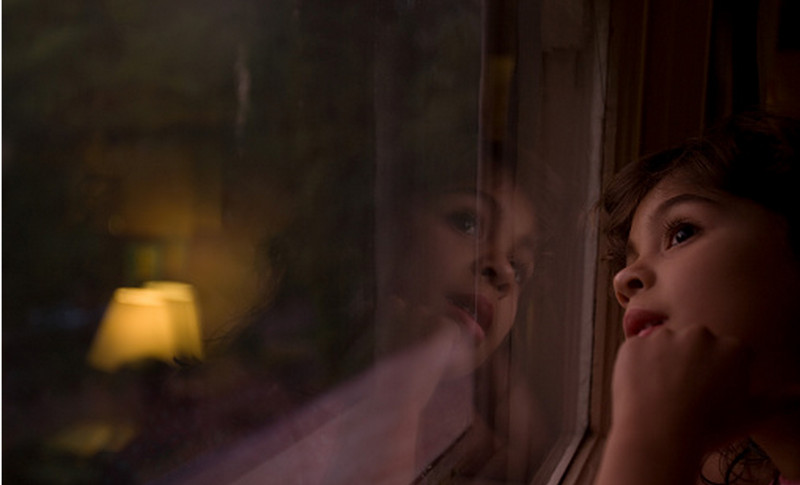

Il primo pensiero che mi sta passando per la testa in questo momento è che odio il numero sei. E il calendario, per una strana coincidenza, segna mercoledì 6 maggio 2009. Sono stesa, mi stanno portando in sala operatoria su una barella ghiacciata. Che cavolo, penso, ma non potevano prenderne una meno fredda? E' un giorno molto torrido e, in condizioni normali, saltellerei dalla gioia... amo il caldo! Invece ho appena finito di discutere col dottore che sta per operarmi.

"_Signorina, ne è proprio sicura? guardi che non è un male dormire durante l'intervento_". "_Non se ne parla_", tuono, "_il corpo è mio, voglio capire cosa mi fate_". Conveniamo per un'anestesia locale con alcune gocce di valium, in modo da essere sveglia ma completamente immobile.

Mia mamma e il dottore dicono che sono coraggiosa, addirittura matta, quando in realtà ho solo una fifa blu delle anestesie generali. Sono una control freak, esigo che tutto sia sempre sotto la mia supervisione. Non è una questione di mancanza di fiducia nel prossimo, è che sapendo tutto in tempo reale mi tranquillizzo e vivo ciò che mi succede con più serenità. Secondo me, questo è un aspetto che si riflette molto nella mia fobia per il sonno.

Quella che affronterò oggi non è un'operazione rischiosa ma è molto seria, è un intervento dal quale capirò quanto è invasivo l'inquilino che sta crescendo dentro di me e se è veramente cattivo come si teme.

Arrivo in sala operatoria, la luce mi acceca. Il chirurgo - senologo, per la precisione - mi ripete "_è sicura di voler rimanere vigile?_" "_sicurissima_". Mette un telo davanti e prepara mascherina, anestesia e valium.

Cosa ci faccio alle 8:30 del mattino in una sala operatoria? Gli eventi che mi hanno portata a questa situazione scorrono rapidamente nella mia mente, quasi fossero la proiezione di un film.

Un sanguinamento apparentemente casuale, proveniente dai canali del latte nel seno, aveva allarmato il mio medico di base - nonché cugino - al punto da farmi avere il bollino verde nel reparto oncologia dell'ospedale. Una biopsia aveva quindi decretato la possibile presenza di cellule tumorali nei dotti, diagnosi che sarebbe risultata più sicura dopo un esame invasivo specialistico dolorosissimo che prendeva il nome di duttogalattografia. La mia paura che il referto desse esito positivo era tanta, in quanto non c'era mai stato un giorno dal primo sanguinamento (avvenuto nel mese di gennaio) in cui non avessi trovato il reggiseno sporco di sangue. Nel giorno del mio ventisettesimo compleanno, il primo aprile, il senologo aveva confermato tutte le mie paure "_C'è una massa di 3,6 cm posta nei canali del latte. Dobbiamo operarla entro 30 giorni, prima che la situazione degeneri_".

E' inevitabile pensare a quelle parole, adesso che sta per iniziare l'operazione. Può essere che vada bene ma anche che vada male, finché non mi aprono non si sa. Mi chiedo chi sono davvero, cosa voglio fare. Una mezza idea ce l'ho: ho sempre avuto un'enorme passione per la musica, una volta mi piaceva anche cantare ma poi ho smesso perché sono troppo introversa e vergognosa. C'è una persona per la quale ho iniziato a scrivere qualche recensione di dischi, come hobby: non so dove mi porteranno questi articoletti ma, mi dico, se l'operazione va bene vedrò di far diventare questo piacevolissimo passatempo un lavoro. Mi vedo con un ragazzo che mi fa più male che bene. Per fortuna, però, ho gli amici: Morena, che è in vacanza a Cardiff e vuole fare l'illustratrice, il mio migliore amico Andrea che è sempre con me, pur non sentendoci tutti i giorni, e tanti altri.

Deduco che il chirurgo abbia in mano il bisturi, sento come del liquido scivolare sulla mia pelle. Ma non ho paura, anzi mi sento tranquilla come se stessi giocando col mio nintendo DS sul divano. Una sensazione di pace meravigliosa, sicuramente il valium sta facendo effetto. L'unica cosa su cui riesco a concentrarmi è la canzone che stanno passando alla radio: si tratta di "_Impossibile_" di Matteo Becucci. E penso, fra me e me, senza nulla togliere a Becucci, quanto cavolo erano fighi i _Bastard Sons Of Dioniso_? Dovevano vincere loro X Factor! E poi dottori, andiamo, mettete una stazione radiofonica più seria. Ogni tanto sento il chirurgo che mi chiede "_Claudia, tutto bene?_" "_sì sì, benissimo_". Dopo due ore e mezza esco dalla sala operatoria, il dottore cerca mia madre per dirle che mi hanno estratto tutta la massa e che i risultati dell'istologico si sapranno tra una settimana, quando toglierò i punti. Io, intanto, fluttuo ancora nel mio mondo esprimendo il disappunto per la scelta musicale in sala operatoria. Se, penserò non appena passata l'anestesia, anche in queste situazioni mi dedico solo alla musica, sono davvero ai limiti dell'autistico. Ancora non so che per settimane non potrò uscire, né muovere il braccio. Né so che avrò un periodo di down, in cui tutta la tensione che ho congelato prima e durante l'operazione si sfogherà facendomi crollare. Dicono che sia normale, ma non ne sono così certa. Comunque, io speriamo che me la cavo (cit.).

Mercoledì 6 maggio 2015, sono le due di notte ed è il sesto anniversario dell'operazione. Quell'intervento mi ha cambiato la vita, in positivo: mi ha fatta crescere come persona e come donna, infondendomi quel coraggio che mi era mancato fino a quel momento. E' passata parecchia acqua sotto i ponti, solo due settimane fa ho intervistato - per la seconda volta nella mia carriera - i _Muse_, ho incontrato tantissimi altri big della musica mondiale e ho realizzato il sogno di andare a Sanremo come inviata. Posso dire di aver dimostrato perseveranza, se penso a tutta la strada che ho fatto nel campo del giornalismo musicale. Ho conosciuto nuovi amici, che si aggiungono a quelli precedenti, e ho avuto la fortuna di trovare una persona che mi ama nonostante i miei duemila difetti. Vado in bagno e mi metto il pigiama. Il mio sguardo si sofferma sulla cicatrice che ho sul seno destro, piccola ma ben visibile, senza vergognarmene. Al contrario, ne vado fiera perché è un piccolo costante promemoria di ciò che sono e che posso essere se mi impegno. Un cumulo di punti chirurgici che mi ha fatto rinascere dalle mie ceneri come un'Araba fenice, trasformandomi da crisalide a farfalla.
