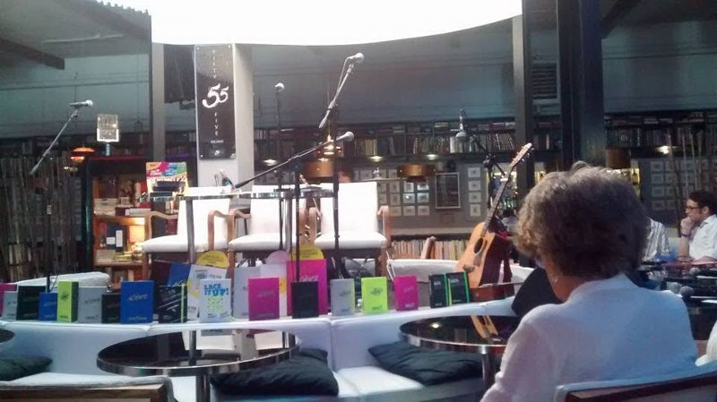
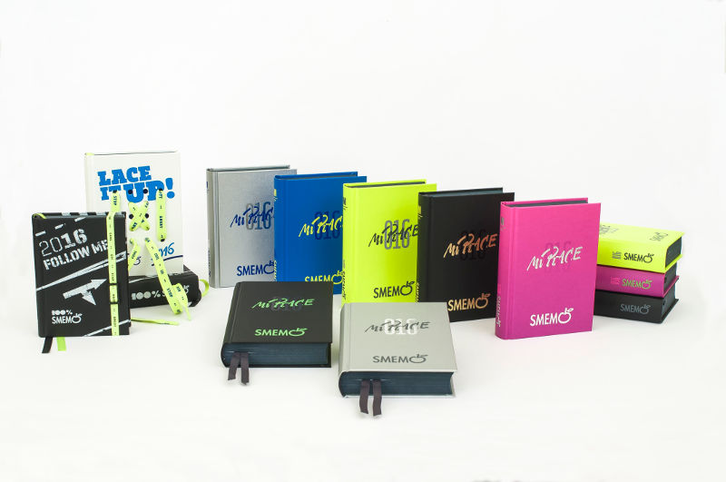
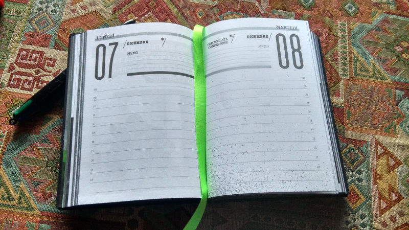
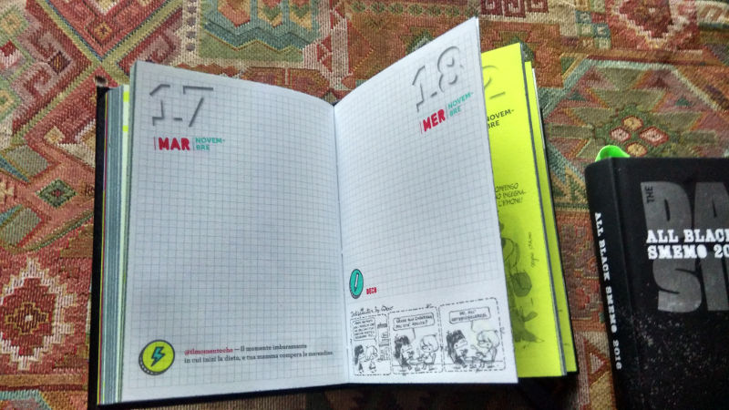
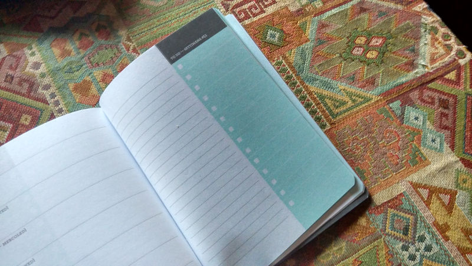
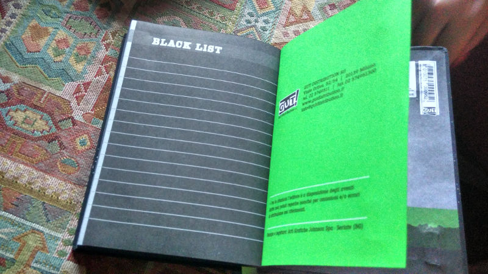
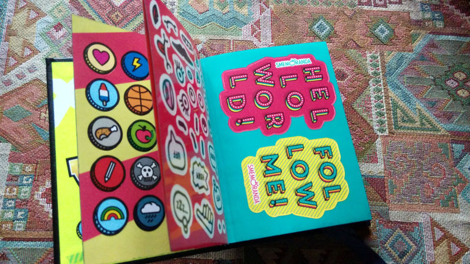
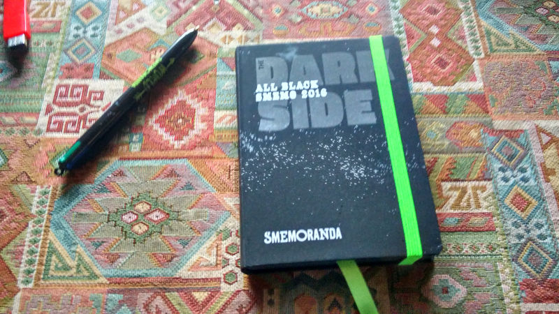
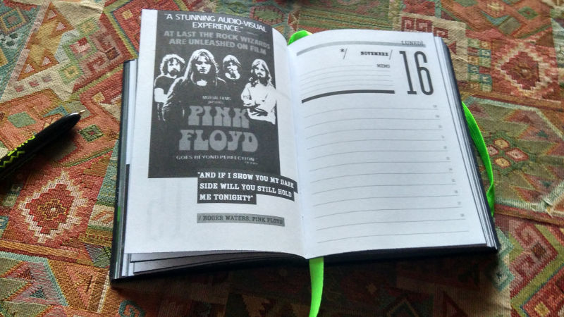
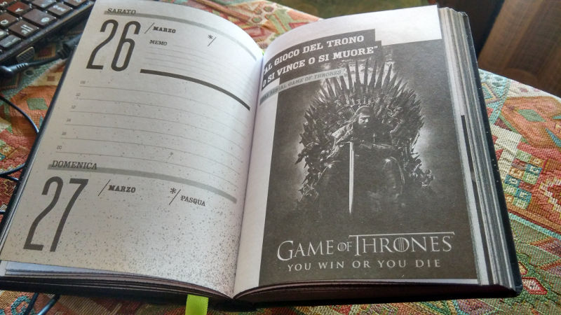

Cosa vuol dire per me il marchio Smemoranda? Sono sicura di non esagerare dicendo che **è parte della mia vita**. Su quelle pagine, che mi hanno accompagnata dal 1996, sono nate le prime piccole poesie, i raccontini e le pillole che sintetizzavano le mie giornate, una dopo l'altra. E' con la 16 mesi più conosciuta e più amata dagli italiani che sono cresciuta, che è nata la parte del mio io che, già da allora, **si divideva tra musica e parole**. E ancora oggi, senza avere più di torno i libri di testo delle scuole superiori e i tomi universitari, la **Smemoranda viaggia ancora con me**. Mi aiuta a tenere aggiornata la mia schedule di appuntamenti lavorativi, le commissioni e relative consegne, e tanto altro.

Con enorme piacere, e un filino di emozione, martedì 7 luglio ho avuto la fortuna di presenziare per il secondo anno consecutivo alla conferenza stampa di presentazione - aperta dalla performance del grande musicista **Fabio Treves** - della nuova Smemoranda 2016, giunta alla sua 38esima edizione e ribattezzata **Smemoranda 2016 Mi Piace.** Per quanto apparentemente il Mi Piace sia un richiamo a Facebook, **Nico Colonna** (presidente della GUT Edizioni e direttore della Smemoranda insieme a **Gino e Michele**) ha affermato che il vero significato del "Mi Piace" è legato a **un messaggio di energia positiva**. Con quel "Mi Piace", ognuno esprime ciò che adora fare, i suoi hobby, le citazioni preferite, il miglior momento della giornata e così via.

La Smemoranda di quest'anno è disponibile in **quattro formati** - XS, S, M, L - e **5 colori**, ovvero nero, argento, blu, giallo fluo e viola. E se il pubblico che la acquista è in percentuali quasi uguali tra uomini e donne (40% e 60%), sono assolutamente queste ultime a sfruttare l'agenda in pieno.

Quest'anno, per ogni giorno, c'è un appuntamento fisso:

- Per il **LUNEDÌ** c'è una lista di Mi Piace correlati alla vita tra i banchi di scuola
- il **MARTEDÌ** e il **GIOVEDÌ** sono all'insegna delle battute più frizzanti, dalle più classiche a quelle che dilagano sul web, da quelle dei film che abbiamo visto mille volte a quelle dei libri che leggiamo fino a consumarli.
- Il **MERCOLEDÌ** è lo Strip Day con le strisce più spiritose, irriverenti e pungenti firmate dai piu\` grandi disegnatori del momento.
- Il **VENERDÌ** ci si dedica alle citazioni tratte da libri, film, canzoni e poesie. Tutte a ricordarci le cose che CI PIACCIONO veramente!
- il **SABATO** è dedicato alla Playlist - ovvero al consiglio musicale della settimana - perché è il giorno della settimana che, di solito, preferiamo.
- Infine la **DOMENICA** di relax e risate con le vignette dei disegnatori Smemoranda.

A grande richiesta torna anche il **countdown per la fine della scuola**, un modo come un altro per sopportare meglio i duri mesi scolastici e aspettare con impazienza il suono dell'ultima campanella dell'anno e l'inizio delle vacanze estive.

Particolare menzione la meritano le edizioni speciali. In primis, parliamo di **UNI**. Con una durata di ben 18 mesi, la sua impaginazione è ideale per annotare i voti agli esami, le varie spese dei libri, e altri impegni legati al mondo dell'Università. Ma UNI. è ottimale anche per chi non va all'università ma ha bisogno di un'**agendina semplice per destreggiarsi nella vita frenetica quotidiana**. Insomma UNI. è il vademecum perfetto con un prezzo davvero pop, e ha un formato tascabile per entrare in ogni zaino e borsa. La copertina è minimal in cartoncino naturale, compatta grazie all'elastico orizzontale, ed è disponibile in due versioni: con dettagli in bianco o in arancio fluo.

**Follow me!** ha una copertina che ricorda l'asfalto e un elastico in cui mettere in evidenza con uno speciale cursore gli stati d'animo o le azioni che più ci piacciono in quel momento.

Poi, abbiamo **Lace it up!** un'agenda coi lacci giallo fluo in copertina per dare libero sfogo alla creatività. Perché le agende Smemoranda non sono nate solo per accompagnarci durante l'anno per elencare i nostri impegni ma anche per **dar sfogo a tutto il nostro estro**.

Tra tutte le edizioni speciali, la mia preferita è **All Black Smemo**. Una Smemoranda tutta dedicata al lato oscuro. All'interno troviamo le bellissime foto in bianco e nero, con citazioni d'autore tratte dai libri, i film, le serie tv e le canzoni che hanno attraversato il cono d'ombra: i **Pink Floyd e Guerre Stellari** (naturalmente), Carl Gustav Jung, Il cigno nero di Darren Aronofski, Il ritratto di Dorian Gray di Oscar Wilde e La metà oscura di Stephen King, i serial **Lost e Game of Thrones**...Un vero **gioiellino per chi è affascinato da sempre dal lato oscuro** e per i nerd amanti di serie tv, cinema e musica.

Infine, non si possono non ricordare le collaborazioni speciali di Smemoranda: **Bic**, che ha realizzato una penna speciale con 4 colori, **Eastpak** che ha studiato una linea esclusiva di zaini e accessori e **Derby**, con 3 succhi di frutta tutti nuovi con ricette altrettanto speciali (Smemo Fruit Derby Blue – lime-zenzero, Smemo Fruit Derby Blue – arancia-mirtillo e Smemo Fruit Derby Blue – arancia-mela-pepe).

Anche quest'anno, **moltissimi i disegnatori** che allietano le pagine di Smemoranda, tra cui **Altan**, Bertolotti e De Pirro, Ceccon, **Squillante**, Staino, Vauro, **Ziche**, Villa De Donno, Donarelli, Migneco e Amlo, Natali, Natangelo, Persichetti Bros, Ponchione, Solines e tanti altri. Ma non è finita qui: alla Smemo 2016 Mi Piace hanno collaborato moltissimi tra attori, cantanti e sportivi che hanno voluto lasciare la loro testimonianza: Antonio Albanese, Albertino, Enrico Bertolino, Claudio Bisio, **Boiler** (Federico Basso, Gianni Cinelli e Davide Paniate), Cristiana Capotondi, Martin Castrogiovanni, Alessandro Cattelan, Cristiano Cavina, Nadia Centoni e Monica De Gennaro, **Cesare Cremonini**, Lorenzo Jovanotti Cherubini, Don Luigi Ciotti, **Andrea Dovizioso**, **Fabri Fibra**, Carlo Gabardin\*, Enzo Gentile, Michele Foresta alias Mr. Forest, Geppi Cucciari, Gialappa’s Band, **Gioele Dix**, Daniel Hackett, Ivan, J-Ax, Maurizio Lastrico, Luciano Ligabue, Luciana Littizzetto, Stefano Mancinelli, Teresa Mannino, Raul Montanari, Moreno, Davide Oldani, **Piero Pelù**, La Pina e Diego, Don Gino Rigoldi, Alessandro Robecchi, **Federico Russo**, Nicola Savino, **Skuola.net**, Sud Sound System, Gino Strada, Licia Troisi, Giovanni Vernia e, infine, i **Finley** - che si sono esibiti in chiusura della conferenza stampa.

La chiave che rende Smemoranda unica nel suo genere è la sua **capacità di reinventarsi senza snaturarsi** e far sentire a proprio agio gli studenti - e non solo - durante il percorso di un anno scolastico o lavorativo. Più che un'agenda, una vera compagna di vita. Ed è per questo che, anche negli anni a venire, continuerò a rimanere fedele a Smemoranda.
