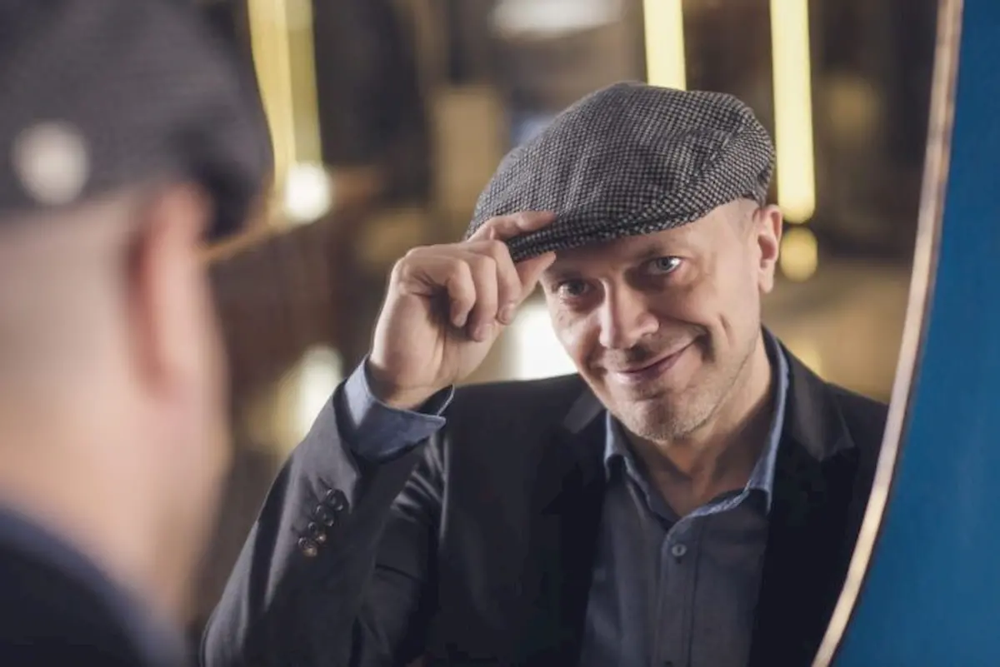

Esce oggi 13 maggio 2016 _Astronave Max New Mission 2016_, il nuovo album di Max Pezzali che contiene, oltre ai brani di "Astronave Max" del 2015, anche 14 brani live e due nuovi inediti: _Due Anime_, scritto da Max con **Niccolò Contessa** della band **i Cani**, e _Non lo So_, realizzato con **Zibba**. Scopriamo cosa ha portato Max a realizzare questo nuovo repack dell'album.

**Uno dei due inediti, Due Anime, vanta la collaborazione di Niccolò Contessa. Puoi spiegarci com'è nata questa unione?**

Niccolò è un amico da una vita. In passato mi segnalarono delle versioni electro-punk di _Con Un Deca_. Da lì ho cercato contatti e mi sono interessato a loro. Ho partecipato ad alcuni loro concerti e da lì è nata un'amicizia nerd. Secondo me, la qualità dei suoi testi e la sua capacità di discostarsi da una scrittura ovvia è unica. Avevo _Due Anime_ come sorta di gioco ritmico perché ero molto annoiato dal mio modo di scrivere. A volte, **quando scrivi canzoni, ti viene una sorta di memoria muscolare** e ti pare di fare sempre le stesse azioni. Ho provato quindi a scrivere un pezzo partendo in un modo diverso, ma ancora mancavano alcuni dettagli. Pier Paolo Peroni - che ha prodotto il disco insieme a Claudio Cecchetto e Davide Ferrario - mi ha suggerito di sentire qualcuno che mi desse un punto di vista differente. Ho contattato Niccolò e dopo pochi giorni mi ha mandato un provino pronto. La mossa geniale di Niccolò è stata quella di mettere, nel secondo bridge, "_Vi succede mai_", anziché "_Ti succede mai_". L'effetto è come quello di Kevin Spacey in _House of Cards_ quando guarda dritto in camera. **Basta una sola lettera per cambiare la prospettiva di un pezzo**. Solitamente in un pezzo d'amore parli con l'amata e non a terzi, è illegale, non rispetta le regole comuni del buon compositore. Grazie a questa intuizione, un pezzo che poteva essere uguale ad altri è diventato unico. Un po' come è successo con Zibba per "Non lo so". Il pezzo era già pronto da un anno, ma non ero convinto, quindi ho contattato Zibba e gli ho chiesto una mano: mi ha mandato un file audio Whatsapp  con la sua versione. Cambiando poche cose ma essenziali, il brano si è completamente trasformato. **Vorrei lavorare così nel prossimo album di inediti**, è una strada da percorrere.

**Quali sarebbero le regole del buon compositore?**

Le regole del buon compositore **cambiano ogni volta che accade qualcosa di deflagrante nella musica**. Fai alcune cose che poi diventano un canone e se provi a fare diversamente non va bene. Quando ho iniziato io c'era il canone Sanremo per le canzoni d'amore, con tanto di aperture di archi. Io e Mauro, ai nostri inizi, avevamo un contratto assurdo secondo il quale dovevamo consegnare un pezzo al mese per tre anni, per un totale di 300.000 lire lorde. Fummo incastrati in questo meccanismo ma ci ha obbligati a **imparare come scrivere le canzoni**. Però, quando infrangi le regole, se hai fortuna e la gente si è rotta, allora hai successo. E' accaduto con gli 883 e oggi col rap. Ho imparato che si nasce incendiari, si diventa pompieri, e poi la senilità ti fa venire voglia di fare casino ancora e se non trovi modo di fare qualcosa che ti dia brivido, a 50 anni è meglio smettere (e io di anni ne ho 48). Per me **la soluzione è stata chiedere aiuto** a qualcuno di più bravo e in modo diverso da me, ma **puoi farlo solo se non sei autoreferenziale fino alla morte**.

**Pensi che la musica sia più un lavoro di team anziché del singolo?**

La musica è un lavoro di squadra per questioni tecniche. Il suono è determinante ed è il producer che lo può fare bene, con un lavoro di cesello in studio. **La canzone in sé è il punto di partenza, non di arrivo** ma quello che si può fare, invece, è far capire al produttore quali sono le tue intenzioni, per essere sicuro che il risultato sia il più vicino possibile a quello che ti immagini.

**Riproporrai le tue canzoni in chiave diversa durante i live?**

Per niente. La gente viene a vedere i miei concerti e si aspetta che riproponga i brani del mio repertorio per come sono, ed è proprio quello che faccio. Per esempio, _Sei Un Mito_ avrà sempre quell'intro. Questi **dettagli** sono quelli che **definiscono l'identità di un pezzo** ed è per questo che, una volta finite, considero le canzoni intoccabili.

**Tu e Niccolò avete due punti di vista compositivi diversi ma vi definite nerd. Qual è il tratto che vi accomuna maggiormente nel vostro nerdismo?**

Io e Niccolò siamo nerd allo stesso modo. Ricordo una volta che mi ha detto "_Che bello quando stai un po' giù, c'hai tristezza, e vai a vedere il sito di thomann_." Thomann.de è il più grande retailer online di strumenti. Ho avuto la conferma che **siamo un po' due anime sbagliate, viviamo la musica col piacere di acquistare uno strumento per avere un giocattolino nuovo. Siamo una sorta di geometri della musica**. Una dimostrazione del mio nerdismo l'ho avuta l'altra sera quando ho incontrato Giorgio Moroder e gli ho detto "_per me lei è più di Dio, ho ordinato un sintetizzatore Moroder edition_" e lui mi ha risposto "_dimmi dove l'hai comprato che lo prendo anch'io_".

**Stai scrivendo nuovo materiale per un futuro disco di inediti?**

Ho buttato giù solo qualche idea ma niente di più. **Il vero nerd** non compone subito, ma **aspetta l'occasione adatta per utilizzare il nuovo giocattolino** comprato tempo prima, perché può pensare "_allora ho fatto bene a comprarlo perché mi serve per lavorare_".

**Ti senti pronto a parlare di qualche tema particolare, con una carriera ventennale alle spalle?**

Oggi la più grande difficoltà è di cosa scrivere. Puoi avere un approccio prosaico-materiale o più aulico, con in mezzo tantissime sfumature che rendono il risultato variabile in maniera incredibile. Trovo sia **difficile parlare del quotidiano**, **possono farlo i rapper perché hanno la credibilità, lo spazio metrico e l'età**. Se dovessi parlare della realtà della mia età suonerebbe triste perché è triste, quindi bisogna inventarsi qualcosa di diverso. Sarebbe bello invece poter fare dei giochi di parole o utilizzare dei pretesti. Per esempio, l'amore è un pretesto: l'amore può essere un ariete per veicolare tanto altro, la cosa importante è dare **più rilievo al significante che al significato** e _Due anime_ è un po' in questa direzione. Per me la canzone ideale è quel brano che sembra un pezzo d'amore ma che è evidentemente un'altra cosa.

**C'è un brano, tra i tuoi classici, che ti sorprende quando lo canti?**

Mi sono accorto che, durante i miei concerti, la gente canta dall'inizio alla fine _Se Tornerai_. Quando l'ho incisa non immaginavo in un riscontro di questo tipo, anche perché è una canzone molto triste, ma ogni volta che la ripropongo nel medley, **posso anche smettere di cantare che il pubblico prosegue per conto suo**.

<iframe width="560" height="315" src="https://www.youtube.com/embed/xfoEnT90qHI" frameborder="0" allow="accelerometer; autoplay; encrypted-media; gyroscope; picture-in-picture" allowfullscreen title="Max Pezzali"></iframe>
