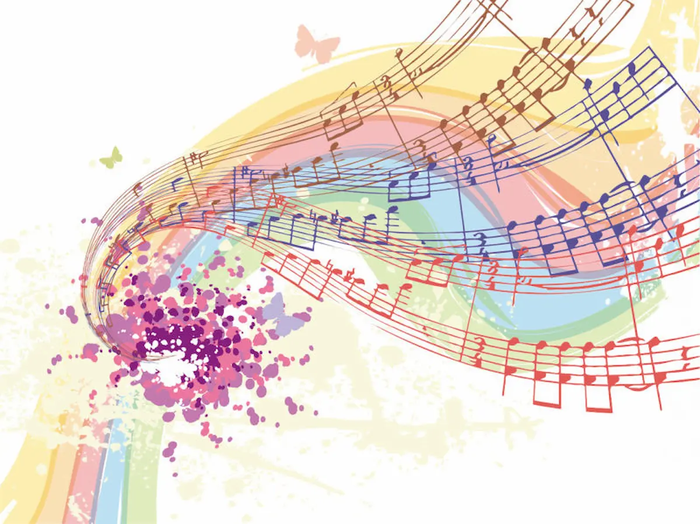
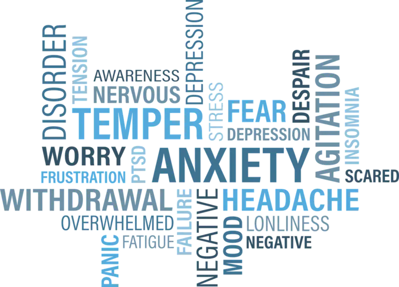
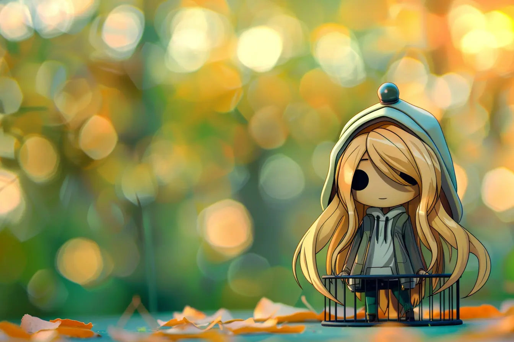
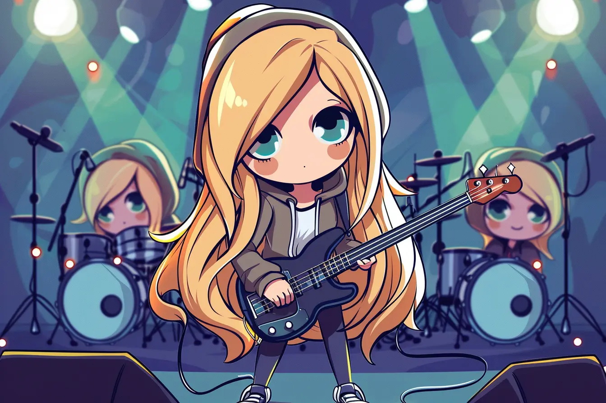

Ci sono elementi che, abbinati, sono assolutamente perfetti (radicchio e speck, coperta di pile e libri, divano e Netflix) e altri che insieme fanno letteralmente a pugni: maglietta a righe e pantaloni a quadri, banana con peperoni, **musica con claustrofobia**. E io, **appassionata di musica**, sono anche tremendamente **claustrofobica**. Ma come può una persona che vive e scrive di musica avere la fobia dei concerti? Ebbene è possibile. E non solo è assurdo ma fa anche terribilmente schifo. **La musica mi accompagna da tutta la vita**: è stata l'ancora alla quale aggrapparmi miliardi di volte, soprattutto nei giorni più bui, è stata **la mia consigliera, la mia compagna, la mia amante** e tutto ciò che di bello può essere. Non sto parlando della banale passione delle ragazzine per le band del momento - anche perché i miei gusti sono sempre stati un po' diversi - ma della _raison d'être_ che mi ha salvata da me stessa in più di un'occasione. Di conseguenza, scrivere recensioni di album e fare interviste mi ha dato quella **sensazione mai provata prima**: il senso di **appartenenza a una dimensione** fatta su misura per me.

Per i concerti, però, la cosa si complica. Non fraintendere: **ritengo i concerti tra le massime espressioni della bellezza della musica**, della sua magia. Giorni fa ho letto [un articolo](https://noisey.vice.com/it/article/andare-ai-concerti-fa-schifo) su Noisey che, senza troppi giri di parole, afferma che **i concerti sono situazioni in cui le persone fanno finta di divertirsi**. Probabilmente può essere vero per chi va solo perché ci va l'amico o il cugino o per fare tendenza, ma per chi vive la musica anche dentro le sue viscere, **vedere un artista cantare e suonare vuol dire essere trasportati in un altro universo**. E succede anche a me, claustrofobica incompatibile con questa forma di spettacolo. Quelle poche volte che sono riuscita a godermi un concerto senza essere colpita da un attacco d'ansia violento, è stata un'esperienza sognante. Il problema, ahimè, è **non sapere in anticipo se i miei disturbi d'ansia si paleseranno**. Non dico che sia invalidante, ma poco ci manca.

Non posso negare che questa condizione mi abbia creato e mi stia creando ancora molti problemi: dalla necessità di stare vicina a una porta completamente da sola alla fuga anticipata, **giustificata da una delle scuse più vecchie del mondo** "_scusa, sai, ma con i mezzi è un casino_", non c'è una sola volta in cui sia riuscita a godermi per intero uno spettacolo senza avere un minimo principio di ansia, che si trattasse di uno show in un club a due/tre ore in uno stadio, seduta in tribuna stampa, nel parterre o nei posti piccionaia. Perché tutto ciò? A tratti **penso di essere pazza, anomala, un ossimoro vivente**. Come fai a spiegare all'amica o al fidanzato che **non riesci a stare in mezzo alla bolgia** perché soffri di attacchi d'ansia e lei/lui vuole vivere, giustamente, le esibizioni nel modo che ritiene migliore? Fortuna ha voluto che, durante gli ultimi concerti, sia stata accompagnata dal moroso, che è un po' all'ABC della cultura musicale ed è una persona a cui non piacciono molto le situazioni eccessivamente chiassose. Al netto di tutto ciò, chiunque sia l'accompagnatore **non è gratificante essere una guastafeste**. Anzi, mi infastidisce star male ma non ci posso fare nulla. È come se fossi **imprigionata in una gabbia che mi sono costruita da sola.**

**I disturbi d'ansia sono molto limitanti**, qualsiasi sia la causa da cui scaturiscono. Ti bloccano, ti impediscono di ragionare lucidamente, ti fanno vergognare di te stesso, non ti fanno vivere normalmente e ti vietano di fare il tuo lavoro, se per esempio fai del giornalismo musicale e dovresti fare un live report. Non so se esistono per rimedi per combattere queste fobie del tutto strane, ma una cosa la so: **l'impossibilità di assistere a un concerto** dal vivo con serenità **fa di me una persona con limiti molto grandi**, ma almeno non una persona che disprezza la musica. Per quanto sia frustrante non riuscire ad andare a vedere le performance dei miei artisti preferiti, nel profondo del mio cuore so che ogni concerto è un'esperienza mistica e divertente allo stesso tempo. Perché **la musica è gioia, è vita**, qualsiasi sia la dimensione ideale di viverla per ognuno di noi. Ed è l'ancora che ci salverà, sempre e comunque. O, **se non altro, salverà me**.

