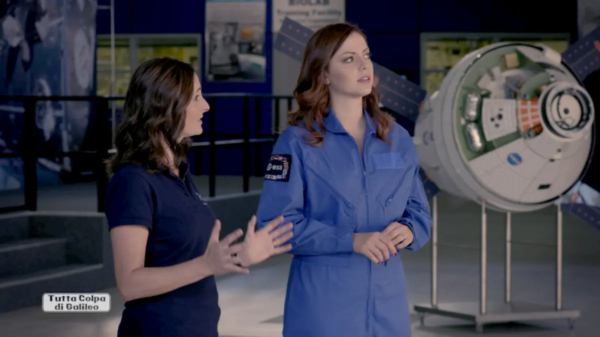
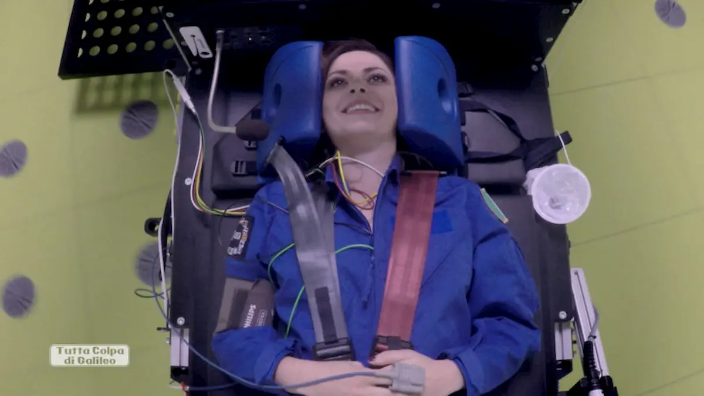
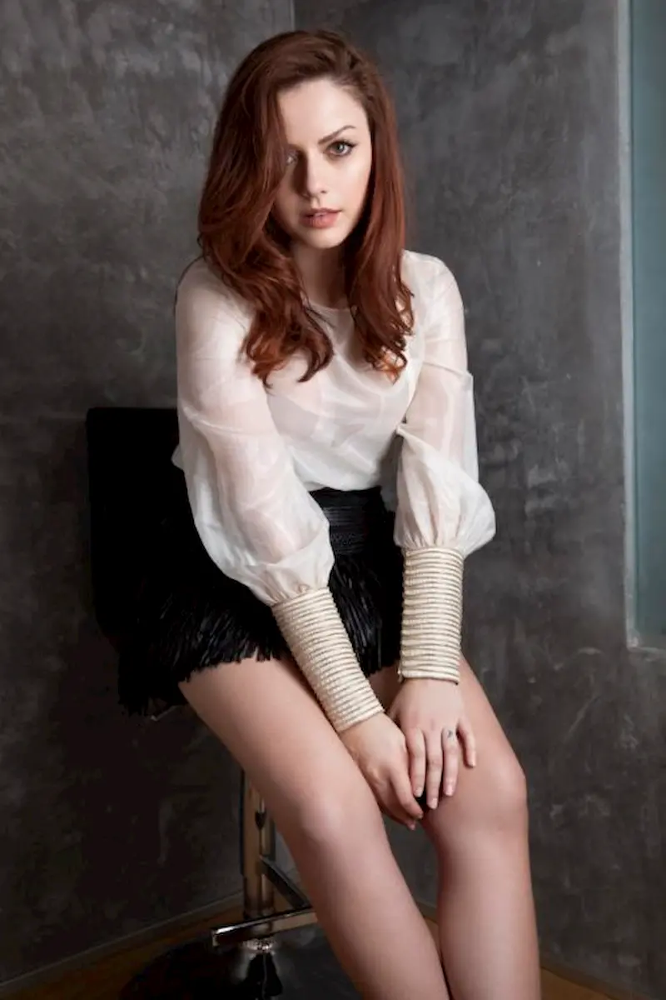

Cos'hanno in comune il mondo della musica pop e della fisica? Nulla, al primo impatto. Eppure **Annalisa Scarrone**, cantante di successo e laureata in Fisica, **riesce a far dialogare queste due dimensioni** all'apparenza così distanti grazie a _Tutta Colpa di Galileo_, in onda **da domenica 4 dicembre in seconda serata**, su Italia 1, subito dopo le Iene. Il programma, il cui format originale è della casa di produzione DueB Produzioni, ci accompagnerà per tre domeniche con puntate da 40 minuti in cui il protagonista sarà **il viaggio di Annalisa e gli spettatori** nel mondo dello spazio. Rappresenta, quindi, la prosecuzione naturale di _Tutta Colpa di Einstein_, andato in onda lo scorso anno ottenendo un grande successo, soprattutto da parte dei giovanissimi. Alla conferenza stampa di presentazione erano presenti **Alessandra Torre** (autrice insieme al regista Andrea Bettinetti), l'amministratore delegato di Due B Produzioni **Luna Berlusconi** e, naturalmente, **Annalisa**.

**Alessandra, ci può dire a grandi linee cosa vedremo nelle tre puntate di Tutta Colpa di Galileo?**

L'anno scorso il programma era incentrato sul CERN e la fisica delle particelle e in quell'occasione abbiamo anche studiato un progetto posizionato sulla stazione spaziale internazionale. Siamo entrati in contatto con **l'Agenzia Spaziale Europea** (ESA) e abbiamo deciso di continuare il nostro viaggio di **divulgazione pop-scientifica** nel mondo dello spazio. L'ESA si è rivelato un partner eccezionale e abbiamo scoperto che l'Italia ricopre un ruolo molto importante all'interno della'agenzia europea. Vedremo incontri con delle eccellenze italiane nel campo dello spazio, quali **Samantha Cristoforetti**, **Paolo Nespoli** e **Luca Parmitano**. Abbiamo incontrato anche **Maurizio Cheli**, che ci ha condotto nel mondo dell'industria italiana dello spazio e ci ha fatto scoprire che più di metà della stazione internazionale è stata costruita in Italia a Torino, la città italiana dello spazio. Inoltre, ci saranno molte tangenze con il mondo della moda, della ricerca, della cultura e così via. Annalisa entrerà nella **Soyuz** e proverà una parte degli addestramenti obbligatori degli astronauti per la preparazione in vista delle missioni e, infine, parleremo dei satelliti e le sonde, gli strumenti attraverso i quali si riesce ad arrivare ai confini del sistema solare. Partiremo dal **Planetario di Milano**, andremo in Germania e finiremo su una spiaggia meravigliosa del Tirreno. Abbiamo avuto l'onore di conoscere **Amalia Ercoli Finzi**, prima donna italiana laureata in Ingegneria Aerospaziale, tra gli ideatori della missione Rosetta. Nella sua chiacchierata ci ha raccontato gli ultimi 60 anni nello spazio.

**Annalisa, hai trovato qualche differenza con l'edizione dell'anno scorso?**

È un'avventura molto bella, quasi più dell'anno scorso. Il tema trattato ha un linguaggio ancora più pop, in quanto **lo spazio è un mondo che abita i nostri sogni** già da bambini e le ispirazioni - nella musica ci sono molte canzoni ispirate dallo spazio. Ho un passato scientifico di cui vado fiera e quest'anno ho vissuto una delle più grandi applicazioni di quello che ho studiato. Tra le varie cose che ho visto in questo viaggio, a Colonia c'erano le riproduzioni in scala 1:1 dei vari moduli della stazione spaziale. Abbiamo approfondito anche **il lato umano** dell'esperienza **degli astronauti** e dei loro stessi preparatori: è incredibile che gli astronauti trascorrano 6 mesi all'interno di questi moduli, alle prese con difficoltà che noi non possiamo nemmeno immaginare.

**Che idea hai della vita nello spazio?**

La mia idea conta poco, mi limito a dire ciò che ho appreso durante questo viaggio. Con la missione **Exomars**, in realizzazione nel 2020, ci si propone di poter capire **se c'è stata vita su Marte**. Mi piace immaginare che possa esserci stata vita anche lì e in altre zone indefinite dell'Universo. Intanto non vedo l'ora di sapere come andrà a finire la missione e spero che sia in grado di dare qualche risposta. **Sarebbe una scoperta scientifica davvero incredibile** e il fatto che l'Italia possa essere parte molto presente in questa missione è ancora più bello.

**Durante Tutta Colpa di Galileo hai incontrato parecchi personaggi simbolici nel mondo dello spazio. Chi ti ha colpita maggiormente?**

Tantissimi di loro, chi per un motivo e chi per un altro. L'incontro con l'istruttore degli astronauti mi ha illuminata, ma **se devo scegliere solo una persona direi Paolo Nespoli**: ci ha accompagnato facendoci vivere sulla nostra pelle esperienze meravigliose, tipo l'ingresso nella Soyuz. E ha un grandissimo carisma.

**Quale parte dell'addestramento per astronauti hai provato? Ti è piaciuto?**

Ho provato **la centrifuga**, un marchingegno in cui l'astronauta si sdraia legato su una struttura che gira. Più veloce gira e più sperimenti la sensazione dell'assenza di gravità. In assenza di gravità, i fluidi corporei vanno tutti verso l'alto; per questo motivo, quando si vedono le immagini degli astronauti in missione, l'impressione è quella di un gonfiore sul viso perché è come se fossero appesi a testa in giù. Su questa centrifuga fai un addestramento per questo tipo di sensazione. Io l'ho provato, seppur non con la stessa velocità, e quando scendi da lì hai la sensazione di **nausea, giramenti di testa e le gambe che non rispondono** esattamente come dovrebbero. È incredibile pensare che questi astronauti all'inizio debbano sperimentare questa condizione e poi ci si abituino.

**Sei una cantante che si presta alla TV, e non molte tue colleghe lo fanno. Cosa ti regala l'esperienza in TV? Si tratta di un episodio circoscritto?**

Non lo so, ma una cosa è certa: questa esperienza la vivo così intensamente perché **sono molto appassionata e legata all'argomento che tratta**. In fondo, tutto nasce dal fatto che sono fisica, ho questa passione dentro di me e tento di portarla ovunque, per questo riesco a viverla con tutto questo entusiasmo. Inoltre, la mia non è una conduzione ma un viaggio. Cerco di **mediare in modo pop** quello che succede e ciò che vedo, perché anche il pop fa parte di me. Sono un **essere pop innamorato della scienza**.

**Come hai detto giustamente, parecchie canzoni sono state ispirate dal cielo e dallo spazio. Stai facendo qualche pensiero su un progetto discografico incentrato interamente su queste tematiche?**

Di canzoni singole ispirate dallo sguardo verso il cielo e l'ignoto ne ho già cantate, **fa parte della natura umana cercare le risposte** che non sa trovare dentro di sé **guardando il cielo**. Per esempio, _Una Finestra tra le Stelle_ è nata proprio da questo.

<iframe width="560" height="315" src="https://www.youtube.com/embed/61Cr5yg8-Uc" frameborder="0" allow="accelerometer; autoplay; encrypted-media; gyroscope; picture-in-picture" allowfullscreen title="Video"></iframe>

**Luna, secondo lei la TV è un mezzo che consente di far cultura? Antonio Ricci, qualche giorno fa, ha detto che la TV non consente di fare cultura.**

Ricci è un grande che ha fatto la storia della televisione, soprattutto grazie all'intrattenimento. Noi siamo piccoli e ci siamo inseriti in un mercato in cui i grandi hanno saputo prendere i loro spazi. Ci siamo inventati dei programmi per farci notare. L'anno scorso, col CERN, all'inizio avevo un po' di timore perché il pubblico italiano **non è abituato a questo tipo di programmi**, la televisione normalmente non regala molti contenuti divulgativi. Noi ci abbiamo provato e ha funzionato. Siamo stati primi su Twitter e abbiamo fatto il 6% all'una di notte. Ciò vuol dire che c'è un pubblico che aspetta anche questo, poi sta a noi la capacità di trasformare queste proposte in modo pop, giovanile e fresco. Annalisa è stata fondamentale, grazie alla sua capacità di trattare un argomento scientifico come la fisica in un linguaggio semplice e fortunatamente ci sono canali che si possono permettere dei programmi diversi da quelli solitamente proposti. Ringrazio quindi Mediaset, Italia 1 e la direttrice di rete **Laura Casarotto** che hanno creduto ancora una volta nel nostro progetto, perché non tutti i direttori di rete danno spazio a queste trasmissioni. Tutta Colpa di Galileo **è un programma curioso** e Annalisa è la prima ad avere questa curiosità.

**Annalisa, un'ultima domanda: parteciperesti a un reality o a un talent come giudice?**

A un reality no, più che altro perché non mi sento all'altezza. Per quanto riguarda il ruolo di giudice in un talent, **sarebbe bellissimo** però occorre farlo **con testa** in quanto si ha a che fare con degli esseri umani che si aspettano qualcosa da te e devi essere in grado di riconoscere se c'è del talento o no: basta un errore per cambiare la vita di una persona. Sono stata dall'altra parte e mi ricordo quello che mi piaceva o non mi piaceva ricevere.

