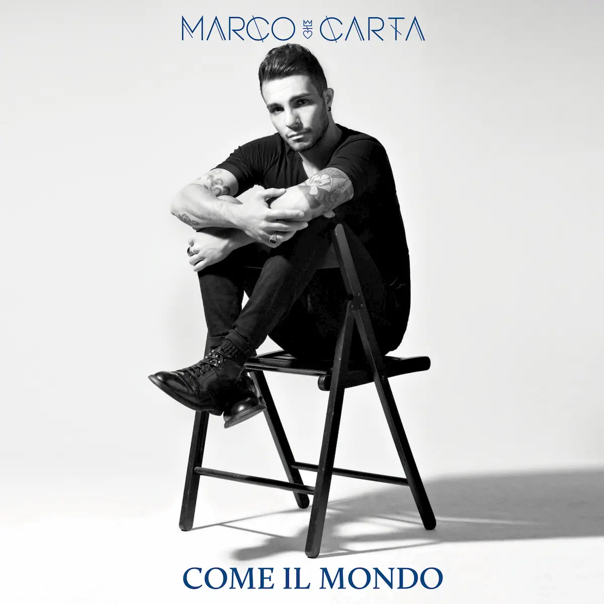

**Marco Carta** **ha pubblicato il 27 maggio** il quinto album di inediti _Come il Mondo_, arrivato a 4 anni di distanza dal precedente _Necessità Lunatica._ Un disco realizzato prima della partenza per l'Isola Dei Famosi, in Honduras, ma **il cui contenuto** può sembrare quasi **una catarsi post-reality**.

"Questo lavoro è cresciuto nel tempo, tanto che ci ho messo ben due anni a completarlo. Sto vivendo un bel momento per la mia carriera, **sono felice e vedo ottime possibilità artistiche davanti a me**. Non vedevo l'ora che Come il Mondo uscisse e, non lo nascondo, **l'Isola dei Famosi è stata una buona opportunità** sapendo che ci sarebbe stato, di lì a poco, **un disco in uscita da promuovere**. Certo, poi ci sono stati anche dei lati che mi hanno sorpreso durante questa esperienza però il motivo del mio viaggio in Honduras non era sicuramente ritrovare me stesso".

Quali sono i lati umani che hanno sorpreso il trentunenne cantante sardo? "**Non pensavo di essere così sensibile, né così poco autonomo**. Mi è mancata la famiglia e tutte le persone che sono parte della mia vita. Pensavo di essere forte e di avercela fatta sempre da solo, sottovalutando l'importanza degli angeli custodi che da sempre stanno al mio fianco. Penso che, da ora in avanti, sprecherò molto meno tempo nella mia vita".

Marco Carta è particolarmente legato al nuovo album "Credo che _Come il Mondo_ parli di cose profonde alle persone. **La title track parla di cose negative, ma questo mondo è pieno di cose positive**. Tornando dall'isola mi sono reso conto di quanti servizi e possibilità abbiamo a nostra disposizione. Un'altra cosa che ho capito ultimamente è che la musica è l'unica cosa in grado di andare al di là delle etnie e di tutte le altre cose perché, di fatto, è _L'Ultima Cosa Vera_. Qui i poveri sono quelli che non riescono a comprarsi l'iPhone o i genitori che non riescono a comprare le Nike ai propri figli. In Honduras, invece, la povertà è a livelli stellari e, nonostante ciò, **le persone sono sempre sorridenti**".

Il primo singolo "Non So Più Amare" racconta di un bluff sentimentale: nonostante Marco Carta canti nel ritornello di non saper più amare, il messaggio fra le righe è un altro "In realtà, ascoltando la canzone, capisci che il messaggio per l'altra persona è: hai il potere di farmi stare bene, ogni giorno. E' un brano scritto da Federica Camba e Daniele Coro, ma **l'ho sentito mio fin da subito**". Già da questo brano si riesce a scorgere la venatura rock che Marco Carta già aveva ai tempi di Amici ma che ha deciso di inseguire in maniera sempre più decisa, sia dal punto di visto sonoro sia dei testi, alcuni dei quali sono stati scritti a 4 mani con gli autori.

Sebbene sia nel pieno della promozione di _Come Il Mondo_, Marco Carta sente ancora una forte esigenza di esternare tutte le sensazioni che l'Isola ha smosso "in questi giorni sto buttando giù qualche idea, ma la realtà è che **queste emozioni si stanno ancora agitando dentro di me**. Questo non vuol dire che scriverò canzoni che avranno come tema l'Isola, bensì pezzi che parleranno delle emozioni che l'esperienza da naufrago in Honduras mi ha regalato".

<iframe width="560" height="315" src="https://www.youtube.com/embed/T9jPYavkQOw" frameborder="0" allow="accelerometer; autoplay; encrypted-media; gyroscope; picture-in-picture" allowfullscreen title="Video"></iframe>
