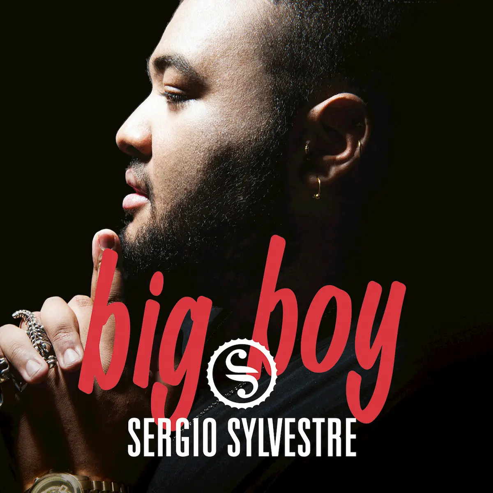

**Sergio Sylvestre**, vincitore di Amici 15, **è ancora incredulo** di quanto sta succedendo: solo poco più di una settimana fa era ancora dentro la scuola, mentre adesso è in tour col firma-copie del suo EP di esordio **_Big Boy_** - pubblicato il 20 maggio con 4 cover e 4 inediti - e incontra tante persone che già sono diventate sue fan. In occasione della data del firma-copie di Milano, abbiamo raccolto **le prime impressioni a caldo di Sergio** a poche ore dalla vittoria.

**Quando hai capito che avresti potuto vincere?**

Forse la settimana in cui sono rimasto solo, perché i miei due coach J.Ax e Nek mi hanno incoraggiato e sostenuto. Però sapevo che sarebbe stata **un'impresa tutt'altro che facile**, perché **le canzoni da preparare** per l'ultima serata **erano davvero tante** e avevo pochi giorni a disposizione.

**Qual è la prima cosa che ti hanno detto i coach dopo la vittoria?**

Nek mi ha detto "ce l'hai fatta, ce l'hai fatta!", mentre J.Ax mi ha guardato negli occhi e ha detto la stessa cosa in inglese, usando parole un po' più colorite "You fucking did it!". Siamo stati felicissimi, anche perché i componenti della squadra blu spesso non erano fra i favoriti, ma possiamo dire di aver fatto sempre belle esibizioni.

**Il tuo inedito _Big Boy_, che è anche il titolo dell'EP, è stato scritto da Ermal Meta. Vorrei sapere se vi siete conosciuti prima che lo scrivesse o se hai letto il pezzo solo quando l'autore ha finito di scriverlo.**

Non ci siamo mai conosciuti ma lui ha guardato Amici, anche le puntate del pomeridiano, e attraverso la trasmissione ha capito che tipo di persona sono e il vissuto che ho alle spalle. **Quando ho letto il testo di Big Boy la prima volta ho pianto** perché è davvero un brano molto bello: ogni volta che lo canto mi fa provare, allo stesso tempo, dolore e felicità. In un certo senso, mi fa anche sfogare, perché è vero che sono lontano da casa e che la vita non è sempre facile, ma quello che conta è andare avanti. Sono molto onorato di avere un inedito così bello, che parla di me.

**Come hanno reagito i tuoi familiari?**

**Mia mamma e mia sorella** mi hanno fatto una sorpresa e **mi sono venute a trovare**, non immaginate le emozioni che ho provato quando le ho viste. Purtroppo mio padre non è riuscito a venire, ma spero di vederlo al più presto.

**Qual è stato l'insegnamento più prezioso?**

**Maria mi ha dato molti consigli al di fuori delle telecamere**, soprattutto per tirarmi su di morale quando mi vedeva triste, **mi ha incoraggiato e mi ha spronato a essere più sicuro di me stesso**. Ma non è stata la sola ad aiutarmi durante il percorso di Amici: Marco Maccarini e Alex Braga mi hanno sempre detto di esternare le mie emozioni e anche Rudy Zerbi, negandomi l'accesso al serale per ben due volte, mi ha spinto a **dare il massimo per conquistare un posto al serale**.

**La critica che più ti ha fatto crescere?**

Quando ho cantato per la prima volta in italiano, _Cambiare_ di Alex Baroni, ero molto teso non solo per la difficoltà vocale della canzone ma anche perché dovevo fare attenzione a pronunciare correttamente il testo. Nek e J.Ax mi hanno detto che **avrei dovuto lasciarmi andare un po' di più** e non aver paura.

**Com'è cambiato Sergio Sylvestre dall'inizio del programma a oggi?**

Sono cresciuto tanto. Prima ero timido e chiuso, ma la scuola mi ha fatto capire **chi sono e cosa voglio fare**. Sono molto più convinto di me stesso.

**Cosa farai nei prossimi giorni?**

Continuerò col firma-copie e tornerò in Salento, dove vivo da 4 anni, per le riprese del video di _Big Boy_. Ma spero anche di avere un attimo di tempo per incontrare i miei amici e festeggiare la mia vittoria con loro.
