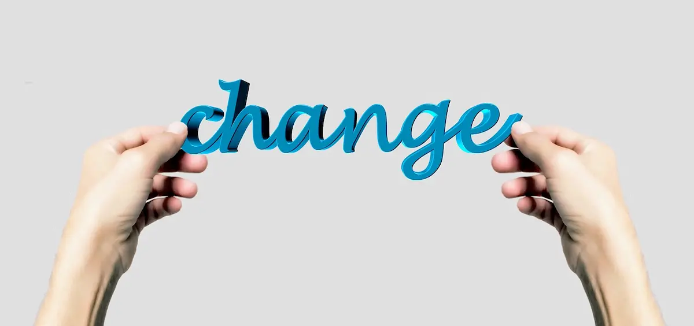

- _Ma che fine hai fatto?_
- _Perché non scrivi più sul blog?_

Se potessi avere un euro per tutte le volte che mi sono sentita ripetere questa frase negli ultimi sei mesi, avrei da parte un bel gruzzoletto. Che abbia momentaneamente abbandonato queste lande era palese, meno chiari i motivi legati a questa latitanza. Per farlo, occorre fare un salto indietro nel tempo all'agosto 2015. Ero in vacanza col mio fidanzato in quel del Vicentino quando, durante una camminata, gli ho chiesto di fermarci. Che non sia mai stata esattamente un grissino lo sanno anche i muri: **regime sedentario da far invidia a un bradipo** **e un lavoro che** la maggior parte del tempo **mi teneva ore seduta davanti a un computer** non erano esattamente un sinonimo di vita salutare. Però, in quel momento, **mi sentivo male**. Non solo in senso fisico per il fiatone, ma anche perché avevo la percezione che qualcosa non andasse. **Oltre alla zavorra interiore** che da moltissimi anni mi affliggeva, **se n'era aggiunta una** pesante come un'incudine, **all'altezza del petto**. Al momento non ho dato importanza a questa strana stanchezza, pensavo fosse colpa del caldo atroce - io, che ad agosto ho il coraggio di dormire con la copertina di lana. Col passare dei giorni, però, **la preoccupazione aumentava** tanto da decidere di andare al reparto di _Dietistica e Alimentazione_ dell'Ospedale di Niguarda. **Non ho mai avuto problemi di** bulimia, mangiate compulsive o qualsiasi tipo di **disturbo alimentare comportamentale**, non mi piacciono i dolci, la Nutella né il cioccolato. Avevo solo una predilezione per gli snack salati e per la pasta condita in un certo modo (besciamella, panna, carbonara e così via), ma erano cose che consideravo "normali". L'unica debolezza che avevo erano i drink: pur non eccedendo, quando si usciva non rinunciavo al mio cocktail o a un paio di birre. Il problema è che tutte queste cose, associate a uno stile di vita sedentario e a un'autostima sotto i piedi, frutto di quella zavorra interiore, mi avevano trasformata nella **matrioska di me stessa**. Avere la consapevolezza di **essere intrappolata in un corpo pesante** che non riconosci come tuo, e non riuscire a liberartene, **è una sensazione opprimente che non auguro a nessuno.** Dopo una serie di esami tra l'ultima settimana di ottobre e quella di novembre, il 18 dello stesso mese **ho iniziato un percorso chiamato MAC**. Tale terapia prevedeva un regime di day hospital dal lunedì al venerdì, dalla mattina al primo pomeriggio, con pranzi in ospedale e una serie di monitoraggi legati al peso. O almeno, inizialmente è così che ho vissuto i primi giorni di MAC. Mi sbagliavo profondamente.

Certo, il peso è un aspetto non indifferente del MAC ma ad affiancarlo c'è, soprattutto, **calore umano.** Quello dei compagni di terapia con cui ho condiviso momenti belli e quelli meno, sessioni in palestra prima da soli e poi coi personal trainer, le sedute di gruppo del martedì tanto aspettate quanto, allo stesso tempo, temute. Il calore umano dell'equipe medica, però, **ha fatto la differenza**. A partire dall'**educazione alimentare** - che, a posteriori, secondo me **farebbe un gran bene a tutti** e non solo ai pazienti - per passare all'aspetto morale. Nei mesi in cui mi fermavo in ospedale (due mesi a 5 giorni, uno a 3 giorni, e due a 2 giorni) avevo i miei rituali quotidiani, tra cui i 5 minuti di dialogo con la dietista. Questi 5 minuti, quasi sempre, erano in grado di svoltare la mia giornata in positivo. Quando ti trovi nel mezzo di un piano di rieducazione alimentare, non sei semplicemente "a dieta": stai facendo un cammino complesso, non esente da momenti di crisi, ma fondamentale per una rivoluzione, esteriore ma soprattutto interiore. Una rivoluzione il cui **insegnamento più grande è prendersi cura di se stessi**. E' una fisioterapia dell'anima, perché ci si trova a tu per tu con le proprie debolezze e con una forza tale che, se si tiene botta, è più grande di quanto si possa credere. E' imparare nuovamente a vivere, nel senso più positivo e sano del termine. Si esce dal tunnel della bassa considerazione di se stessi influenzata dal proprio peso corporeo e si entra in una dimensione più a contatto con la realtà, in cui il valore di una persona **si misura dai pregi che ha**. Adesso sono tornata alla mia vita di quasi tutti i giorni, con tanto di interviste, conferenze, commissioni e chi più ne ha più ne metta, ma ogni martedì mattina mi ricongiungo con i medici che ci hanno preso a cuore e seguono ogni paziente nel modo migliore possibile. Un team che, consapevolmente o meno, **mi aiuta costantemente a riscoprire la mia vera me**, spolverando via quella coltre polverosa che prima mi faceva sentire di continuo un brutto anatroccolo. **Quel brutto anatroccolo che** aveva al suo fianco una persona che la amava e un lavoro tanto precario quanto bello ma, nonostante ciò, **non riusciva ad essere felice**. Di strada davanti a me ne ho ancora tanta e, di fatto, non riesco ancora a quantificare i progressi che sto facendo - dicono che sia normale, guadandosi tutti i giorni - però una cosa la so: questa terapia mi sta cambiando la vita, facendomi imparare non solo le buone abitudini alimentari ma, soprattutto, la soddisfazione derivante dall'attività fisica. La pigrizia se n'è andata, i kg idem e pure il brutto anatroccolo ha deciso di andarsene. Al suo posto, un cigno che sta facendo il massimo per poter risplendere in un futuro non troppo lontano. Cos'è rimasto? La crescita interiore di questi mesi, il lavoro precario e uno stile di vita salutare.  Oltre al fidanzato, ovviamente.

<iframe width="560" height="315" src="https://www.youtube.com/embed/CmwRQqJsegw" frameborder="0" allow="accelerometer; autoplay; encrypted-media; gyroscope; picture-in-picture" allowfullscreen title="Muse - Feeling Good"></iframe>

Grazie all'equipe di medici e dietisti del MAC che mi sostiene giorno per giorno. Grazie ai compagni di terapia che hanno reso questo cammino più piacevole. Grazie agli amici che sopportano una mia maggiore assenza ma sono contenti per me. Grazie agli amici che riescono comunque a essere presenti. Grazie ai colleghi che, poco per volta, mi stanno dando il bentornata. Grazie alla mia famiglia che mi supporta e sopporta. Grazie al mio fidanzato, per incoraggiarmi ogni giorno.

E grazie a me stessa per aver avuto la spinta a voler cambiare vita.
