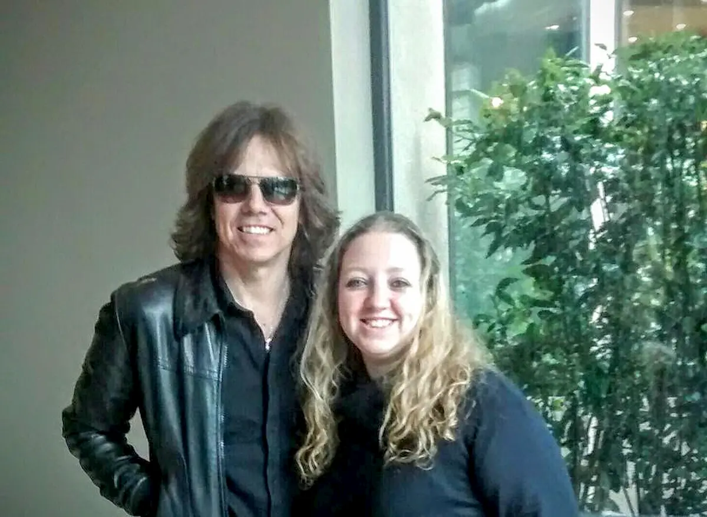

Che la mia vita sia scandita da canzoni non è un mistero. Vado a fare una camminata per tenermi in forma? So che il tempo perfetto per l'allenamento è compreso tra le 5 e le 10 canzoni. Meglio ancora se rock, ma questo è esclusivamente un dettaglio. Se tu che leggi volessi chiedermi che musica ascolto, **preparati ad ascoltare un monologo** - probabilmente con alcuni momenti nonsense - in cui ti spiego che **associo i generi in base alle emozioni e allo stato d'animo** in cui mi trovo. Però è inutile negarlo: nonostante tutte queste belle premesse, anch'io ho **una mia classifica personale**. La top 3 (che poi non è 3 ma questo lo vedremo fra poco) è costituita da brani oggettivamente molto belli ma, soprattutto, legati a momenti molto importanti della mia vita. Premetto che l'ordine in cui le presento non è una classifica, bensì una cronologia in cui sono comparse nella mia vita. Oggi, nella terza tappa dei **Venti Passi**, voglio svelare la mia top 3.

### 1) Europe - The Final Countdown

<iframe width="560" height="315" src="https://www.youtube.com/embed/9jK-NcRmVcw" frameborder="0" allow="accelerometer; autoplay; encrypted-media; gyroscope; picture-in-picture" allowfullscreen title="Europe - The Final Countdown"></iframe>

Quando penso a _The Final Countdown_, torno subito bambina. Si dice che **i primi ricordi siano legati a un istante emotivo importante**. Il mio primo ricordo nitido è mio padre che mi mette in testa una cuffia con questo pezzo degli Europe. **Avevo quattro anni** e ovviamente, all'epoca, non potevo sapere chi fossero gli Europe né i loro visi. Mia mamma, presente in quel momento, mi ha detto più volte che avevo un'espressione tanto estasiata da spingere mio padre, di professione fotografo, a scattarmi una foto. Inutile dire che la foto della piccola Claudia con delle cuffie enormi in testa è ancora appesa in camera. **Anni dopo**, guardando il video di The Final Coundown su MTV, **mi innamorai platonicamente di Joey Tempest**, considerandolo il mio ideale di principe azzurro. E poi, nel 2015...ho incontrato Joey Tempest di persona! Tremavo come una foglia, ero emozionatissima ma felice, perché la me adulta e la Claudia bambina si erano ricongiunte al cospetto di uno dei loro idoli!

### 2) Nine Inch Nails - Hurt

<iframe width="560" height="315" src="https://www.youtube.com/embed/KR4DjYczINM" frameborder="0" allow="accelerometer; autoplay; encrypted-media; gyroscope; picture-in-picture" allowfullscreen title="Nine Inch Nails - Hurt"></iframe>

Tanto la prima canzone è legata alla gioia, tanto la seconda è legata al dolore. Non quello fisico, bensì quello psicologico. Quello che da persona normale **ti rivolta come un calzino, sbattendoti al muro senza lasciarti via di scampo**. Si chiama depressione, dicono. Non so se questa definizione sia corretta, o se capita a tutti un momento in cui il senso di inadeguatezza ti pesa talmente tanto da essere la prima nemica di te stessa. L'essere una secchiona a scuola non mi ha di certo reso le cose semplici, ma il malessere è saltato fuori dopo. Ci sono stati numerosi picchi in cui **l'unico desiderio, l'unica necessità, era ottenebrarsi completamente**. Questa era la sensazione che volevo ottenere, ascoltando la voce struggente di Trent Reznor in _Hurt_. E invece, come dice il titolo stesso, **l'unico risultato che ottenevo era farmi sempre più male**, innescando un pericolosissimo circolo vizioso - confesso che ancora oggi, quando mi capita questo brano, devo skipparlo. Per quanto alcune cicatrici siano rimarginate, **non vuol dire che non esistono più**. In quell'inferno ci sei solo e soltanto tu, il resto non ha la benché minima importanza. Fino a quando arriva un momento di svolta in cui ti ritrovi davanti a un bivio. Soccombere o andare avanti?

### 3) High Hopes - Pink Floyd

<iframe width="560" height="315" src="https://www.youtube.com/embed/7jMlFXouPk8" frameborder="0" allow="accelerometer; autoplay; encrypted-media; gyroscope; picture-in-picture" allowfullscreen title="High Hopes - Pink Floyd"></iframe>

**Quel punto di svolta, in effetti, è arrivato**. Devastante come un TIR che ti investe a tutta velocità. Nel 2009, mi hanno trovato [un tumore](https://www.tramusicaeparole.com/sei/) ai canali del latte nel seno destro. A quel punto realizzi che **tutti i dolori interiori** di cui sei stata vittima per anni interminabili, **avresti benissimo potuto risparmiarteli**. Visto che, prima o poi, la vita decide di complicarti la vita e cambiare le carte in tavola. Dal momento della diagnosi al momento dell'operazione **sono passati poco meno di tre mesi**, che ho vissuto con grandissima tristezza. Perché quando ti rendi conto di aver buttato via del tempo prezioso della tua vita a massacrarti con problemi inesistenti, quando avresti solo dovuto sganciare qualche vaffanculo in più, ti senti **mancare la terra sotto i piedi**. Si possono recuperare degli oggetti, dei contanti, ma il tempo buttato via non ce lo restituisce più nessuno. In quei giorni, questo brano dei Pink Floyd è stato **meglio di qualsiasi terapia**. Da una parte c'era il rammarico ma dall'altra c'era la speranza, seppur fragile, che le cose **potessero avere ancora un risvolto positivo**.

### 3bis) Aerosmith - Aerosmith

<iframe width="560" height="315" src="https://www.youtube.com/embed/aU44W5W9lqg" frameborder="0" allow="accelerometer; autoplay; encrypted-media; gyroscope; picture-in-picture" allowfullscreen title="YouTube video player"></iframe>

E, in effetti, le cose hanno avuto un risvolto positivo. Dopo l'operazione si è scoperto che il mio tumore **era di natura benigna**. Un gran sospiro di sollievo e la consapevolezza che la dea bendata aveva deciso di darmi un'altra possibilità. Chance che avrei dovuto utilizzare per **uscire da una situazione di stallo** diventata troppo soffocante. Ho iniziato a lottare per me stessa, a inseguire i miei sogni e stringere i denti nonostante le porte chiuse in faccia. Sebbene sia ancora lontana dall'avere una grande stabilità lavorativa, ho fatto parecchia strada e non ho alcuna paura del cammino che devo ancora percorrere. Con la speranza ho capito che quasi tutto è possibile. Anche **attraversare l'inferno e uscirne indenne**, con solo l'orlo dei jeans lievemente bruciacchiato.

