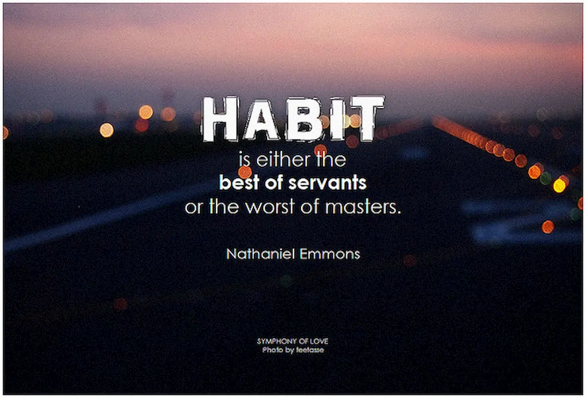
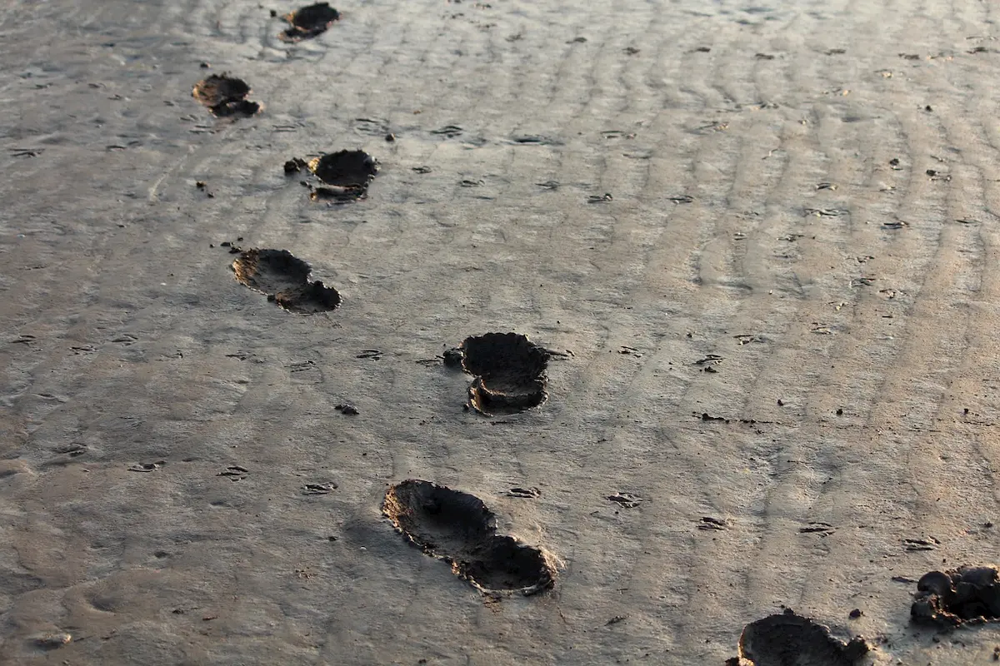

Se c'è una cosa di cui mi lamento spesso, è la mancanza di tempo nello scrivere. Mi lamento con i miei colleghi, mi lamento con me stessa ma soprattutto annoio il moroso con i miei deliri. All'ennesima lamentela, se n'è uscito con una delle sue idee geniali.

- _Uffa, vorrei dedicare più tempo al mio blog ma tra commissioni, [ospedale](https://www.tramusicaeparole.com/svolta-chiamata-mac/) e altre cose, non ci riesco mai._
- _Ho un'idea_

E così, dal nulla, mi parla di un esperimento a cui molti blogger (soprattutto anglofoni) hanno preso parte: **il Writing 101: Build a Blogging Habit.** Si tratta, sostanzialmente, di costringersi ogni giorno, per 20 giorni, a scrivere qualcosa. Che sia un articolo corto o lungo, un editoriale o una recensione, vita vissuta o un racconto fantastico, poco importa. Ciò che importa invece, come dice il titolo del progetto, è **sviluppare un'abitudine quotidiana** che prevede un ritaglio di tempo esclusivamente dedicato alla mia casa virtuale. Lo so che è paradossale non trovare il tempo di scrivere per se stessi, se di lavoro vuoi fare questo, ma dopo aver scritto tutto il giorno su commissione, **non riesci a uscire dall'ottica** "lavoro". Cosa mi aspetto da questo esperimento? Non ne ho idea. Al momento, in realtà, mi basterebbe avere la costanza di scrivere dal lunedì al venerdì, lasciando il weekend ai miei hobby - o alle altre commissioni, ovviamente. Pigrizia? No. E' che, se devo costruire un'abitudine quotidiana, **bisogna agire sui 5 giorni lavorativi**, in modo da non crearmi troppe giustificazioni se un giorno non ho voglia di farlo.

C'è di buono che, almeno, le idee non mi mancano. Per questo motivo mi sono imposta di **non seguire esattamente alla lettera le istruzioni**, ma semplicemente prenderne spunto per scrivere di argomenti a me familiari. Per esempio, ho deciso come primo post di presentare questo progetto, per farti entrare in questo mini-viaggio della durata di 4 settimane. Non nascondo che, quando ho letto le regole, mi sono detta "_oddio, ma come faccio a sviluppare questi temi? Non ce la farò mai, non sono nelle mie corde!_". Il moroso, che è molto più fantasioso e sognatore della sottoscritta, mi ha aiutata a comprendere meglio lo spirito degli input previsti per ogni tappa. Il problema di trovare il tempo per scrivere, occorre ammetterlo, ce l'ha anche lui: di conseguenza, da oggi, Tra Musica e Parole e **[Strani Anelli](https://blog.stranianelli.com/)** (il blog di Samuele) inizieranno **un gemellaggio** che abbiamo deciso di intitolare **I Venti Passi**. Ogni giorno, io e lui scriveremo un post, per sostenerci l'un l'altro e motivarci. Un esperimento romantico? Non lo so, non credo. Ma è risaputo che l'unione fa la forza. E che se, a motivarti e sostenerti, è una persona molto importante per te, fai di tutto per non deluderla. E adesso, allacciamo le cinture: il primo passo è stato fatto, ne mancano solo altri 19.

